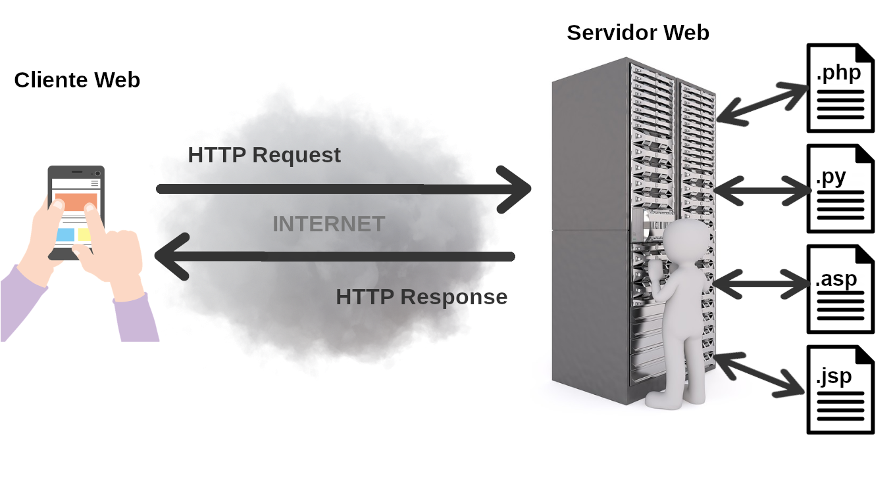
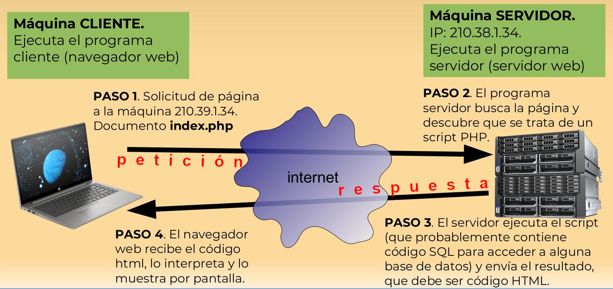

## 2.1. El protocolo HTTP y HTTPS
{: .no_toc }

- TOC
{:toc}

<div style="text-align: center; padding: 20px; background-color: #ccc">
<a href="https://www.dropbox.com/scl/fi/hrki7s8efe12q6kva2gs2/02_01_protocolo_http.pdf?rlkey=vijvw24d2mp7y3h90i69pjnyg&st=hy9rdd5w&dl=0">
DESCARGAR PRESENTACIÓN
</a>
</div>

Para entender cómo funciona PHP (o cualquier otro lenguaje de servidor), primero tenemos que comprender cómo se comunican los ordenadores en la web. Y ese idioma común no es otro que el protocolo HTTP (HyperText Transfer Protocol).

Si vienes de programar en Java, probablemente estás acostumbrado a hacer programas que se ejecutan de principio a fin en una sola máquina. En la web, el juego cambia: tenemos un **cliente** (normalmente el navegador web) y un **servidor** (donde vivirá nuestro código PHP).

### 2.1.1. Arquitectura Cliente-Servidor

La web funciona mediante un ciclo constante de **peticiones y respuestas**. 
1. El **cliente** (tu navegador) le dice al servidor: *"Oye, dame una página llamada index.html, o index.php, o la que sea"*. Esto es una **petición** (Request).
2. El **servidor** (Apache, Nginx, etc.) procesa esa petición.
   * Si el documento solicitado es HTML, lo devuelve al cliente tal cual para que el navegador web lo muestre.
   * Pero si el documento solicitado es un programa en PHP (o en cualquier otro lenguaje), el servidor **intentará ejecutarlo**, y lo que devolverá al cliente será *la salida resultante de ejecutar ese programa*, no el programa mismo. Es decir, que el programa PHP *debe generar una salida en formato HTML válido*.
   
   Esto es la **respuesta** (Response), que siempre debe ser HTML (con CSS o Javascript añadido, cuando sea necesario). Es decir, algo comprensible por los navegadores web.



¡Y ya está! Tras enviar su respuesta, el servidor se olvida completamente del cliente. 

Se dice que HTTP es un protocolo **sin estado** (*stateless*). Esto significa que no *recuerda* quiénes son los clientes ni lo que hicieron en las peticiones anteriores al mismo servidor. Ya veremos más adelante cómo nos las ingeniamos para que el servidor recuerde qué clientes han hecho qué cosas, porque, si no, difícilmente vamos a poder programar nada más complejo que una página web estática.



### 2.1.2. Peticiones HTTP (Requests)

Cuando haces clic en un enlace o envías un formulario, tu navegador construye un mensaje de texto plano y se lo envía al servidor. Ese mensaje tiene una estructura muy concreta:

```http
GET /articulos/php-moderno HTTP/1.1
Host: www.nuestro-curso.es
User-Agent: Mozilla/5.0 (Windows NT 10.0; Win64; x64)
Accept: text/html
```

Fíjate en la primera línea. Tiene tres partes fundamentales:
* **El método (GET):** Indica qué queremos hacer. `GET` es para pedir datos, `POST` para enviar datos (como en un formulario), `PUT` o `PATCH` para actualizar, y `DELETE` para borrar.
* **La ruta (/articulos/php-moderno):** Qué recurso concreto estamos pidiendo.
* **La versión del protocolo (HTTP/1.1):** Simplemente la versión que estamos usando.

A continuación vienen las **cabeceras** (Headers). Son pares clave-valor que envían información adicional (qué navegador usas, qué tipo de contenido aceptas, las cookies que tienes guardadas, etc.).

### 2.1.3. Respuestas HTTP (Responses)

El servidor recibe esa petición, la procesa y contesta con otro mensaje de texto:

```http
HTTP/1.1 200 OK
Date: Mon, 11 Sep 2026 19:00:00 GMT
Server: Apache
Content-Type: text/html; charset=UTF-8

<!DOCTYPE html>
<html>
<head><title>PHP Moderno</title></head>
<body>
    <h1>Bienvenido a la web moderna</h1>
</body>
</html>
```

Igual que antes, tenemos:
* **Una línea de estado (`HTTP/1.1 200 OK`):** Nos dice la versión del protocolo y, lo más importante, el **código de estado** (`200`).
* **Cabeceras de respuesta:** Información adicional (tipo de contenido, fecha, etc.).
* **Una línea en blanco:** Separa las cabeceras del cuerpo del mensaje.
* **El cuerpo (Body):** El HTML, JSON o la imagen que hemos pedido.

### 2.1.4. Códigos de Estado

Ese número misterioso (`200`) de la respuesta es el **código de estado**. Te resume cómo ha ido la cosa. Los tienes que conocer, porque cuando desarrolles APIs, vas a tener que devolver el correcto:

* **2xx (Éxito):** Todo ha ido bien. El más famoso es el `200 OK`. Si creas un recurso nuevo (con un POST), devolverías un `201 Created`.
* **3xx (Redirecciones):** El recurso que buscas ya no está aquí, ve a esta otra URL. Ejemplo: `301 Moved Permanently`.
* **4xx (Errores del cliente):** La has liado tú. El famosísimo `404 Not Found` (has pedido algo que no existe), el `403 Forbidden` (no tienes permisos) o el `400 Bad Request` (la petición está mal formada).
* **5xx (Errores del servidor):** La hemos liado nosotros en el servidor (nuestro código PHP ha petado, por ejemplo). El clásico es el `500 Internal Server Error`.

### 2.1.5. ¿Y el HTTPS?

HTTP transmite todo este texto **en plano**. Si alguien "pincha" el cable entre tu casa y el servidor, puede leer tus contraseñas y tus datos bancarios. 

HTTPS es exactamente lo mismo que HTTP, pero todo ese mensaje de texto va **encriptado** usando un protocolo llamado TLS (antiguamente SSL). Hoy en día, HTTPS es obligatorio. Los navegadores marcarán tu web como insegura si usas HTTP a secas.

¡Pero no te preocupes! Tú, como programador, no tienes que hacer nada. El protocolo HTTPS encripta la información que viaja por la red sin que tú intervengas en el proceso, así que no hay que hacer nada especial.

