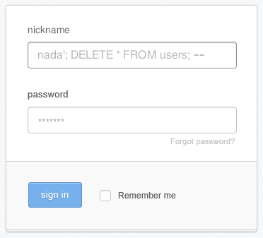

## 2.5. Estado y seguridad
{: .no_toc }

- TOC
{:toc}

Como comentamos al principio, HTTP es un protocolo **sin estado**. El servidor no tiene ni idea de si la petición que le acaba de llegar es del mismo usuario que le pidió una página hace cinco segundos o de alguien completamente distinto.

Para construir aplicaciones web reales (donde un usuario hace login, añade cosas a un carrito, etc.) necesitamos inventarnos alguna forma de "recordar" el estado. Y ahí es donde entran las Cookies y las Sesiones.

### 2.5.1. Las cookies

Una cookie no es más que un pequeño trocito de texto que el servidor le envía al navegador y le dice: *"Oye, guárdame esto, y devuélvemelo en cada petición que me hagas a partir de ahora"*.

En PHP, crear una cookie es muy sencillo con la función `setcookie()`:

```php
<?php
// Nombre de la cookie, valor, tiempo de expiración (1 hora), ruta
setcookie("idioma", "es", time() + 3600, "/");
```

Y para leerla en una petición futura, usamos la variable superglobal `$_COOKIE`:

```php
<?php
$idioma_elegido = $_COOKIE['idioma'] ?? 'en';
echo "El idioma es: " . htmlspecialchars($idioma_elegido);
```

**¡Peligro!** Las cookies se guardan en el ordenador del usuario, así que **NUNCA** se debe guardar información sensible (como contraseñas, roles de usuario y cosas así) en una cookie, porque cualquier usuario puede modificarla fácilmente desde su navegador web.

### 2.5.2. Las sesiones

Las sesiones son una alternativa más segura a las cookies. En lugar de guardar los datos en el navegador del usuario, **se guardan en el servidor** (normalmente en un archivo temporal o en una base de datos, según como esté configurado el servidor). 

Pero puede haber muchos clientes conectados a la vez al mismo servidor. ¿Cómo sabe el servidor qué datos corresponden a qué cliente/usuario? 

Para lograrlo, PHP usa este truco: cuando inicias una sesión, el servidor crea un identificador único (un chorizo de letras y números) y se lo envía al navegador... ¡en forma de cookie! Esta cookie especial suele llamarse `PHPSESSID`.

Así que las variables de sesión son más seguras que las cookies, pero no *completamente* seguras, porque dependen de esa `PHPSESSID` que se guarda en una cookie y, por lo tanto, puede ser manipulada para engañar al servidor y hacerle creer que un usuario es alguien que realmente no es.

Para usar sesiones en PHP, **siempre** debes llamar a `session_start()` al principio del script, antes de enviar cualquier HTML.

```php
<?php
session_start(); // Debe ser lo primero de todo, antes de cualquier salida HTML

// Guardar datos en la sesión
$_SESSION['usuario_id'] = 42;
$_SESSION['rol'] = 'admin';
```

Luego, en otro archivo PHP, puedes recuperar esos datos si los necesitas (siempre haciendo `session_start()` primero):

```php
<?php
echo "Bienvenido, usuario número: " . $_SESSION['usuario_id'];
```

Para cerrar la sesión (hacer logout), hay que destruirla. Esto elimina todas las variables `$_SESSION[]` que se hubieran guardado:

```php
<?php
session_start();
session_unset();     // Vaciamos el array $_SESSION
session_destroy();   // Destruimos la sesión en el servidor
```

### 2.5.3. Prevención de vulnerabilidades en aplicaciones web

En cuanto tu aplicación está en internet, van a intentar atacarla tarde o temprano. Esto es un hecho incontrovertible, así que tienes que protegerte contra estas tres vulnerabilidades clásicas:

#### 1. XSS (Cross-Site Scripting)

El XSS ocurre cuando un usuario malintencionado inyecta código Javascript en tu web. 

Imagina que en un foro, por ejemplo, alguien publica un mensaje que dice: `<script>alert('Te he hackeado');</script>`. ¿Qué pasaría si el foro reprodujese ese mensaje tal cual? Que tu navegador, al cargar el mensaje, recibiría el código Javascript como parte de la página y lo ejecutaría.

(El XSS suele hacer cosas más chungas que mostrar un simple `alert()`, como te puedes imaginar).

**Solución:** Desconfiar *siempre* de cualquier dato que provenga del usuario antes de imprimirlo en el HTML. Para eso se usa el método de PHP `htmlspecialchars()`, que "escapa" un string, es decir, elimina cualquier rastro de código Javascript o SQL.

```php
// MAL: Vulnerable a XSS
echo "<p>Comentario: " . $_POST['comentario'] . "</p>";

// BIEN: Seguro
echo "<p>Comentario: " . htmlspecialchars($_POST['comentario'], ENT_QUOTES, 'UTF-8') . "</p>";
```

#### 2. Inyección SQL

Esta vulnerabilidad es más peligrosa. Ocurre cuando concatenas texto introducido por el usuario directamente en una consulta SQL. 

Imagina que, en un formulario de login, un usuario introduce esto en su nombre de usuario:

`' OR 1=1 --`

Si eso se envía tal cual al servidor, este ejecutará una consulta parecida a esto:

```sql
SELECT * FROM users WHERE username = '' OR 1=1 --`
```

Como `--` es el símbolo de comentario en SQL, la base de datos ignorará el resto de la consulta y lanzará solo ese SELECT, y puede loguear a un usuario malicioso que realmente no tiene cuenta en ese sistema.

Con la misma técnica se pueden insertar datos en la base de datos o eliminar información. Mira qué fácil sería destruir la tabla de usuarios de la base de datos desde un inocente formulario de login:



**Solución:** Usar **SIEMPRE sentencias preparadas** con PDO, como hemos visto en el apartado anterior. ¡Jamás concatenes variables que provienen de un usario en el SQL que ejecutas contra la base de datos!

```php
// **PELIGRO**: Vulnerable a inyección de SQL
$sql = "SELECT * FROM usuarios WHERE email = '" . $_POST['email'] . "'";
$pdo->query($sql);

// BIEN: Sentencia preparada
$stmt = $pdo->prepare("SELECT * FROM usuarios WHERE email = :email");
$stmt->execute(['email' => $_POST['email']]);
$user = $stmt->fetch();
```


#### 3. CSRF (Cross-Site Request Forgery)

Imagina que estás logueado en tu banco. Abres otra pestaña en el navegador y navegas pr ella, y llegas a una página maligna que un formulario oculto que envía una petición POST a tu banco ordenando una transferencia. 

Como estás logueado, tu navegador enviará automáticamente la cookie de sesión al banco, y el banco pensará que la petición es tuya. *Eso es un ataque por CSRF*.

**Solución:** Usar un **Token CSRF**. En el servidor, generas un token aleatorio, lo guardas en sesión y lo pones en un campo oculto del formulario. Al recibir el POST, compruebas que si token coincida. Si alguien trata de atacar por CSRF, no dispondrá del token, y el servidor puede detectarlo.

En este caso, el código es más complejo, pero no temas, pronto lo entenderás:

```php
// Generar token en el formulario (GET)
$_SESSION['csrf_token'] = bin2hex(random_bytes(32));
?>
<form action="/transferir" method="POST">
    <input type="hidden" name="csrf_token" value="<?= $_SESSION['csrf_token'] ?>">
    <!-- resto de campos -->
</form>

<?php
// Comprobar token al recibir los datos (POST)
if (!hash_equals($_SESSION['csrf_token'], $_POST['csrf_token'])) {
    die("¡Ataque CSRF detectado!");
}
```

