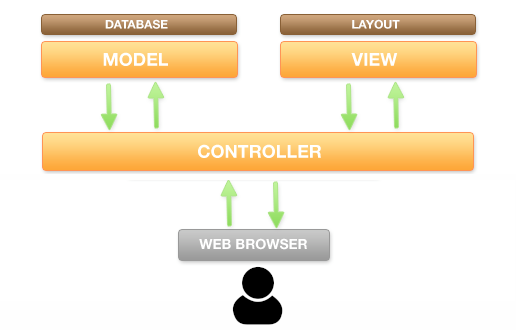

## 2.6. MVC y enrutado Web
{: .no_toc }

- TOC
{:toc}

Cuando empiezas a programar en PHP, **la tendencia natural es crear un archivo por cada página** (por ejemplo, `formulario_login.php` te lleva a `comprobar_login.php`, que a su vez te lleva a `home.php`, etc.). 

Al programar así, en cada archivo se mezcla todo: la conexión a la base de datos, la lógica para procesar formularios, la salida HTML... Esto se conoce como "**código espagueti**" y es imposible de mantener cuando el proyecto crece.

Para resolver este problema usamos un **patrón de arquitectura**, y el más famoso en el mundillo de las aplicaciones web es el **patrón MVC (Modelo-Vista-Controlador)**.

### 2.6.1. ¿Qué es el MVC?

El MVC divide la aplicación web en **tres capas**, cada una con una responsabilidad muy clara:

* **Los modelos:** Son los encargados de manejar los datos. 

  Es decir, se conectan a la base de datos, lanzan las consultas (usando PDO), aplican sobre ellos las reglas de que requiera la lógica de la aplicación (lo que se conoce como "**lógica de negocio**") y devuelven los datos ya preprocesados (¡pero nunca los muestran!). 
  
  Normalmente, *tendrás un modelo por cada tabla maestra* de tu base de datos (por ejemplo, si tienes una tabla `articulos`, tendrás un modelo llamado `Articulo`).

* **Las Vistas:** Son los archivos que contienen el HTML y el CSS. 

   Su misión es recibir los datos (ya procesados) de los modelos y mostrarlos por pantalla de forma bonita. 
   
   En las vistas **no debe haber ninguna consulta a la base de datos**. Lo habitual es encontrar bucles `foreach` sobre los datos y sentencias `echo` para generar la salida HTML.

* **Los Controladores:** Son los directores de orquesta. 

   Reciben la petición http del usuario (*Request*), la analizan y deciden a qué modelo deben llamar para conseguir los datos y qué vista debe mostrar esos datos. También suelen encargarse de aplicar la capa de seguridad.




### 2.6.2. Estructura profesional de un proyecto

Si montamos un proyecto moderno con PHP usando Composer y Namespaces, nuestro árbol de carpetas debería tener un aspecto parecido a este:

```text
mi-proyecto/
├── src/                # Aquí estará el código fuente PHP (Namespace: App\)
│   ├── Controllers/    # Aquí colocamos los controladores
│   │   └── ArticleController.php
│   ├── Models/         # Aquí colocamos los modelos
│   │   └── Article.php
│   └── Views/          # Aquí colocamos las vistas (a menudo se organizan en subcarpetas)
│       └── articles_list.php
├── public/             # ¡La ÚNICA carpeta accesible desde el navegador!
│   └── index.php       # El FrontController o punto de entrada (ver más abajo)
├── vendor/             # Librerías gestionadas por Composer
└── composer.json       # Configuración de Composer
```

Fíjate en algo crucial: **la carpeta `src/` está *fuera* de la carpeta pública**. Así los usuarios nunca pueden acceder directamente a tus modelos o controladores poniendo la URL en el navegador. El único archivo accesible públicamente es `public/index.php`.

### 2.6.3. El FrontController y el enrutador

Cuando se trabajaba con PHP clásico, los *Request* del usuario tenían este aspecto:
* `misitio.com/index.php` - Esta era la homepage de la aplicación, con links al resto de subpáginas (por ejemplo, si fuera una tienda online, contendría un link a la lista de artículos)
* `misitio.com/articulos.php` - Este archivo .php consultaría la tabla de artículos y generaría un HTML con la lista de artículos.
* `misitio.com/ver_articulo.php?id=5` - Este otro script mostraría una página de detalle del artículo con id = 5

Es decir, según lo que estuviera ocurriendo en la aplicación, la ejecución saltaba de un archivo (como `index.php`) a otro (como `articulos.php`).

**En el desarrollo web moderno, usamos un FrontController** (o controlador frontal). Se trata de un script .php especial que recoge TODAS, absolutamente todas las peticiones que llegan al servidor. Ese FrontController suele ser el archivo `public/index.php`. 

¿Cómo sabe entonces `index.php` qué página queremos ver? Gracias al **Enrutador (Router)**. El enrutador examina la URL (por ejemplo, `misitio.com/articles/show/5`) y la divide en trozos, con lo que se encuentra:

* `articles` - El FrontController ya sabe que el usuario que hacer algo con los artículos.
* `show` - El FrontController sabe que el usuario ha pedido *ver* artículos. Pero aún no sabe si todos o uno en concreto.
* `5` - El FrontController sabe que el usuario quiere ver el artículo con id = 5, así que ya sabe **qué modelo y qué vista tiene que invocar**.

Usar un FrontController no solo permite construir aplicaciones mejor organizadas y más seguras, sino también usar URL limpias y semánticas:

* `misitio.com/ver_articulo.php?id=5` - URL "sucia" y antigua, difícil de leer e interpretar.
* `misitio.com/articles/show/5` - URL limpia y moderna, fácil de leer e interpretar. Mejora la semántica y el posicionamiento web.

#### Ejemplo de FrontController básico (`public/index.php`)

Este es un ejemplo sencillo de cómo se puede escribir un archivo tan importante como el FrontController de forma sencilla y limpia:

```php
<?php
// Cargamos el autoload de Composer
require __DIR__ . '/../vendor/autoload.php';

// Conexión a la BD
$pdo = new PDO("mysql:host=localhost;dbname=blog", "root", "");

// Capturamos la acción por GET (modo "cutre" pero fácil de entender)
// ¡OJO! Lo mejor sería leer la URL limpia ($_SERVER['REQUEST_URI'])
XXX $controllerName = $_GET['controller'] ?? 'Article';
$action = $_GET['action'] ?? 'index';

// Construimos el nombre completo de la clase usando nuestro namespace
$controllerClass = "\\App\\Controllers\\" . $controllerName . "Controller";

if (class_exists($controllerClass) && method_exists($controllerClass, $action)) {
    // Instanciamos el controlador y le pasamos la conexión a la base de datos
    $controller = new $controllerClass($pdo);
    // Ejecutamos el método
    $controller->$action();
} else {
    header("HTTP/1.0 404 Not Found");
    echo "Página no encontrada";  // Aquí personalizamos la página del error 404
}
```

### 2.6.4. Inyección de dependencias

Fíjate en esta línea del controlador frontal: `$controller = new $controllerClass($pdo);`.

Le estamos pasando el objeto de la base de datos (`$pdo`) al controlador. El controlador, a su vez, se lo pasará al modelo. A esto se le llama **Inyección de dependencias**. 

En lugar de que cada modelo cree su propia conexión (lo cual es un infierno si mañana cambias la contraseña de la BD, porque tendrías que cambiarla en 50 archivos), **creamos la conexión una sola vez en el `index.php` y se la "inyectamos" a las clases que la necesiten**.

Los frameworks modernos como Laravel automatizan todo esto de una forma aparentemente mágica. Pero lo que ocurre en las tripas del framework no es magia, sino exactamente lo mismo que acabamos de explicar.
