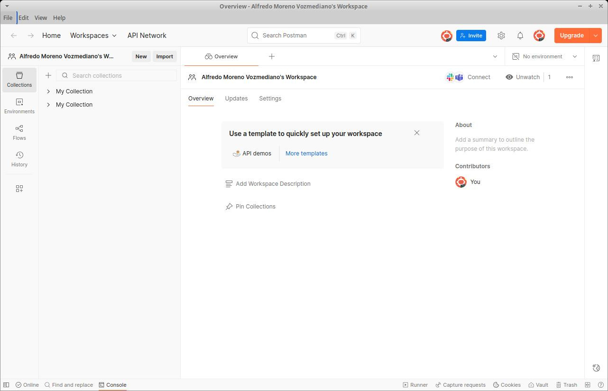
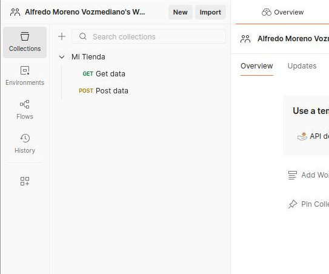
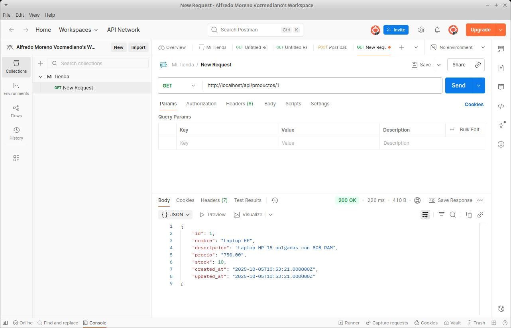
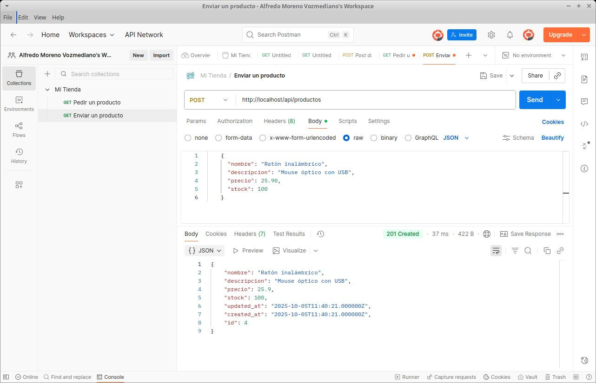
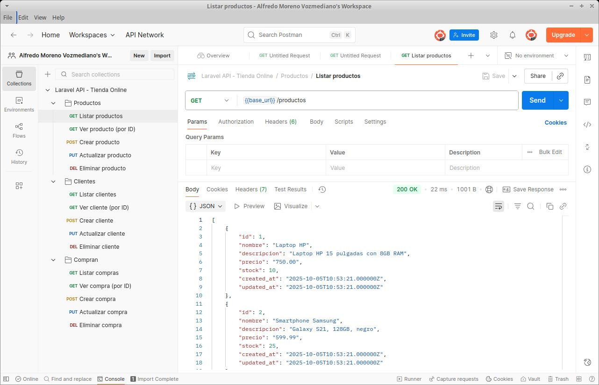

# 4. APIs RESTful con Laravel
{: .no_toc }

- TOC
{:toc}

Los **servicios web** son un tipo particular de aplicación web: una aplicación pensada no solo para ser usada por usuarios humanos, sino por otras aplicaciones de software.

Existen dos estándares históricos para crear servicios web: SOAP y REST. En este tema, vamos a estudiar las diferencias fundamentales y a centrarnos en cómo podemos construir una API RESTful moderna utilizando Laravel 13.

**¡¡OJO!!** Ten en cuenta que SOAP y REST no son los únicos estándares que existen para construir APIs. Hay otros que también se usan mucho, como **GraphQL** (el más flexible), **WebSocket** (comunicación bidireccional en tiempo real), **MQTT** (para IoT o Internet de las Cosas) o **gRPC** (para microservicios), etc. ¡Pero no podemos verlos todos! Así que veremos REST, que es el más popular en la actualidad.

## 4.1. ¿Qué es un servicio web?

#### Una definición de servicio web

Un **servicio web** es una aplicación web capaz de **comunicarse e intercambiar información con otra aplicación** (que denominaremos *cliente*) independientemente de la plataforma en la que cada una se ejecute.

Es decir, el servicio web puede estar programado en PHP (Laravel) y correr bajo un servidor GNU/Linux, y el cliente puede ser una aplicación móvil en Kotlin para Android, y deberían ser capaces de comunicarse y trabajar juntas. Pero es importante que quede claro que, en este caso, el servicio web (servidor) y la aplicación cliente *son dos piezas de software totalmente diferentes*.

Los mensajes que las aplicaciones se intercambian actualmente tienen, casi en el 100% de los casos, formato **JSON**.

#### Diferencias entre servicios web y aplicaciones web

Llegados a este punto, puede que estés pensando: "Vale, pero ¿en qué se diferencia esto de una aplicación web normal? ¿No intercambian también el cliente y el servidor información a través de Internet?".

Sí, pero hay algunas **diferencias fundamentales entre un *servicio web (API)* y una *aplicación web SSR***:

* Una aplicación web tradicional (SSR) está diseñada para que un ser humano interactúe con ella a través de una interfaz gráfica en un navegador (HTML/CSS). Un servicio web (API), en cambio, está pensado para que lo use otra aplicación informática (el cliente móvil, una aplicación frontend como React/Vue, o un servidor externo), no un ser humano directamente.
* Por ese motivo, los servicios web carecen de interfaz de usuario y no devuelven HTML. Es decir, un servicio web **no tiene vistas**.
* En lugar de vistas, los servicios web devuelven datos crudos formateados en **JSON**, pensados para que la máquina cliente los lea, los procese y sea ella quien decida cómo dibujarlos en la pantalla del usuario final.

Por lo demás, un servicio web sigue teniendo una arquitectura MVC, pero *sin la V*. Conservamos las rutas, los controladores y los modelos. Los controladores simplemente pedirán datos al modelo y los escupirán en formato JSON.

## 4.2. SOAP (El pasado)

**SOAP (Simple Object Access Protocol)** fue, durante muchos años, el estándar dominante en la industria para la implementación de servicios web en entornos corporativos.

SOAP estaba orientado a *procesos* (RPC - Remote Procedure Call). Obligaba a empaquetar toda la información en pesados documentos **XML** y requería la publicación de un archivo llamado **WSDL**, que era un enorme diccionario técnico que describía exactamente qué funciones tenía el servidor y qué parámetros aceptaba.

Aunque SOAP era muy riguroso, también era **extremadamente rígido, lento, pesado y difícil de programar**. Escribir un cliente o un servidor SOAP sin herramientas de autogeneración de código era una pesadilla.

Hoy en día, SOAP se considera una tecnología **heredada (legacy)**. A menos que tengas que mantener sistemas bancarios o institucionales antiguos, rara vez iniciarás un proyecto nuevo usando SOAP. La industria entera ha migrado a REST. Por lo tanto, no entraremos en más detalles técnicos sobre él.

## 4.3. REST (El presente)

### 4.3.1. ¿REST o RESTful?

**REST (Representational State Transfer)** es el mecanismo de intercambio de información estándar en la actualidad. 

A diferencia de SOAP, REST está **orientado a los datos (recursos)**. En lugar de crear URLs como `/api/obtenerListadoDeCoches` (enfocado a la acción), en REST las URLs representan recursos estáticos, como `/api/coches`, y la acción que queremos hacer sobre esos coches la indicamos utilizando los **verbos HTTP**.

Cuando decimos que una API es **RESTful**, simplemente nos referimos a que es un servicio web que respeta estrictamente los principios de la arquitectura REST y devuelve sus respuestas en formato JSON.

Si un servicio se desvía un poco de REST, todavía puede seguir siendo un API REST, pero ya no lo llamaremos "RESTful".

### 4.3.2. Repaso de los verbos HTTP

Recuerda que el protocolo HTTP soporta varios métodos o verbos para realizar peticiones. El estándar REST, como hemos dicho, hace un uso intensivo de ellos para determinar qué queremos hacer con un recurso:

* **GET** se utiliza para *solicitar* datos al servidor (solo lectura). Ejemplo: "Dame toda la información de este producto".
* **POST** se utiliza para *enviar* nuevos datos al servidor. Ejemplo: "Aquí tienes un nuevo producto, créalo en la base de datos".
* **PUT / PATCH** se utilizan para *modificar* datos que ya existen. (PUT suele usarse para reemplazar el objeto entero, y PATCH para modificar solo algunos campos parciales).
* **DELETE** se usa para solicitar la *eliminación* de datos en el servidor.

El HTML tradicional solo soporta GET y POST, pero en el contexto de una API REST, los clientes como Postman, Axios, Fetch u otros que iremos viendo sí pueden enviar peticiones PUT o DELETE sin ningún problema. Y, si usamos HTML, el envío de PUT o DELETE se *simula* con un campo oculto en el formulario, como vimos que hace Blade con las vistas de Laravel.

### 4.3.3. Las 5 operaciones típicas de una API REST

Como en una API no existen formularios HTML que mostrarle al usuario humano, las operaciones de un controlador REST se reducen de las 7 tradicionales a **solo 5 operaciones**.

Si tuviéramos un recurso llamado `Product`, una API RESTful perfecta tendría las siguientes rutas, verbos y funciones en el controlador:

| Operación | Verbo HTTP | Ruta (URL) | Acción en el Controlador |
| :--- | :--- | :--- | :--- |
| **index** | GET | `/api/products` | Devuelve un JSON con la lista de todos los productos o un error (si ocurre). |
| **show** | GET | `/api/products/{id}` | Devuelve un JSON con los datos del producto solicitado o un error (si ocurre) |
| **store** | POST | `/api/products` | Recibe un JSON, crea el producto en la BD y devuelve código 201 (Created) o un error (si ocurre). |
| **update** | PUT / PATCH | `/api/products/{id}` | Recibe un JSON, actualiza el producto y devuelve los datos modificados. O un error (si ocurre)|
| **destroy** | DELETE | `/api/products/{id}` | Elimina el producto y devuelve un código 204 (No Content) o mensaje de éxito. O un error (si ocurre)|

Cualquier programador del mundo que consuma tu API sabrá, por pura convención, que si hace un POST a `/api/products`, estará creando un producto. ¡Esa es la magia de REST!

## 4.4. Cómo crear una API REST con Laravel

Crear una API en Laravel es muy similar a crear una aplicación web estándar, pero en realidad es **más sencillo** porque nos saltamos toda la capa de Vistas y Blade.

#### Instalación de las rutas API

En las versiones modernas de Laravel (a partir de la v11), el archivo de rutas para APIs no viene habilitado por defecto para ahorrar peso. Para generar la infraestructura de APIs, debes abrir tu terminal y ejecutar **una sola vez**:

```bash
./vendor/bin/sail artisan install:api
```

Este comando creará el archivo `routes/api.php`. Todas las rutas que escribas dentro de ese archivo tendrán automáticamente el prefijo `/api/` en la URL (por ejemplo, `http://localhost/api/mis-rutas`).

#### El controlador API

Laravel tiene un comando específico para crear controladores orientados exclusivamente a APIs (sin los métodos `create` y `edit` que usábamos para renderizar formularios HTML). 

Se utiliza la opción `--api`:

```bash
./vendor/bin/sail artisan make:controller ProductController --api
```

#### El enrutador API

En tu archivo `routes/api.php`, puedes declarar las 5 rutas RESTful en una sola línea utilizando `apiResource` (en lugar de `resource`):

```php
use App\Http\Controllers\ProductController;

Route::apiResource('products', ProductController::class);
```

#### Devolver respuestas JSON

En los métodos de tu controlador, en lugar de utilizar `return view(...)`, simplemente puedes devolver tu modelo o colección de Eloquent, y Laravel lo convertirá mágicamente a formato JSON:

```php
public function index()
{
    $products = Product::all();
    return response()->json($products);
    // ¡Incluso podrías hacer simplemente `return Product::all();` y Laravel lo transforma!
}

public function show($id)
{
    $product = Product::findOrFail($id);
    return response()->json($product);
}
```

Al crear o actualizar, puedes usar validaciones de Request tal y como lo hacías antes. Laravel es tan inteligente que, si la validación falla estando en un entorno API, devolverá automáticamente un JSON con el error 422 y los detalles de validación, en lugar de hacer una redirección como haría en un entorno web.

## 4.5. Autenticación en una API con Laravel Sanctum

En las aplicaciones web, la sesión del usuario se mantiene viva usando Cookies en el navegador. Sin embargo, en una API REST pura, **no hay estado (stateless)** y no se puede asumir que clientes vayan a manejar cookies.

La solución estándar es usar lo que se llama **Tokens de acceso**. 

Cuando un usuario se identifica correctamente, el servidor le emite un "Token" (una larga cadena alfanumérica secreta). A partir de ese momento, el cliente debe incluir ese token en la **Cabecera HTTP (Header)** de cada petición que haga al servidor.

Laravel facilita esto mediante un paquete oficial llamado **Laravel Sanctum**. Cuando ejecutaste el comando `install:api` anteriormente, Laravel Sanctum se instaló y configuró automáticamente.

#### Generar el Token de acceso

Imagínate que un usuario hace una petición POST a `/api/login` con su email y contraseña. En el controlador de la API, verificaríamos sus credenciales y, si son correctas, le generaríamos un token usando Sanctum de este modo:

```php
use Illuminate\Support\Facades\Hash;
use Illuminate\Validation\ValidationException;
use App\Models\User;

public function login(Request $request)
{
    $request->validate([
        'email' => 'required|email',
        'password' => 'required',
    ]);

    $user = User::where('email', $request->email)->first();

    if (! $user || ! Hash::check($request->password, $user->password)) {
        return response()->json(['message' => 'Credenciales incorrectas'], 401);
    }

    // Generamos el token usando Sanctum
    $token = $user->createToken('token_de_acceso')->plainTextToken;

    // Devolvemos el token al cliente (la app móvil, React, etc.)
    return response()->json(['token' => $token]);
}
```

#### Rutas protegidas

Para proteger las rutas de tu API en `routes/api.php`, debes agruparlas bajo el middleware de Sanctum:

```php
Route::middleware('auth:sanctum')->group(function () {
    // Estas rutas requerirán un Token válido
    Route::apiResource('products', ProductController::class);
});
```

A partir de este momento, si el cliente intenta acceder a `/api/products` sin token, recibirá un error 401 (Unauthorized). 

Para acceder sin problemas, **el cliente deberá incluir la siguiente cabecera HTTP obligatoriamente** (si no, Sanctum rechazará la petición):

```http
Authorization: Bearer <aquí_pega_el_largo_token_generado>
```

Y de igual manera que en SSR, dentro de tu controlador podrás usar `$request->user()` o `Auth::user()` para saber qué usuario está realizando esa petición a la API y autorizar si puede borrar o editar un recurso concreto.

---
## 4.6. Consumir el servicio web con Postman

### 4.6.1 Instalación y uso de Postman

#### Qué es Postman

Postman es una herramienta cliente para APIs muy popular que permite a desarrolladores **probar, documentar y automatizar peticiones a servicios web**. Es gratuita con opciones de pago.

Postman se usa para todas estas cosas:

* **Enviar peticiones HTTP** (GET, POST, PUT, PATCH, DELETE, etc.) hacia tu API y visualizar la respuesta.
* **Configurar headers y parámetros**. Por ejemplo, "Content-Type: application/json", tokens de autenticación, etc.
* **Enviar cuerpos de petición en JSON** para probar *endpoints*, es decir, URLs que esperan recibir datos en JSON para funcionar.
* **Visualizar las respuestas del servidor** en formato JSON, XML, texto, etc., junto con el código de estado HTTP.
* **Guardar colecciones de pruebas para reutilizarlas** o compartirlas con tu equipo (muy útil cuando varios desarrolladores trabajan con la misma API).
* **Automatizar pruebas**: puedes escribir scripts en JavaScript dentro de Postman para verificar automáticamente que las respuestas cumplen con lo esperado.
* **Generar documentación** de tu API a partir de las colecciones.

#### Instalación y puesta en marcha de Postman

**Opción 1: Instalar Postman como app de escritorio** (***RECOMENDADO***)

* Visita la web [https://www.postman.com/downloads/](https://www.postman.com/downloads/). Si usas Linux, puedes buscar antes en los repositorios oficiales de tu distribución, porque podría incluir Postman.
* Descarga e instala la versión más adecuada para tu sistema operativo.
* Inicia sesión (puedes usar Google o GitHub).

**Opción 2: Usar Postman en la nube**

* Accede a: [https://web.postman.com/](https://web.postman.com/)
* Inicia sesión y comienza a trabajar directamente en la nube.

**Ignorando el asistente de IA**

En las nuevas versiones de Postman aparece por defecto un **asistente de IA** al lanzar la aplicación. *Vamos a ignorar ese asistente para aprender a usar Postman nosotros, no una IA, que para eso estamos aquí*. 

Para ello, puedes escribir algo como "Quiero ir al interfaz clásico de Postman" en el cuadro de diálogo de la IA, o elegir la opción *File -> New Postman Window*.

Entonces obtendrás una pantalla como esta:



### 4.6.2. Cómo testear un API con Postman

Vamos a ilustrar cómo funciona Postman con un **ejemplo práctico**: configurándolo para probar nuestro API REST de clientes, productos y compras que hemos implementado un poco más arriba.

#### Configura una colección en Postman

**Una colección es una serie de *request* o peticiones al servidor agrupados** bajo el mismo nombre. Son como carpetas donde organizar peticiones para poder reutilizarlas más tarde, algo habitual si estás en fase de desarrollo de una API.

La colección que nosotros vamos a crear nos permitirá lanzar todas las peticiones para trabajar con Productos, Clientes y Compras.

En Postman puedes crear una colección llamada, por ejemplo, **Tienda API**, o bien puedes usar la colección que viene creada por defecto, **MyCollection**. 

**Todo ello se hace en el panel izquierdo de Postman**.
   



#### Requests GET

Veamos como hacer un GET con Postman para comprobar si el API responde con los datos correctos.

Cada request tendrá la URL base de tu API. En todos los ejemplos vamos a suponer que es *https://servidor/api*, pero, lógicamente, tendrás que cambiarla por la tuya.

Pues bien: para hacer un **GET /productos** y guardar el request en nuestra colección solo tenemos que:

1. Hacer clic en los tres puntos junto al nombre de la colección y pulsar en *"Add request"*.
2. Escribir el *endpoint* o ruta ***https://servidor/api/productos*** en el cuadro de búsqueda.
3. Asegurarnos de tener seleccionado el **verbo GET**. 
4. Pulsar el **botón "Send"**.

El servidor nos debería devolver todos los productos empaquetados en un JSON:



#### Requests POST con datos

Si hacemos una petición como **POST /productos**, el estándar REST indica que estamos tratando de enviar los datos de un producto al servidor para que este lo almacene en la base de datos.

Por lo tanto, esta petición debe llevar los datos del producto empaquetados como JSON en el cuerpo (*body*) de la propia petición HTTP.

Esto se logra así en Postman:

1. **Crear una nueva *request*** en tu colección (haz clic en los 3 puntos junto al nombre de la colección y elige *"Add request"*).
2. **Escribir el *endpoint*** o ruta ***https://servidor/api/productos*** en el cuadro de búsqueda.
3. Asegurarnos de tener seleccionado el **verbo POST**.  
4. En el panel de la *request*, seleccionar la **pestaña "Body"**.
5. **Seleccionar "raw" y "JSON"** en los desplegables, pues vamos a enviar los datos como JSON en texto plano (raw).
6. **Escribir el objeto JSON** que deseamos enviar al servidor. Por ejemplo:

    ```json
    {
      "nombre": "Ratón inalámbrico",
      "descripcion": "Mouse óptico con USB",
      "precio": 25.90,
      "stock": 100
    }
    ```

7. Pulsar el **botón "Send"**.

El servidor responderá con un estado http 200 o 201 (si todo va bien) o con un error (estados 403, 404, 500 o cualquier otro). Además, puede enviarnos datos adicionales, como el id del recurso que acaba de crear o incluso **un JSON con todos los datos del recurso que acaba de crear**, como ocurre en el siguiente pantallazo:



#### Requests PUT, PATCH o DELETE

Del mismo modo que con POST podemos enviar *requests* con los verbos PUT, PATCH o DELETE, puesto que en el selector del método de envío encontraremos todos esos verbos.

#### Crear un archivo de colección .json

Probablemente una de las formas más útiles de usar Postman como **herramienta de testeo de un API** es disponer de un archivo .json con todos los datos para lanzar los tests. 

Esto te permite preparar la batería de pruebas de una sola vez y utilizarla todas las veces que lo necesites. También es fácil hacer pequeños retoques en las pruebas y volver a cargar el .json en Postman.

Para usar Postman de este modo, debes:

1. **Crear tu archivo .json con la colección de tests**. No suele ser buena idea escribirlo a mano. Para esto puedes apoyarte en una IA como ChatGPT o la propia IA que viene integrada con Postman, a la que puedes pedir algo como esto: *"Genera un archivo .json con una colección para Postman con la que probar la siguiente una API REST basada en las siguientes tablas"*. Y, a continuación, detalla la estructura de tu base de datos.

2. **Importa tu archivo .json con la opción *"Import"* de Postman**. Se importará como una nueva colección. Si la colección ya existiera y te quedan dos con el mismo nombre, puedes borrar la que te sobre.

Y listo: solo con esto ya tendrás todos los *endpoints* listos para probar.



### 4.6.3. ¿Qué más puede hacer Postman?

Postman es mucho más que una herramienta para probar endpoints; es una **plataforma completa de colaboración y automatización para APIs**.

Nosotros no vamos a ver mucho más en esta introducción, pero si quieres profundizar en ello, aquí tienes algunos de los trucos de magia que Postman puede realizar para ti:

* **Automatización de pruebas**: puedes escribir sripts en Javascript para validar las respuestas de forma automática o ejecutar múltiples peticiones en secuencia, así como ejecutar código antes y después de lanzar las peticiones.

* **Documentación de API**: Postman no solo puede generar automáticamente documentación de la API a partir de la colección, sino que también puede publicarla online y mantenerla actualizada.

* **Monitoreo**: con Postman se puede monitorear el estado de una API de forma automática a intervalos regulares y hacer que nos avise de cualquier mal funcionamiento.

* **Simulación de servidores**: Postman puede simular servidores inexistentes para pruebas más complejas.

* **Trabajo en equipo**: Puedes integrar Postman con GitHub, GitLab, Jenkins, etc.

* **Autenticación**: también puedes gestionar la autenticación por múltiples medios en aquellas APIs que la exijan antes de responder a *requests*.

## 4.7. Práctica final: API REST de Gestión de Academias y Cursos

Es hora de poner en práctica los conceptos de las APIs RESTful y el uso de Postman como cliente.

Vas a construir una **API RESTful de Gestión de Academias** donde se gestionarán centros de estudio (`Academies`), los cursos que ofrecen (`Courses`), y los alumnos que se matriculan en dichos cursos (`Students`).

#### ADVERTENCIA HABITUAL: Uso de Inteligencia Artificial

Al igual que en la práctica anterior, **puedes y debes usar la IA** para ayudarte, pero recordando que el uso debe ser **ético y eficiente**. Es decir, que te ayude a apreder más, no a fingir que has aprendido:

1. **Construye pieza a pieza**. No pidas la API completa de golpe. Pide ayuda para entidades aisladas: *"Hazme el controlador API Resource para el modelo Course en Laravel"*, o *"¿Cómo genero un token con Sanctum al hacer login?"*.
2. **Entiende el funcionamiento**. El profesor revisará el código y te hará preguntas en la defensa oral o escrita, o en el examen.
3. **No uses herramientas que desconozcas**. Si la IA te sugiere "Resources" complejos (`JsonResource`), "FormRequests" avanzados o repositorios que no dominas, pídele que simplifique el código para usar las técnicas que conoces y hemos visto en los apuntes, o bien que te explique qué narices está haciendo (simplificar suele ser mejor estrategia; a las IAs se les va la cabeza con facilidad).

> **Defensa del código (Eliminatorio)**: Recuerda que se evaluará tu conocimiento de la aplicación mediante defensa oral o escrita de la práctica **sin IA** y/o con preguntas **sin AI** en el examen. No superar esto implica suspender automáticamente la práctica porque no habrás podido probar tu autoría.


### Especificación de requisitos

La aplicación será exclusivamente backend. No desarrollarás **ninguna vista HTML ni Blade**. Toda tu comunicación con ella debes hacerla con Postman, devolviendo y recibiendo JSON.

#### 1. Tablas de la base de datos
- `users`: id, name, email, password, timestamps
- `academies`: id, user_id, name, description, address, phone, email, timestamps
- `courses`: id, academy_id, name, description, start_date, end_date, capacity, timestamps
- `students`: id, name, surname, email, phone, date_of_birth, timestamps
- `course_student`: id, course_id, student_id, enrolled_at, timestamps

Observa que hay tres relaciones:
- **Relación 1:N** entre `users` y `academies`.
- **Relación 1:N** entre `academies` y `courses`.
- **Relación N:N** entre `courses` y `students`, con una tabla pivote `course_student`

#### 2. Endpoints de Autenticación
- **POST `/api/register`**: Recibe datos, crea un usuario (`User`) y devuelve su Token de acceso.
- **POST `/api/login`**: Verifica credenciales de un `User` y devuelve un Token Sanctum.

#### 3. Endpoints de Academias (1:N)
Un usuario logueado puede crear y gestionar Academias. (Una Academia pertenece a un usuario, y un usuario puede tener varias Academias).
Las rutas de Academias deben estar **protegidas** (Requieren Token).
- **CRUD Completo de `Academy`**: Rutas generadas por `apiResource`.
- *Autorización*: Un usuario solo podrá modificar o eliminar las Academias que él mismo haya creado.

#### 4. Endpoints de Cursos (N:N con Estudiantes)
Cada Academia imparte varios Cursos (`Course`), y cada Curso pertenece a una Academia.
A su vez, un Curso puede tener muchos Estudiantes inscritos, y un Estudiante puede matricularse en muchos Cursos (Relación N:N).
- Implementa endpoints para poder ver los Cursos (esta ruta puede ser pública, sin token).
- Implementa endpoints privados que permitan, mediante peticiones POST/DELETE a URLs específicas (ej: `/api/courses/{course}/enroll`), inscribir o desinscribir a un Estudiante (`Student`) en un Curso, modificando la tabla pivote.

---

### Normas de entrega

El incumplimiento de cualquiera de los siguientes requisitos conllevará penalización o rechazo de la entrega:

1. **Código fuente comprimido**: Sube a Moodle Centros un archivo ZIP con tu proyecto, **excluyendo la carpeta `/vendor` y `/node_modules`**.
2. **Repositorio público**: Enlace a tu repositorio público en GitHub o GitLab, con commits periódicos y descriptivos.
3. **Vídeo de test con Postman**: Graba un vídeo capturando tu pantalla, con **tu propia voz** explicando brevemente cómo haces peticiones a tu API en Postman (muestra el login, copia el token, inclúyelo en la cabecera `Bearer` y crea una academia o inscribe un estudiante). Debe verse claramente cómo el servidor responde con JSON.
4. **Conversación con la IA**: Sube un archivo .docx o .odt con TODA tu conversación con la IA. Necesitamos ver cómo has interactuado con la Inteligencia Artificial.
5. **Reproducibilidad**: El proyecto debe poder ejecutarse sin errores descargando el ZIP (o clonando el repositorio), lanzando `./vendor/bin/sail up -d` y `./vendor/bin/sail artisan migrate`. 

---

### Rúbrica de calificación

La evaluación se realizará según los siguientes ítems (niveles 0 a 3):
* **0**: Sin hacer o sin evidencia de esfuerzo.
* **1**: Hecho, pero con errores graves o funcionamiento muy deficiente.
* **2**: Hecho y funcional, pero mejorable (falta alguna validación, bugs menores, no cumple el 100% de la lógica).
* **3**: Perfecto, cumple todos los requisitos con excelencia y código limpio.

| Ítem Evaluable | Peso | Nivel 0 | Nivel 1 | Nivel 2 | Nivel 3 |
| :--- | :---: | :--- | :--- | :--- | :--- |
| **0. Uso ético y eficiente de la IA (Eliminatorio)** | **Requisito** | No defiende el código. Uso fraudulento. | (No se aplica) | (No se aplica) | Entiende y explica las decisiones arquitectónicas perfectamente. |
| **1. Entrega en tiempo y forma** | **10%** | No entregado / Formato erróneo. | Faltan requisitos (ej. vendor incluido) o falta vídeo Postman. | Cumple mayoría, fallos en explicación del vídeo o faltan requests menores. | Cumple 100% de la norma. Vídeo nítido y bien narrado. |
| **2. Control de versiones** | **10%** | Sin repositorio. | Un único commit inmenso. | Varios commits, mensajes poco descriptivos. | Commits lógicos, frecuentes y descriptivos a medida que avanza. |
| **3. Endpoints y controladores API (Resource)** | **20%** | No responde en `/api`. Devuelve HTML. | Rutas fuera de los estándares REST. Devuelve strings en lugar de JSON estructurado. | Uso parcial de `apiResource`. Faltan validaciones de entrada (`Request`). | Rutas RESTful estrictas, uso impecable de respuestas JSON y validaciones. |
| **4. Relaciones (1:N y N:N)** | **20%** | No hay migraciones foráneas. | Las relaciones fallan al insertar datos. | Relación básica funciona, pero falla la tabla pivote de inscripción de estudiantes. | Modelos perfectamente enlazados (hasMany, belongsToMany), uso de sync/attach impecable. |
| **5. Autenticación (tokens con Sanctum)** | **20%** | API pública e insegura. | Token generado pero no se usa para proteger rutas de manera efectiva. | Rutas protegidas, token funcional, pero falla la autorización (puedo borrar cosas de otros). | Login/Register devuelve Tokens perfectos. Protección `auth:sanctum` y Autorización de propiedad implacable. |
| **6. Uso de Postman** | **10%** | No usa Postman para el testeo o no muestra cómo lo hace. | Usa Postman pero no testea todas las especificaciones o deja pasar muchos errores. | Testea todas las especificaciones con Postman pero de forma poco eficiente o con algunos errores. | Testea todas las especificaciones con Postman de forma eficiente y sin errores. |
| **7. Calidad del código** | **10%** | Archivos caóticos. | Lógica de base de datos esparcida en archivos de rutas. | Buen código, pero verboso o repetitivo. | Nomenclatura clara en inglés, Controladores finos, uso elegante de Eloquent. |

*Nota: Recuerda que para aprobar es obligatorio obtener el Nivel 3 en el ítem 0 y que este ítem se valorará con posterioridad al resto de la práctica (en entrevistas o pruebas individuales o durante el examen)*.
