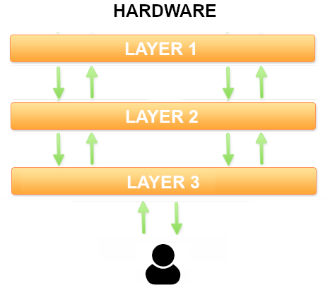

## 1.7. Arquitectura MVC
{: .no_toc }

- TOC
{:toc}

La arquitectura MVC es un **patrón de software**, es decir, una solución probada montones de veces que se adapta bien a muchos problemas diferentes.

En este apartado vamos a aprender a aplicar este patrón arquitectónico a nuestras aplicaciones web hechas con PHP.

### 1.7.1. Arquitectura de aplicaciones

Cuando hablamos de **arquitectura de una aplicación** nos referimos a la estructura básica que la sustenta, como los pilares de un edificio en construcción. Si quitas las paredes, las ventanas, las puertas, los azulejos de la cocina... todavía pueden distinguirse las formas fundamentales, ¿verdad?

Pues bien, el *patrón de arquitectura* más popular en aplicaciones web se llama **MVC o Modelo-Vista-Controlador**. 

### 1.7.2. ¿Qué es la arquitectura MVC?

El MVC es tan solo **una arquitectura multicapa estandarizada**. Una arquitectura de **3 capas**, para ser exactos.

Este es el esquema de una arquitectura en 3 capas. Cada capa ejecuta una parte de la solución, y entre ellas colaboran para formar la aplicación completa. La capa superior interactúa con el usuario; la capa inferior, con la máquina (donde dice "hardware", debería decir "cualquier cosa menos abstracta que nuestro programa"). Tienes permiso para imaginar cada capa como una clase con sus métodos y atributos.



Pues bien, si a esas tres capas les ponemos nombres exóticos como *modelo*, *vista* y *controlador*, y tuneamos un poco el esquema, ya lo tenemos: **la arquitectura MVC**.


¿Y ya está? Bueno, no. Ahora tienes que aprender qué significa *en realidad* esta palabrería.

Porque todo esto está muy bien como construcción teórica, pero ¿cómo te afecta a ti a la hora de programar? ¿Qué clases tienes que crear? ¿Qué parte del código hay que poner en cada clase?

En la práctica, es más simple de lo que parece. Lo vas a ver enseguida. Y lo maravilloso es que muchísimas aplicaciones web encajan como un guante en esta arquitectura. Es decir, apenas tendremos que hacer trabajo de diseño previo, porque, si es una aplicación web, ya sabemos qué clases tendremos que construir: los que nos indique la arquitectura MVC.

Antes de pasar a la parte práctica de todo esto, permíteme un breve apunte: por supuesto, nada impide construir arquitecturas con más de 3 capas. De hecho, nosotros vamos a usar una variante del MVC en el que se añade una capa adicional por debajo del modelo, es decir, una arquitectura con 4 capas. Pero ya llegaremos a eso.

### 1.7.3. MVC en la práctica: una implementación incremental

<div style='color:red'><i>ATENCIÓN: esta sección es solo para quien esté interesado en comprender más profundamente el patrón MVC. Léela atentamente si es tu caso. Si no, puedes saltar sin problemas al <a href='../mvc/#174-el-patr%C3%B3n-mvc-en-la-teor%C3%ADa'>Apartado 1.7.4</a></i>.</div>

Tras esta introducción al MVC, vamos a estudiar a fondo este patrón. Y lo vamos a hacer por medio de un ejemplo, que es como mejor suelen comprenderse estas cosas. Una vez terminado y comprendido el ejemplo, daremos una definición más teórica.

Es decir, que lo vamos hacer al revés de lo habitual: primero la práctica y luego la teoría. Según mi experiencia, la gente suele comprenderlo mejor en ese orden.

Pero, para que esto funcione, tienes que **leer el código fuente con atención**. Es un código sencillo y bien comentado, y que se va complicando muy poco a poco, en pasos incrementales, desde un código clásico monolítico hasta una implementación completa de un MVC.

Si lo lees con la atención que te pido, verás como, **al acabar, entenderás perfectamente en qué consiste el MVC** y podrás empezar a aplicarlo en tus proyectos.

El ejemplo con el que vamos a trabajar es este: supongamos que queremos programar una pequeña aplicación web que nos permita hacer publicaciones en una especie de blog simplificado. Esas publicaciones se guardan como registros en una tabla de una base de datos.

En el código de ejemplo sobre el que vamos a trabajar, nos vamos a centrar en una funcionalidad concreta de este mini-blog: el listado de los artículos existentes en la base de datos.

#### Código monolítico

Una primera aproximación a la solución, **sin usar ningún patrón de arquitectura** en absoluto, podría ser esta (échale un vistazo y asegúrate de entenderlo):

```php
<?
  // Conectamos con la base de datos
  $db = new mysqli('mi-host', 'mi-usuario', 'mi-clave', 'mi-base-de-datos');
  // Lanzamos una consulta para recuperar los artículos que haya en la base de datos
  $res = $db->query('SELECT fecha, titulo FROM articulo');
?>
// Generamos una tabla HTML con el resultado de la consulta
<h1>Listado de Artículos</h1>
<table>
     <tr> <th>Fecha</th> <th>Titulo</th> </tr>
<?php
  // Recorremos fila a fila el resultado de la consulta
  while ($row = $res->fetch_array())  {
      echo "<tr>";
      echo "<td> ".$row['fecha']." </td>";
      echo "<td> ".$row['titulo']." </td>";
      echo "</tr>";
  }
  echo "</table>";
  // Cerramos la conexión con la BD
  $db->close();
?>
```

Esta solución se denomina **monolítica**, porque incluye todo el código necesario en el mismo bloque. 

Por supuesto, para un ejemplo tan simple como este, el código monolítico es más que suficiente, pero en un sistema más complejo pronto empieza a convertirse en un monstruo inmanejable.

#### Primera mejora: controlador + vista

Vamos a aproximarnos un poco a la solución MVC **separando ese código monolítico en dos bloques** (que guardaremos en archivos distintos):

* **Un controlador** (archivo *index.php*).
* **Una vista** (archivo *showAllArticles.php*).

Primero, el **controlador**. Se encargará de recuperar los datos, pero *no de mostrarlos*. Generar el interfaz de usuario, es decir, el HTML, será la labor que le dejaremos a la vista. El controlador preparará esos datos y los empaquetará en un array para que estén disponibles en la vista. Y la vista la insertaremos en el controlador con un *include()*.

```php
<?
  // Este es el controlador.
  // Como esta aplicación de ejemplo solo realiza una acción,
  // no usamos de momento la variable "action"

  // Conectamos a la BD y sacamos la lista de artículos
  $db = new mysqli('mi-host', 'mi-usuario', 'mi-clave', 'mi-base-de-datos');
  $res = $db->query('SELECT fecha, titulo FROM articulo');

  // Convertimos la lista de artículos, que es un cursor de MySQL, en un array estándar de PHP
  $articles = array();
  while ($row = $res->fetch_array())  {
      $articles[] = $row;
  }
  $db->close();

  // Incluimos el código de la vista, donde se usará el array de artículos
  // para generar la tabla HTML.
  include('showAllArticles.php');
?>
```

La **vista** que mostrará los datos del array contiene un código muy semejante al de la solución monolítica, solo que ahora estará ubicada en un archivo aparte (*showAllArticles.php*) y hará un bucle sobre el array de resultados que le ha preparado el controlador: 

```php
<h1>Listado de Articulos</h1>
<table>
     <tr> <th>Fecha</th> <th>Titulo</th> </tr>
     <?php 
     foreach($articles as $article) {
        echo "<tr>
           <td>".$article['fecha']."</td>
           <td>".$article['titulo']."</td>
        </tr>";
     }
     ?>
</table>
```

#### Segunda mejora: modelo, vista y controlador

En esta segunda mejora, **dividiremos el código en tres bloques** (ubicados, de nuevo, en archivos diferentes):

* **Un modelo** para los artíclos (archivo *articles.php*). Contendrá una clase con un método que se encargará de acceder a la base de datos y empaquetar el resultado de la consulta en un array.
* **Una vista** (archivo *showAllArticles.php*). Se encargará de generar el HTML con el resultado de la consulta.
* **Un controlador** (archivo *index.php*). Se encargará de invocar al modelo y a la vista en el orden correcto.

Por lo tanto, el **controlador** (*index.php*), al extraer de él todo lo que tenga que ver con la base de datos, se queda en algo tan sencillo como esto:

```php
include('articles.php');       // En este archivo estará el modelo
$articulos = Model::getAll();  // Este método del modelo nos devuelve la lista de artículos
include('showAllArticles.php');   // En este archivo estará la vista
```

El **modelo** (*articles.php*) consta de una clase con solo un método (de momento) encargado de consultar todos los artículos y devolverlos empaquetados en un array:

```php
<?php
class Articles {
  public function getAll()
  {
    $db = new mysqli('mi-host', 'mi-usuario', 'mi-clave', 'mi-base-de-datos');
    $res=$db->query('SELECT fecha, titulo FROM articulo');

    $articles = array();
    while ($row = $res->fetch_array())  {
        $articles[] = $row;
    }
    $db->close();
    return $articles;
  }
}
?>
```

Por último, la **vista** (*showAllArticles.php*) será exactamente igual que en la versión anterior: un recorrido por el array de artículos para mostrarlos en formato HTML:

```php
<h1>Listado de Articulos</h1>
<table>
     <tr> <th>Fecha</th> <th>Titulo</th> </tr>
     <?php 
     foreach($articles as $article) {
        echo "<tr>
           <td>".$article['fecha']."</td>
           <td>".$article['titulo']."</td>
        </tr>";
     }
     ?>
</table>
```

#### Tercera mejora: añadiendo capa de abstracción de datos

Como no sabemos lo que es el miedo, vamos a complicar nuestro patrón modelo-vista-controlador con una **cuarta capa**: la **capa de abstracción de datos**.

La idea de esta capa adicional es proporcionar un mecanismo de abstracción respecto del gestor de base de datos concreto que estemos utilizando.

Vaya frasecita, ¿eh? *"Un mecanismo de abstracción respecto del gestor de base de datos"*. Si no has bizqueado un poco al leerlo, es que tienes los nervios de acero. ¿Qué narices significa eso?

Es solo una de esas expresiones de que los informáticos usamos para fardar, como cuando un médico te dice que estás acatarrado, pero te lo dice en latín para que parezca más complicado de lo que es.

Te explico qué es eso del *"mecanismo de abstracción bla, bla, bla"*.

Si te fijas en el **modelo** de la solución anterior, verás que estamos usando una clase (*mysqli*) y unos métodos que solo funcionan con MySQL o MariaDB. Si quiséramos cambiar el gestor de base de datos (algo relativamente frecuente), tendríamos que revisar *todos* nuestros modelos, y tal vez modificar y volver a probar miles de líneas de código.

Una forma de independizar nuestra aplicación del gestor de base de datos que haya debajo es programar lo que se llama **capa de abstracción** que contenga dos o tres métodos genéricos (como *consultar()* para lanzar SELECT o *manipular()* para lanzar INSERT, UPDATE o DELETE).

De ese modo, cuando queramos hacer una consulta desde el modelo, no lo haremos con los métodos de MySQL (como *query()*, *fetch_array()* y similares), sino con los nuestros (*consultar()*, *manipular()*, o como los hayamos querido llamar). Si algún día necesitamos cambiar el gestor de base de datos, solo tendremos que reescribir el código de esa capa de abstracción, es decir, un par de decenas de líneas de código frente a varios miles que teníamos que revisar y probar antes.

Por lo tanto, en esta tercera mejora vamos a dividir el código en cuatro bloques:

* **Un controlador** (archivo *index.php*).
* **Una vista** (archivo *view.php*).
* **Un modelo en dos capas**:
   * **Capa de abstracción de datos** (*db.php*)
   * **Capa de acceso a datos** (el modelo de artículos propiamente dicho) (*articles.php*).

El código de la **capa de abstracción** sería algo así:

```php
class Db {

  private $db; // Aquí guardaremos la conexión con la base de datos

  /**
   * Abre la conexión con la base de datos
   * @param $server URL del servidor de la base de datos
   * @param $username Nombre de usuario en ese servidor
   * @param $pass Contraseña
   * @param $dbname Nombre de la base de datos
   * @return 0 si la conexión se realiza con normalidad y -1 en caso de error
   */
  function createConnection($server, $username, $pass, $dbname) {
    $db = new mysqli($servidor, $usuario, $clave, $dbname);
    if ($db->connect_errno) return -1;
    else return 0;
  }

  /**
   * Cierra la conexión con la base de datos
   */
  function closeConnection() {
    if ($this->db) $this->db->close();
  }

  /**
   * Lanza una consulta (SELECT) contra la base de datos.
   * ¡Ojo! Este método solo funcionará con sentencias SELECT.
   * @param $sql El código de la consulta que se quiere lanzar
   * @return Un array bidimensional con los resultados de la consulta (estará vacío si la consulta no devolvió nada)
   */
  function dataQuery($sql) {
    $res = $this->db->query($sql);
    $resArray = array();
    if ($res) {
      $resArray = $res->fetch_all();
    }
    return $resArray;
  }

  /**
   * Lanza una sentencia de manipulación de datos contra la base de datos.
   * ¡Ojo! Este método solo funcionará con sentencias INSERT, UPDATE, DELETE y similares.
   * @param $sql El código de la consulta que se quiere lanzar
   * @return El número de filas insertadas, modificadas o borradas por la sentencia SQL (0 si no produjo ningún efecto).
   */
  function dataManipulation($sql) {
    $this->db->query($sql);
    return $this->db->affected_rows;
  }
}
```

El código del **modelo** va a hacer uso de la capa de abstracción en lugar de usar los métodos de la clase *mysqli* directamente:

```php
include "Db.php";

class Articles {

  public function getAll() {
    $db = new Db();  // Creamos un objeto para usar nuestra capa de abstracción

    // Conectamos con la BD a través de nuestra capa de abstracción
    $db->createConnection('mi-host', 'mi-usuario', 'mi-clave', 'mi-base-de-datos');

    // Lanzamos la consulta a través de nuestra capa de abstracción.
    // Nos devolverá directamente un array estándar de PHP.
    $articles = $db->dataQuery('SELECT fecha, titulo FROM articulo');

    // Cerramos la conexión con la BD
    $db->closeConnection();

    return $articles;
  }

}
```

El **controlador** y la **vista** son exactamente los mismos que en la solución anterior, así que no vamos a escribir el código de nuevo. Esto es lógico: solo hemos modificado la forma en la que trabaja el modelo, pero gracias al encapsulamiento de los objetos, el resto de la aplicación no se ha enterado de ello.

#### Cuarta mejora: transformación en clases y objetos reutilizables.

Ahora vamos a dejar el **código bien organizado** y a mostrarlo (casi) completo.

Lo que haremos es **empaquetarlo todo en clases reutilizables**. Observa que sigue siendo el mismo código fuente, solo que empaquetado en clases y métodos. Lo único que queda fuera de una clase es la instanciación inicial del objeto controlador.

Fíjate bien en cómo hemos convertido las vistas en una clase con un método *show()* que nos servirá para mostrar cualquier vista y reutilizar el mismo *header* y el mismo *footer*. Cada vista se programará en un archivo independiente que deberemos organizar en directorios y subdirectorios. De momento, nuestra aplicación solo tiene una vista llamada *showAllArticles*, pero se podrían visualizar todas las necesarias usando el método *show()*.

Otra cosa que quiero que observes con mucha atención es **el punto de entrada a la aplicación** (archivo ***index.php***), porque lo hemos dejado preparado para poder añadir nuevas funciones al programa con posterioridad, así como varios controladores. El método que se ejecutará dependerá no solo de la **variable *"action"*** que se pasa por GET, sino también de otra variable llamada ***"controller"***, que también se pasa por GET, y que contendrá el nombre de la clase del controlador.

Así, para invocar, por ejemplo, el método *showAll()* del controlador *ArticlesController*, la ruta debería ser esta:

<code>
http://mi-servidor/index.php?controller=ArticlesController&action=showAll
</code>

Este *index.php* es tan genérico que **te puede servir para montar otras aplicaciones MVC**.

**Punto de entrada a la aplicación (enrutador)** (*index.php*)

```php
<?php
  include("articlesController.php");

  // Miramos a ver si se indica alguna acción en la URL
  if (!isset($_REQUEST['action'])) {
    // No hay acción en la URL. Usamos la acción por defecto (main). Puedes cambiarla por cualquier otra que vaya bien con tu aplicación.
    $action = "main";
  } else {
    // Sí hay acción en la URL. Recuperamos su nombre.
    $action = $_REQUEST['action'];
  }

  // Hacemos lo mismo con el nombre del controlador
  if (!isset($_REQUEST['controller'])) {
    // No hay controlador en la URL. Asignaremos un controlador por defecto (Articles). Por supuesto, puedes cambiarlo por otro que vaya bien con tu aplicación.
    $controllerClassName = "ArticlesController";
  } else {
    // Sí hay controlador en la URL. Recuperamos su nombre.
    $controllerClassName = $_REQUEST['controller'];
  }

  // Instanciamos el controlador e invocamos al método que se llama como la acción
  $controller = new $controllerClassName();
  $controller->$action();
?>

```

**Controlador de artículos** (articlesController.php)

```php
// Controlador. Debería tener un método por cada posible valor de la variable "action".
include ("view.php");
include ("articles.php");

class ArticlesController {

   public function showAll() {
      $data['articles'] = Articles::getAll();
      View::show("showAllArticles", $data);
   }

   // Añadir a partir de aquí un método por cada posible valor de la variable "action"

}
```

**Clase vista** (view.php)

```php
<?php

class View
{
   public function show($viewName, $data=null) {
      include("header.php");
      include("$viewName.php", $data);
      include("footer.php");
   }
}

?>
```

**Vista showAllArticles** (showAllArticles.php)

```html
<h1>Listado de Articulos</h1>
<table>
     <tr> <th>Fecha</th> <th>Titulo</th> </tr>
     <?php 
     $articles = $data['articles'];
     foreach($articles as $article) {
        echo "<tr>
           <td>".$articles['fecha']."</td>
           <td>".$articles['titulo']."</td>
        </tr>";
     }
     ?>
</table>
```

**Modelo - Capa de acceso a datos** (articles.php)

```php
include "db.php";

class Articles {

  public function getAll() {
    $db = new Db();
    $db->createConnection('mi-host', 'mi-usuario', 'mi-clave', 'mi-base-de-datos');
    $articles = $db->dataQuery('SELECT fecha, titulo FROM articulo');
    $db->closeConnection();
    return $articles;
  }
}
```

**Modelo - Capa de abstracción de datos** (db.php)

```php
class Db {

  private $db; // Aquí guardaremos la conexión con la base de datos

  /**
   * Abre la conexión con la base de datos
   * @param $server URL del servidor de la base de datos
   * @param $username Nombre de usuario en ese servidor
   * @param $pass Contraseña
   * @param $dbname Nombre de la base de datos
   * @return 0 si la conexión se realiza con normalidad y -1 en caso de error
   */
  function createConnection($server, $username, $pass, $dbname) {
    $db = new mysqli($servidor, $usuario, $clave, $dbname);
    if ($db->connect_errno) return -1;
    else return 0;
  }

  /**
   * Cierra la conexión con la base de datos
   */
  function closeConnection() {
    if ($this->db) $this->db->close();
  }

  /**
   * Lanza una consulta (SELECT) contra la base de datos.
   * ¡Ojo! Este método solo funcionará con sentencias SELECT.
   * @param $sql El código de la consulta que se quiere lanzar
   * @return Un array bidimensional con los resultados de la consulta (estará vacío si la consulta no devolvió nada)
   */
  function dataQuery($sql) {
    $res = $this->db->query($sql);
    $resArray = array();
    if ($res) {
      $resArray = $res->fetch_all();
    }
    return $resArray;
  }

  /**
   * Lanza una sentencia de manipulación de datos contra la base de datos.
   * ¡Ojo! Este método solo funcionará con sentencias INSERT, UPDATE, DELETE y similares.
   * @param $sql El código de la consulta que se quiere lanzar
   * @return El número de filas insertadas, modificadas o borradas por la sentencia SQL (0 si no produjo ningún efecto).
   */
  function dataManipulation($sql) {
    $this->db->query($sql);
    return $this->db->affected_rows;
  }
}
```

#### Quinta (y última) mejora: añadiendo un modelo genérico

En todos los modelos nos solemos encontrar una serie de operaciones que se repiten una y otra vez, como:

* Obtener todos los registros de una tabla.
* Obtener un registro de una tabla buscando por id.
* Borrar un registro a partir de su id.
* Insertar un registro.
* Modificar un registro.

Podemos programar un modelo genérico que haga estas cosas *sea cual sea la tabla de la que se trate*. Así no tendremos que escribir una y otr avez las mismas operaciones para cada uno de los modelos: bastará con que nuestros modelos **hereden** de este modelo genérico, y todas esas operaciones ya estarán disponibles sin escribir ni una línea de código.

Vamos a llamar ***Model*** a ese modelo genérico. Observa bien el siguiente código:

**Modelo genérico** (model.php)

```php
class Model {

  protected $table;  // Aquí guardaremos el nombre de la tabla a la que estamos accediendo
  private $db;       // Y aquí la capa de abstracción de datos

  public function __construct($tableName)  {
    $this->table = $tableName;
    $this->db = new Db();
    $this->db->createConnection('mi-host', 'mi-usuario', 'mi-clave', 'mi-base-de-datos');
  }

  public function getAll() {
    $list = $this->db->dataQuery('SELECT * FROM '.$this->table);
    $db->closeConnection();
    return $list;
  }
}
```

¡Acabamos de crear un método *getAll()* genérico que funcionará con cualquier tabla!

Mira ahora en qué poquita cosa se queda nuestro **modelo *Articles***:

```php
include "db.php";

class Articles extends Model {

  public __construct() {
    $this->table = "articles";
  }

}
```

Como el modelo *Articles* hereda ahora del modelo genérico, *Model*, resulta que ya posee un método llamado *getAll()* que, por lo tanto, no tenemos que programar. A cambio, todo lo que tenemos que hacer es asignar el valor correcto al atributo *$this->table*, para que el modelo genérico *Model* sepa el nombre de la tabla con la que tiene que trabajar.

Si ampliásemos nuestro modelo genérico, *Model*, con más funciones genéricas, todas ellas se heredarían en *Articles* (y en cualquier otro modelo de la aplicación). Las únicas funciones que tendríamos que escribir en *Articles* serían las específicas de ese modelo, si es que tiene alguna. Por experiencia, te puedo decir que la mayoría de los modelos no necesitarán ninguna función específica adicional, quedando así su código reducido a la mínima expresión.

Vamos a añadir algunas funciones más a nuestro modelo genérico:

```php
class Model {

  protected $table;  // Aquí guardaremos el nombre de la tabla a la que estamos accediendo
  private $db;       // Y aquí la capa de abstracción de datos

  public function __construct($tableName)  {
    $this->table = $tableName;
    $this->db = new Db();
    $this->db->createConnection('mi-host', 'mi-usuario', 'mi-clave', 'mi-base-de-datos');
  }

  public function getAll() {
    $list = $this->db->dataQuery("SELECT * FROM ".$this->table);
    return $list;
  }

  public function get($id) {
    $record = $this->db->dataQuery("SELECT * FROM ".$this->table." WHERE id = ".$id);
    return $record;
  } 

  public function delete($id) {
    $result = $this->db->dataQuery("DELETE FROM ".$this->table." WHERE id = ".$id);
    return $result;
  }
}
```

Solo faltaría crear una función *insert()* y otra *update()* para tener un CRUD completo en nuestro modelo genérico. ¿Te atreves a hacerlo? (Advertencia: generalizar estas dos funciones es bastante más difícil que todas las demás).

## 1.7.4. El patrón MVC en la teoría

Ahora que hemos aprendido a manejarnos con el patrón MVC por medio de un ejemplo, estamos en condiciones de definirlo de manera más teórica y entender mejor esa defición.

*(Si no has leído el ejemplo práctico del [Apartado 1.7.3](../mvc/#173-mvc-en-la-práctica-una-implementación-incremental), es posible que las siguientes definiciones no acaben de tener sentido para ti. No te preocupes, lo irás pillando más adelante conforme practiques con el patrón MVC).*

El patrón MVC consiste, pues, en dividir la aplicación en tres capas:

* **Los modelos**, donde se programa la *lógica de negocio*. De esa forma tan rimbombante se refiere la literatura técnica al acceso a los datos con los filtros, algoritmos y restricciones que el sistema imponga. 
   
   Dicho en palabras más sencillas, esto significa que en los modelos debemos colocar todo el código de acceso a la base de datos o a cualquier otro recurso del servidor (como las variables de sesión, por ejemplo). Los modelos deben empaquetar esos datos en objetos estándar de PHP (como arrays) y devolverlos al controlador.

   Lo más práctico es **crear un modelo para cada tabla maestra** de la base de datos.

   Los *frameworks* automatizan los métodos más típicos de cada modelo, como insertar un registro, borrar, actualizar, consultar uno o consultar todos. Ya veremos de qué formas tan alucinantes se las ingenian para hacer todo esto con un mínimo de esfuerzo por nuestra parte y, por supuesto, sin escribir el mismo código una y otra vez.

* **Las vistas**, donde se programan todas las salidas HTML que el usuario final va a ver y con las que va a interactuar.

   El código Javascript y CSS, por lo tanto, forma parte de las vistas.

   En las vistas estará el grueso del código de cualquier aplicación. Los *frameworks* más avanzados incluyen sistemas de **plantillas** para reutilizar fragmentos de vistas, así como lenguajes adicionales para simplificar la codificación de las vistas. Pero, si programamos en PHP clásico, tendremos que construir las vistas manualmente.

* **Los controladores**, donde se captura cada petición del usuario y se dirige el flujo de ejecución, invocando a los modelos y a las vistas en el orden adecuado.

   En una aplicación pequeña, bastará con tener un controlador para todo. Cuando la aplicación crece, suele hacerse **un controlador por cada modelo**, es decir, un controlador por cada tabla maestra.

   Los controladores estarán compuestos por una colección de métodos, uno para cada funcionalidad de la aplicación. El método que se ejecute en cada ocasión estará controlado por la URL. En concreto, por la variable *"action"* que se pasará por GET, aunque, por supuesto, puedes ponerle otro nombre si *"action"* no te gusta.
   
   En los *frameworks*, esta variable "action" se transforma en una URL limpia que, a través de un objeto adicional llamado **enrutador**, termina provocando la invocación del método adecuado. 

   Es decir: en una aplicación MVC como las que hemos visto hasta ahora, tendremos una ruta como esta para, por ejemplo, consultar el artículo con id 37:

   <code>https://mi-servidor/index.php?action=showArticle&idArticle=37</code>

### Endpoints

Los ***endpoints*** son las URLs a las que una aplicación o servicio web responde. Hay un número limitado de maneras de invocar a la aplicación web de manera que esta responda adecuadamente. El resto de peticiones al servidor provocarán (o deberían provocar) un error de "página no encontrada".

Esto es un endpoint de nuestra aplicación MVC "casera":

<code>https://mi-servidor/index.php?action=showArticle&idArticle=37</code>

Pero los endpoints no suelen tener un aspecto tan feo como ese. Esto es propio de aplicaciones web antiguas, hechas con PHP clásico y, aunque todavía encontrarás muchas aplicaciones así, la mayor parte de las aplicaciones y servicios web modernos usar **endpoints limpios** y con significado por sí mismos, lo que no solo es una mejora estética, sino que resulta más flexible y escalable, además de beneficiar el posicionamiento del sitio web. 

De hecho, existen maneras estandarizadas de construir los endpoints. Cuando aprendamos a usar un *framework* avanzado (como **Laravel**), nuestros endpoints tendrán un aspecto mucho más limpio para hacer lo mismo. Algo así como:

<code>https://mi-servidor/articles/show/37</code>

Y el enrutador del framework se encargará trocear esa URL y extraer de ella la información para instanciar el controlador adecuado y llamar al método correcto.

## 1.7.5. Una implementación completa: Biblioteca

A continuación encontrarás una posible implementación de una Biblioteca hecha con PHP. La implementación sigue la arquitectura MVC, pero ten en cuenta que **solo es una primera aproximación que se puede mejorar en muchos aspectos**, como, por ejemplo:

* La creación de un enrutador.
* Un mecanismo de control de acceso de usuarios.
* La creación de una capa de abstracción de datos que independice los modelos de la base de datos.
* La creación de un modelo genérico (del que herdarían el resto de modelos), que implementaría los métodos que aparecen la mayoría de los modelos, como get($id), getAll(), delete($id), etc.
* Controladores múltiples (uno por modelo)
* Archivo de configuración con los datos de conexión a la base de datos, para poder cambiarlos con facilidad y sin tocar el código de los modelos.

Como ves, es una solución imperfecta en muchos sentidos, pero ilustra bastante bien los principios del MVC. 

Esta biblioteca, además, es una simplificación de una biblioteca real. Por el momento, lo único que puede hacer es el mantenimiento de los libros (dar de alta nuevos libros, modificarlos, borrarlos, buscarlos, etc). La hemos mantenido sencilla para que sea más fácil de seguir y el volumen del código no se dispare, pero es completamente funcional, y puedes añadirle nuevas funciones si quieres.

### Controlador (index.php)

En aplicaciones grandes suele haber varios controladores. Aquí, de momento, vamos a apañarnos solo con uno.

```php
<!-- *** CONTROLADOR (CON ENRUTAMIENTO PRIMITIVO) *** -->
<?php
    include_once("models/libro.php");  // Modelos
    include_once("models/persona.php");
    include_once("view.php");   // Plantilla de vista

    // Miramos el valor de la variable "action", si existe. Si no, le asignamos una acción por defecto
    if (isset($_REQUEST["action"])) {
        $action = $_REQUEST["action"];
    } else {
        $action = "mostrarListaLibros";  // Acción por defecto
    }

    // Creamos un objeto de tipo Biblioteca y llamamos al método $action()
    $biblio = new Biblioteca();
    $biblio->$action();

    class Biblioteca {
        private $db;     // Conexión con la base de datos
        private $libro, $persona; // Modelos

        public function __construct() {
            $this->libro = new Libro();
            $this->persona = new Persona();
        }

        // --------------------------------- MOSTRAR LISTA DE LIBROS ----------------------------------------
        public function mostrarListaLibros() {
            $data["listaLibros"] = $this->libro->getAll();
            View::render("libro/all", $data);
        }

        // --------------------------------- FORMULARIO ALTA DE LIBROS ----------------------------------------

        public function formularioInsertarLibros() {
            $data["todosLosAutores"] = $this->persona->getAll();
            $data["autoresLibro"] = array();  // Array vacío (el libro aún no tiene autores asignados)
            View::render("libro/form", $data);
        }

        // --------------------------------- INSERTAR LIBROS ----------------------------------------

        public function insertarLibro() {
            // Primero, recuperamos todos los datos del formulario
            $titulo = $_REQUEST["titulo"];
            $genero = $_REQUEST["genero"];
            $pais = $_REQUEST["pais"];
            $ano = $_REQUEST["ano"];
            $numPaginas = $_REQUEST["numPaginas"];
            $autores = $_REQUEST["autor"];            

            // Le pedimos al modelo que guarde el libro en la BD
            $result = $this->libro->insert($titulo, $genero, $pais, $ano, $numPaginas);
            if ($result == 1) {
                // Si la inserción del libro ha funcionado, continuamos insertando los autores, pero
                // necesitamos conocer el id del libro que acabamos de insertar
                $idLibro = $this->libro->getMaxId();
                // Ya podemos insertar todos los autores junto con el libro en "escriben"
                $result = $this->libro->insertAutores($idLibro, $autores);
                if ($result > 0) {
                    $data["info"] = "Libro insertado con éxito";
                } else {
                    $data["error"] = "Error al insertar los autores del libro";
                }
            } else {
                // Si la inserción del libro ha fallado, mostramos mensaje de error
                $data["error"] = "Error al insertar el libro";
            }
            $data["listaLibros"] = $this->libro->getAll();
            View::render("libro/all", $data);

        }

        // --------------------------------- BORRAR LIBROS ----------------------------------------

        public function borrarLibro() {
            // Recuperamos el id del libro que hay que borrar
            $idLibro = $_REQUEST["idLibro"];
            // Pedimos al modelo que intente borrar el libro
            $result = $this->libro->delete($idLibro);
            // Comprobamos si el borrado ha tenido éxito
            if ($result == 0) {
                $data["error"] = "Ha ocurrido un error al borrar el libro. Por favor, inténtelo de nuevo";
            } else {
                $data["info"] = "Libro borrado con éxito";
            }
            $data["listaLibros"] = $this->libro->getAll();
            View::render("libro/all", $data);

        }

        // --------------------------------- FORMULARIO MODIFICAR LIBROS ----------------------------------------

        public function formularioModificarLibro() {
            // Recuperamos los datos del libro a modificar
            $data["libro"] = $this->libro->get($_REQUEST["idLibro"]);
            // Renderizamos la vista de inserción de libros, pero enviándole los datos del libro recuperado.
            // Esa vista necesitará la lista de todos los autores y, además, la lista
            // de los autores de este libro en concreto.
            $data["todosLosAutores"] = $this->persona->getAll();
            $data["autoresLibro"] = $this->persona->getAutores($_REQUEST["idLibro"]);
            View::render("libro/form", $data);
        }

        // --------------------------------- MODIFICAR LIBROS ----------------------------------------

        public function modificarLibro() {
            // Primero, recuperamos todos los datos del formulario
            $idLibro = $_REQUEST["idLibro"];
            $titulo = $_REQUEST["titulo"];
            $genero = $_REQUEST["genero"];
            $pais = $_REQUEST["pais"];
            $ano = $_REQUEST["ano"];
            $numPaginas = $_REQUEST["numPaginas"];
            $autores = $_REQUEST["autor"];

            // Pedimos al modelo que haga el update
            $result = $this->libro->update($idLibro, $titulo, $genero, $pais, $ano, $numPaginas);
            if ($result == 1) {
                $data["info"] = "Libro actualizado con éxito";
            } else {
                // Si la modificación del libro ha fallado, mostramos mensaje de error
                $data["error"] = "Ha ocurrido un error al modificar el libro. Por favor, inténtelo más tarde";
            }
            $data["listaLibros"] = $this->libro->getAll();
            View::render("libro/all", $data);
        }

        // --------------------------------- BUSCAR LIBROS ----------------------------------------

        public function buscarLibros() {
            // Recuperamos el texto de búsqueda de la variable de formulario
            $textoBusqueda = $_REQUEST["textoBusqueda"];
            // Buscamos los libros que coinciden con la búsqueda
            $data["listaLibros"] = $this->libro->search($textoBusqueda);
            $data["info"] = "Resultados de la búsqueda: <i>$textoBusqueda</i>";
            // Mostramos el resultado en la misma vista que la lista completa de libros
            View::render("libro/all", $data);
        }

        // --------------------------------- MOSTRAR LISTA DE AUTORES ----------------------------------------
        public function mostrarListaAutores() {
            // Esto está en construcción. Llamaremos a una vista inexistente.
            View::render("autor/all");
        }        

    } // class
```

### Modelo de libros (models/libro.php)

El modelo de libros realiza todos los accesos a la base de datos para trabajar con la tabla *Libros*. Hemos utilizado PDO para ello.

```php
<?php

// *** MODELO DE LIBROS CON PDO ***

class Libro
{
    private $db;

    // Constructor. Habilita la conexión con la base de datos.
    public function __construct()
    {
        $dsn = "mysql:host=mariadb;dbname=biblioteca;charset=utf8mb4";
        $usuario = "user";
        $clave = "1234";

        try {
            $this->db = new PDO($dsn, $usuario, $clave);
            $this->db->setAttribute(PDO::ATTR_ERRMODE, PDO::ERRMODE_EXCEPTION);
        } catch (PDOException $e) {
            die("Error en la conexión: " . $e->getMessage());
        }
    }

    // Obtiene todos los libros con sus autores
    public function getAll()
    {
        $sql = "SELECT * FROM libros
                INNER JOIN escriben ON libros.idLibro = escriben.idLibro
                INNER JOIN personas ON escriben.idPersona = personas.idPersona
                ORDER BY libros.titulo";
        $stmt = $this->db->query($sql);
        return $stmt->fetchAll(PDO::FETCH_OBJ);
    }

    // Obtiene un libro por su ID
    public function get($id)
    {
        $sql = "SELECT * FROM libros WHERE idLibro = :id";
        $stmt = $this->db->prepare($sql);
        $stmt->execute([":id" => $id]);
        return $stmt->fetch(PDO::FETCH_OBJ);
    }

    // Devuelve el último id asignado en la tabla libros
    public function getMaxId()
    {
        $sql = "SELECT MAX(idLibro) AS ultimoIdLibro FROM libros";
        $stmt = $this->db->query($sql);
        return $stmt->fetch(PDO::FETCH_OBJ)->ultimoIdLibro;
    }

    // Inserta un libro
    public function insert($titulo, $genero, $pais, $ano, $numPaginas)
    {
        $sql = "INSERT INTO libros (titulo, genero, pais, ano, numPaginas)
                VALUES (:titulo, :genero, :pais, :ano, :numPaginas)";
        $stmt = $this->db->prepare($sql);
        $stmt->execute([
            ":titulo"     => $titulo,
            ":genero"     => $genero,
            ":pais"       => $pais,
            ":ano"        => $ano,
            ":numPaginas" => $numPaginas
        ]);
        return $stmt->rowCount();
    }

    // Inserta los autores de un libro
    public function insertAutores($idLibro, $autores)
    {
        $sql = "INSERT INTO escriben (idLibro, idPersona) VALUES (:idLibro, :idPersona)";
        $stmt = $this->db->prepare($sql);
        $correctos = 0;

        foreach ($autores as $idAutor) {
            $stmt->execute([
                ":idLibro"  => $idLibro,
                ":idPersona"=> $idAutor
            ]);
            $correctos += $stmt->rowCount();
        }

        return $correctos;
    }

    // Actualiza un libro
    public function update($idLibro, $titulo, $genero, $pais, $ano, $numPaginas)
    {
        $sql = "UPDATE libros SET
                    titulo = :titulo,
                    genero = :genero,
                    pais = :pais,
                    ano = :ano,
                    numPaginas = :numPaginas
                WHERE idLibro = :idLibro";
        $stmt = $this->db->prepare($sql);
        $stmt->execute([
            ":titulo"     => $titulo,
            ":genero"     => $genero,
            ":pais"       => $pais,
            ":ano"        => $ano,
            ":numPaginas" => $numPaginas,
            ":idLibro"    => $idLibro
        ]);
        return $stmt->rowCount();
    }

    // Elimina un libro
    public function delete($idLibro)
    {
        $sql = "DELETE FROM libros WHERE idLibro = :idLibro";
        $stmt = $this->db->prepare($sql);
        $stmt->execute([":idLibro" => $idLibro]);
        return $stmt->rowCount();
    }

    // Busca un texto en libros y autores
    public function search($textoBusqueda)
    {
        $sql = "SELECT * FROM libros
                INNER JOIN escriben ON libros.idLibro = escriben.idLibro
                INNER JOIN personas ON escriben.idPersona = personas.idPersona
                WHERE libros.titulo LIKE :texto
                   OR libros.genero LIKE :texto
                   OR personas.nombre LIKE :texto
                   OR personas.apellido LIKE :texto
                ORDER BY libros.titulo";
        $stmt = $this->db->prepare($sql);
        $param = "%" . $textoBusqueda . "%";
        $stmt->execute([":texto" => $param]);
        return $stmt->fetchAll(PDO::FETCH_OBJ);
    }
}
```

### Plantilla de las vistas (view.php)

Esta clase proporciona un método con una plantilla muy primitiva, pero que es una buena forma de comprender qué es eso de las plantillas para las vistas.

Fíjate que podemos usar este método desde cualquier controlador para mostrar cualquier vista, y que todas ellas compartirán la misma estructura sin necesidad de escribir una y otra vez el código de la cabecera, el pie o el menú de navegación.

La variable *$data* contiene los datos que deben ser mostrados en la vista. Es una variable genérica, que puede contener un array con cualquier cosa dentro (por ejemplo, una lista de libros, si la vista es "mostrar todos los libros"). Cada vista en concreto se encargará de recorrer ese array y extraer de él los datos que necesite.

Si alguna vista no necesita ningún dato, el array $data valdrá *null*, que es su valor por defecto.

```php
<?php

// PLANTILLA DE LAS VISTAS

class View {
    public static function render($nombreVista, $data = null) {
        include("views/header.php");
        include("views/nav.php");
        include("views/$nombreVista.php");
        include("views/footer.php");
    }
}
```

### Vista "lista de libros" (views/libro/all.php)

En esta vista se muestran todos los libros de la biblioteca junto con links para añadir, modificar y borrar libros. 

Observa cómo se construyen esos links para que proporcionen al controlador (index.php) toda la información que necesita para trabajar (como mínimo, la variable *action*).

```php
<?php
// VISTA PARA LA LISTA DE LIBROS

// Recuperamos la lista de libros
$listaLibros = $data["listaLibros"];

// Si hay algún mensaje de feedback, lo mostramos
if (isset($data["info"])) {
  echo "<div style='color:blue'>".$data["info"]."</div>";
}

if (isset($data["error"])) {
  echo "<div style='color:red'>".$data["error"]."</div>";
}

echo "<form action='index.php'>
        <input type='hidden' name='action' value='buscarLibros'>
        <input type='text' name='textoBusqueda'>
        <input type='submit' value='Buscar'>
      </form><br>";

// Ahora, la tabla con los datos de los libros
if (count($listaLibros) == 0) {
  echo "No hay datos";
} else {
  echo "<table border ='1'>";
  foreach ($listaLibros as $fila) {
    echo "<tr>";
    echo "<td>" . $fila->titulo . "</td>";
    echo "<td>" . $fila->genero . "</td>";
    echo "<td>" . $fila->numPaginas . "</td>";
    echo "<td>" . $fila->nombre . "</td>";
    echo "<td>" . $fila->apellido . "</td>";
    echo "<td><a href='index.php?action=formularioModificarLibro&idLibro=" . $fila->idLibro . "'>Modificar</a></td>";
    echo "<td><a href='index.php?action=borrarLibro&idLibro=" . $fila->idLibro . "'>Borrar</a></td>";
    echo "</tr>";
  }
  echo "</table>";
}
echo "<p><a href='index.php?action=formularioInsertarLibros'>Nuevo</a></p>";
```

### Vista para inserción/modificación de libros (views/libro/form.php)

Esta vista se utilizará tanto para insertar nuevos libros como para modificar los que ya existen en la base de datos.

Es habitual usar la misma vista para las dos cosas, puesto que son prácticamente iguales. La vista será lo suficientemente "lista" como para saber si está insertando o modificando: si la variable *$data* tiene los datos de libro, significará que estamos modificando un libro. En cambio, si la variable $data viene vacía, significa que estamos añadiendo un libro nuevo.

```php
<?php
// VISTA PARA INSERCIÓN/EDICIÓN DE LIBROS

extract($data);   // Extrae el contenido de $data y lo convierte en variables individuales ($libro, $todosLosAutores y $autoresLibro)

// Vamos a usar la misma vista para insertar y modificar. Para saber si hacemos una cosa u otra,
// usaremos la variable $libro: si existe, es porque estamos modificando un libro. Si no, estamos insertando uno nuevo.
if (isset($libro)) {   
    echo "<h1>Modificación de libros</h1>";
} else {
    echo "<h1>Inserción de libros</h1>";
}

// Sacamos los datos del libro (si existe) a variables individuales para mostrarlo en los inputs del formulario.
// (Si no hay libro, dejamos los campos en blanco y el formulario servirá para inserción).
$idLibro = $libro->idLibro ?? ""; 
$titulo = $libro->titulo ?? "";
$genero = $libro->genero ?? "";
$pais = $libro->pais ?? "";
$ano = $libro->ano ?? "";
$numPags = $libro->numPaginas ?? "";

// Creamos el formulario con los campos del libro
echo "<form action = 'index.php' method = 'get'>
        <input type='hidden' name='idLibro' value='".$idLibro."'>
        Título:<input type='text' name='titulo' value='".$titulo."'><br>
        Género:<input type='text' name='genero' value='".$genero."'><br>
        País:<input type='text' name='pais' value='".$pais."'><br>
        Año:<input type='text' name='ano' value='".$ano."'><br>
        Número de páginas:<input type='text' name='numPaginas' value='".$numPags."'><br>";

echo "Autores: <select name='autor[]' multiple size='3'>";
foreach ($todosLosAutores as $fila) {
    if (in_array($fila->idPersona, $autoresLibro))
        echo "<option value='$fila->idPersona' selected>$fila->nombre $fila->apellido</option>";
    else
        echo "<option value='$fila->idPersona'>$fila->nombre $fila->apellido</option>";
}
echo "</select>";

// Finalizamos el formulario
if (isset($libro)) {
    echo "  <input type='hidden' name='action' value='modificarLibro'>";
} else {
    echo "  <input type='hidden' name='action' value='insertarLibro'>";
}
echo "	<input type='submit'></form>";
echo "<p><a href='index.php'>Volver</a></p>";
```

### Componentes de la plantilla: cabecera, menú de navegación y pie

Aquí te ofrezco unas versiones mínimas de estos componentes que aparecerán en todas las vistas. Obviamente, puedes mejorar el aspecto de la aplicación retocándolos a tu gusto.

**views/header.php**

```php
<!DOCTYPE html>
<html lang="es">
<head>
    <meta charset="UTF-8">
</head>

<body>
    <h1>BIBLIOTECA</h1>
```

**views/nav.php**

```php
<hr/>
<nav>
    Menú de navegación: 
    <a href='index.php'>Home</a>
    <a href='index.php?action=mostrarListaLibros'>Libros</a>
    <a href='index.php?action=mostrarListaAutores'>Autores</a>
</nav>
<hr/>
```

**views/footer.php**

```php
<h5>Este es el pie de página</h5>
<h5>&copy; 2025 Yo mismo</h5>
</body>
</html>
```