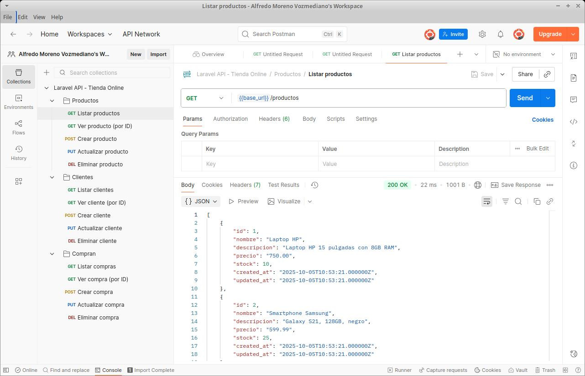

# 3. Desarrollo de un API REST con Laravel
{: .no_toc }

- TOC
{:toc}

Los **servicios web** son un tipo particular de aplicación web: una aplicación pensada no solo para ser usada por usuarios humanos, sino también por otras aplicaciones informáticas. 

Por esa razón, un servicio web puede que no genere HTML (vistas), sino datos, normalmente codificados como XML o JSON, que serán consumidos por otras aplicaciones informáticas.

Hay varios estándares de facto para crear servicios web. El más extendido es **REST**, que es el que vamos a estudiar, pero hay otros como **GraphQL** (en rápido crecimiento, sobre todo en aplicaciones ricas en datos), **gRPC** (muy usado para microservicios con necesidades alto rendimiento) o **SOAP** (más antiguo pero muy común en grandes empresas y organismos como banca, seguros o gobiernos).

Nosotros nos centraremos en REST. Una aplicación web que ofrezca en el servidor un interfaz que implemente este estándar se suele denominar **API REST**. En este tema, vamos a aprender a construir una aplicación API REST usando Laravel.

## 3.1. ¿Qué es un servicio web?

### 3.1.1. Una definición de servicio web

Un **servicio web** es una aplicación web capaz de **comunicarse e intercambiar información con otra aplicación** (que denominaremos *cliente*) independientemente de la plataforma en la que cada una se ejecute.

Es decir, el servicio web puede estar programado en PHP y correr bajo un sistema operativo GNU/Linux y el cliente puede estar programado con C# y correr bajo un Windows, y deberían ser capaces de comunicarse y trabajar juntas. Pero es importante que quede claro que, en este caso, la aplicación web (servidor) y la aplicación cliente *son dos aplicaciones diferentes*.

Los mensajes que las aplicaciones se intercambian generalmente tienen formato **JSON** o **XML**.

Existen dos estándares principales en la industria para implementar servicios web, denominados **SOAP** y **REST**, aunque hay otros en rápido crecimiento como **GraphQL** o **gRPC**. A lo largo el tema, vamos a aprender cómo funcionan los dos primeros.

### 3.1.2. Diferencias entre servicios web y aplicaciones web

Llegados a este punto, puede que estés pensando: "Vale, pero ¿en qué se diferencia un servicio web de una aplicación web MVC? ¿En una aplicación web no intercambian también el cliente y el servidor información independientemente de la plataforma en la que se ejecuta cada uno?".

Pues sí, pero hay algunas **diferencias entre un *servicio web* y una *aplicación web***:

* **Una aplicación web** está diseñada exclusivamente para que un ser humano interactúe con ella a través de un interfaz HTML. 
* **Un servicio web**, en cambio, está pensado para que lo pueda usar otra aplicación informática (el cliente), no necesariamente un ser humano.

Por ese motivo, los servicios web pueden carecer de interfaz de usuario y no producir salidas HTML legibles. Un servicio web puro, de hecho, **no suele tener vistas**, solo salidas XML o JSON pensadas para que los clientes las procesen.

Por lo demás, un servicio web puede tener una arquitectura *aproximadamente* MVC, y digo *aproximadamente* porque el servicio web, como acabo de contarte, puede carecer de vistas (aunque podría tenerlas). Pero seguirá conservando sus controladores y sus modelos. Los controladores se encargarán de convertir los datos de los modelos a JSON o XML y devolverlos al cliente, sin necesidad de crear vistas.

## 3.2. SOAP

**SOAP (Single Object Access Protocol)** es un mecanismo estandarizado para la implementación, descripción y publicación de servicios en red.

SOAP establece el modo en el que deben comportarse el cliente y el servidor para hablar entre sí, así como la forma en la que el servidor debe dar a conocer sus servicios.

El estándar SOAP fue durante mucho tiempo la forma "oficial" y más extendida de construir servicios web de tipo empresarial, sobre todo en entornos donde la robustez, la estandarización y la compatibilidad con herramientas de integración eran cruciales (por ejemplo, banca, seguros, telecomunicaciones). En la actualidad, sin embargo, pocos servicios se montan como SOAP, y se prefieren casi siempre alternativas más modernas como REST, GraphQL o gRPC.

Sin embargo, SOAP no está muerto ni mucho menos: todavía se usa ampliamente en sectores muy regulados y en sistemas antiguos (por ejemplo, servicios de facturación electrónica o sistemas de información gubernamentales).

**La pila de protocolos de SOAP**

El estándar **SOAP** define una serie de protocolos de niveles de abstracción crecientes. Esta colección de protocolos suele denominarse **pila de protocolos SOAP**, y son los siguientes:

Nivel de abstracción|Protocolo
-|-
Nivel de descubrimiento|UDDI
-|-
Nivel de publicación|UDDI
-|-
Nivel de descripción|WSDL
-|-
Nivel de mensajería|SOAP
-|-
Nivel de red|TCP, SMTP, FTP, etc

Como ves, SOAP solo es uno de los protocolos de la pila, aunque todo el tinglado recibe el nombre "SOAP" por extensión.

<div style='background-color: #ddd'><i>En este curso no vamos a ver cómo trabajar con SOAP, sino que simplemente lo mencionamos por su importancia histórica. En su lugar, nos vamos a centrar en el estándar más extendido en la actualidad entre servidores: REST.</i></div>

## 3.3. API REST

### 3.3.1. ¿Qué es un API REST?

**REST (Representational State Transfer)** es una arquitectura web para intercambiar información entre clientes y servidores de una red; es decir, es una arquitectura para diseñar servicios web.

Los términos **REST**, **API REST** y **RESTful** son casi como sinónimos, pero tienen sutiles diferencias:

* **REST** es una *arquitectura* para diseñar servicios web.
* **API REST** es un *interfaz de programación (API)* que sigue los principios REST. Es decir, es un servicio web que ofrece a los clientes una forma de interactuar acorde a la arquitectura REST.
* **RESTful** se refiere a una API que respeta escrupulosamente los principios de diseño REST. Algunas API REST son RESTful, pero otras introducen pequeñas variaciones sobre el estándar REST. Solo las que siguen al 100% los principios de diseño REST son RESTful.

A diferencia de SOAP, **REST está orientado a los datos**, esto es, proporciona siempre los mismos tipos de acceso a los recursos, sin posibilidad de definir nuevas operaciones.

Suele decirse, por esa razón, que *REST está orientado a los datos* mientras que *SOAP está orientado a los procesos*.

Actualmente, gran parte de las APIs, ya sean públicas o privadas, se programan según el diseño REST para que los programadores que las usen sepan qué esperar de la API sin necesidad de consultar farragosas páginas de documentación o de pelearse con el servidor mediante el infalible método de ensayo y error.

### 3.3.2. Las 7 operaciones REST

Un servidor REST debe implementar **siete operaciones de acceso a cada tipo de recurso**. 

Si no las implementa, ya no es REST. Podrá ser *aproximadamente* REST, pero no REST.

Los nombres de las operaciones, los datos que se esperan que se devuelvan y el verbo http de acceso deben respetarse escrupulosamente.

Imagina que estamos programando un servidor REST para acceder, por ejemplo, a un recurso llamado *Producto* dentro de una aplicación más grande (por ejemplo, una tienda online). En la siguiente tabla tienes las siete operaciones que un servidor REST puede realizar con ese recurso, es decir, con los productos de la base de datos. También te indico qué significa cada operación y un ejemplo típico de la URL que permitirá el acceso a través de https.

|Operación|Significado|Verbo|URL típica|
|---|---|---|---|
|index|Mostrar todos los productos|GET|https://servidor/producto/|
|show|Mostrar un producto|GET|https://servidor/producto/id|
|create|Mostrar formulario de creación de un producto|GET|https://servidor/producto/create|
|store|Crear un producto con los datos procedentes de un formulario|POST|https://servidor/producto/store|
|edit|Mostrar el formulario de edición de un producto|GET|https://servidor/producto/edit/id|
|update|Actualizar el producto con los datos procedentes del formulario|PUT o PATCH|https://servidor/producto/update/id|
|destroy|Eliminar un producto|DELETE|https://servidor/producto/destroy/id|

Hay una excepción a esta regla: las operaciones *create* y *edit* podrían no estar disponibles en algunas APIs REST, cuando estas estén diseñadas para que las usen otras aplicaciones y no seres humanos.

Soy consciente de que esta tabla necesita algunas explicaciones adicionales, así que vamos a ello.

En primer lugar, ¿qué es eso de los *verbos* que figura en cada petición?

### 3.3.3. Los verbos http: GET, POST, PUT, PATCH y DELETE

El protocolo http define dos tipos de petición al servidor, GET y POST. El estándar REST aumenta estos tipos en otros tres: PUT, PATCH y DELETE.

Veamos qué significa exactamente cada uno:

* **GET** se utiliza para *solicitar* datos al servidor. Por ejemplo: "Dame toda la información de un producto".
* **POST** se utiliza para *enviar* datos al servidor. Por ejemplo: "Aquí tienes toda la información de un producto; anda, almacénalo en tu base de datos".
* **PUT/PATCH** se utiliza para solicitar al servidor la modificación de datos que ya existen. Por ejemplo: "Este es el nuevo precio de un producto que ya estaba en tu base de datos. Tómalo y actualízalo".

   Si se van a actualizar *todos* los datos de un producto, se utiliza *PUT*. Si se va a actualizar solo *una parte* de los datos de un producto, se utiliza *PATCH*.

* **DELETE** se usa para solicitar la eliminación de datos en el servidor. Por ejemplo: "Elimina este producto".

Por ese motivo, en algunas URLs de la tabla anterior enviamos un id como parte de la ruta. Ese id indicará al servidor qué producto le estamos pidiendo que nos busque, modifique o elimine.

Una moraleja tal vez imprevista de esta tabla es que nunca deberías enviar datos al servidor mediante GET, puesto que GET solo tendría que usarse para *obtener* datos del servidor.

Otra moraleja es que el propio verbo de la petición http ya contiene información sobre lo que se le está pidiendo hacer al servidor. De hecho, en un servidor REST, contiene información fundamental. Por eso es tan importante respetar las convenciones.

Si ya has trabajado con HTML antes, seguro que conocías el significado de GET y POST, pero probablemente nunca habías oído hablar de PUT, PATCH y DELETE, ¿verdad?

### 3.3.4. El problema de PUT, PATCH y DELETE

Cuando solicitamos una URL a un servidor sin indicar otra cosa, el protocolo http/https asumirá que se trata de una petición GET.

Si en un formulario indicamos que el método de envío de los datos al servidor es POST, los datos que el usuario rellene en ese formulario se enviarán al servidor mediante POST, como parte del paquete http, en una zona especialmente dedicada a empaquetarlos:

```html
<form action='http://servidor/lo-que-sea' method='POST'>
...cuerpo del formulario
</form>
```

Pero **con HTML5 *no hay manera de hacer una petición al servidor por PUT, por PATACH o por DELETE***.

Esto se debe a que la implementación actual de http no contempla los verbos PUT, PATCH ni DELETE. Sin embargo, **en el estándar REST estos verbos son fundamentales**. 

Como a nosotros nos interesa construir servidores REST con acceso por http, es decir, vía web, aquí tenemos un grave problema.

Mientras llega una nueva implementación de http y/o de HTML, **este problema tiene dos soluciones temporales**:

* Sustituir las llamadas con PUT, PATCH o DELETE por llamadas POST convencionales. Esto hará que, en la práctica, nuestro servidor deje de ser REST, claro.
* Parchear las llamadas con PUT, PATCH o DELETE mediante un campo oculto (de tipo *hidden*) en el formulario. Esta es la forma en la que se realizan las implementaciones REST vía web en la actualidad. Tienes un ejemplo en este formulario:

```html
<form action='http://servidor/lo-que-sea' method='POST'>
   <input type='hidden' name='_method' value='PUT'>
   ...cuerpo del formulario...
</form>
```

Tal vez recuerdes que esto es exactamente lo que hace Laravel para implementar llamadas mediante PUT, PATCH o DELETE. ¿Qué dices? ¿Que no te acuerdas? Entonces quizá sea el momento de que retrocedas y repases un poco el enrutador de Laravel.

### 3.3.5. REST vs SOAP

Ya sabemos en qué consisten las dos grandes arquitecturas para construir servicios web. Ahora, la pregunta del millón: ¿cuál es mejor de las dos?

**SOAP es más flexible que REST**: permite definir nuevas operaciones sobre los recursos, mientras que REST está limitado a las 7 operaciones predefinidas.

**REST es mucho más sencillo de usar e implementar que SOAP**: las operaciones son bien conocidas y no es necesario describirlas (WSDL) ni publicarlas de ningún modo. Para usar un servidor REST, no hay que estudiarse ninguna API ni pelearse con estructuras de datos desconocidas.

Por todo ello, para la mayor parte de las aplicaciones REST es más que suficiente, y de ahí su mayor implantación en la actualidad.

## 3.4. Implementar un API REST con Laravel

### 3.4.1. Tips importantes antes de empezar...

Antes de lanzarte a implementar un API REST en Laravel, lee esta sección, por favor.

Para implementar un API REST con Laravel debes:

1. **Instalar el complemento para APIs de Laravel**. Esto solo es necesario a partir de Laravel 12 (en versiones anteriores ya venía "de serie"):

    ```bash
    $ php artisan install:api
    ```

2. **Crear la infraestructura de la base de datos**, como en cualquier aplicación web. La base de datos son los cimientos, así que tendrás que empezar por crear tus migraciones y, opcionalmente, tus *seeders*.

3. **Crear una arquitectura MVC para los recursos/datos que tengas que servir.**

   Con Laravel, esto se consigue con uno de estos comandos:

   ```bash
   $ php artisan make:controller --resource <nombre-controlador>
   $ php artisan make:controller --api <nombre-controlador>
   ```

    * **resource** creará las 7 rutas REST y los 7 métodos del controlador correspondiente. Está pensado para construir una API RESTful con la que puede interactuar cualquiera, tanto usuarios humanos como otras aplicaciones.

    * **api** creará solo 5 de las 7 rutas REST, junto con los 5 métodos del controlador. Está pensado para construir una API REST con la que interactuarán otras aplicaciones, pero no humanos, por lo que no ofrece las operaciones *create* ni *edit*, que muestran formularios.

4. **Devolver al cliente los datos formateados como JSON** en lugar de mostrarlos en una vista HTML. Puede usarse también XML, pero JSON es más habitual.

   Con Laravel, en lugar de hacer ```return view()``` al final de cada método del controlador, usaremos ```return response()->json(<datos>)```. Laravel se encargará de enviar ese valor devuelto al cliente.

5. **Respetar los nombres de los verbos y de las peticiones HTTP**, puesto que serán los que el cliente utilice. Recuerda que en una API RESTful estos son:

    * Verbos: *GET, POST, PUT, PATCH, DELETE*.

    * Peticiones: *index (GET), show (GET), create (GET), store (POST), edit (GET), update (PUT/PATCH), destroy (DELETE)*.

### 3.4.2. Un ejemplo completo

[(Haz clic aquí para acceder al código fuente completo de este ejemplo)](https://github.com/avozme/compras)

Ya estamos en condiciones de construir nuestro primer API REST con Laravel. En este ejemplo, serviremos los siguientes datos:

* **Productos** (id, nombre, descripcion, precio, stock): son los productos de una tienda online ficticia.
* **Clientes** (id, nombre, apellido1, apellido2 y email): son los clientes de la tienda online.
* **Compras** (cliente_id, producto_id, fecha, hora, unidades): es la relación N:N entre Productos y Clientes.

#### Migraciones

Lo primero es crear las migraciones con ```$ php artisan make:migration nombre_migracion```. Aquí te ofrezco un ejemplo de cómo podrían quedar: 

**Migración de Productos:** *database/migrations/\<timestamp\>_create_productos_table.php*

```php
<?php
use Illuminate\Database\Migrations\Migration;
use Illuminate\Database\Schema\Blueprint;
use Illuminate\Support\Facades\Schema;

return new class extends Migration {
    public function up() {
        Schema::create('productos', function (Blueprint $table) {
            $table->id();
            $table->string('nombre');
            $table->text('descripcion')->nullable();
            $table->decimal('precio', 10, 2);
            $table->integer('stock');
            $table->timestamps();
        });
    }
    public function down() {
        Schema::dropIfExists('productos');
    }
};
```

**Migración de Clientes:** *database/migrations/\<timestamp\>_create_clientes_table.php*

```php
<?php
use Illuminate\Database\Migrations\Migration;
use Illuminate\Database\Schema\Blueprint;
use Illuminate\Support\Facades\Schema;

return new class extends Migration {
    public function up() {
        Schema::create('clientes', function (Blueprint $table) {
            $table->id();
            $table->string('nombre');
            $table->string('apellido1');
            $table->string('apellido2')->nullable();
            $table->string('domicilio')->nullable();
            $table->string('email')->unique();
            $table->timestamps();
        });
    }
    public function down() {
        Schema::dropIfExists('clientes');
    }
};
```

**Migración de Compras** (pivote con atributos): *database/migrations/\<timestamp\>_create_compras_table.php*

```php
<?php
use Illuminate\Database\Migrations\Migration;
use Illuminate\Database\Schema\Blueprint;
use Illuminate\Support\Facades\Schema;

return new class extends Migration {
    public function up() {
        Schema::create('compras', function (Blueprint $table) {
            $table->id();
            $table->foreignId('producto_id')->constrained()->onDelete('cascade');
            $table->foreignId('cliente_id')->constrained()->onDelete('cascade');
            $table->date('fecha');
            $table->time('hora');
            $table->integer('unidades');
            $table->timestamps();
        });
    }
    public function down() {
        Schema::dropIfExists('compras');
    }
};
```

#### Modelos

Lo siguiente sería crear los modelos con ```php artisan make:model NombreModelo```. Aquí te muestro cómo podrían quedar para que reflejasen las relaciones entre las tablas mediante Eloquent.

**Modelo de Producto:** *app/Models/Producto.php*

```php
<?php
namespace App\Models;

use Illuminate\Database\Eloquent\Model;

class Producto extends Model {
    protected $fillable = ['nombre', 'descripcion', 'precio', 'stock'];

    public function clientes() {
        return $this->belongsToMany(Cliente::class, 'compras')
            ->withPivot('fecha', 'hora', 'unidades')
            ->withTimestamps();
    }
}
```

**Modelo de Cliente:** *app/Models/Cliente.php*

```php
<?php
namespace App\Models;

use Illuminate\Database\Eloquent\Model;

class Cliente extends Model {
    protected $fillable = ['nombre', 'apellido1', 'apellido2', 'domicilio', 'email'];

    public function productos() {
        return $this->belongsToMany(Producto::class, 'compras')
            ->withPivot('fecha', 'hora', 'unidades')
            ->withTimestamps();
    }
}
```

**Modelo de Compra** (pivote): *app/Models/Compra.php*

```php
<?php
namespace App\Models;

use Illuminate\Database\Eloquent\Model;

class Compra extends Model {
    protected $fillable = ['producto_id', 'cliente_id', 'fecha', 'hora', 'unidades'];

    public function producto() {
        return $this->belongsTo(Producto::class);
    }

    public function cliente() {
        return $this->belongsTo(Cliente::class);
    }
}
```

#### Controladores RESTful

El siguiente paso es crear los controladores. Los generaremos con estos comandos:

```bash
$ php artisan make:controller ProductoController --api
$ php artisan make:controller ClienteController --api
$ php artisan make:controller CompraController --api
```

Recuerda que usamos la opción ***api*** en lugar de ***resource*** para que nos genere 5 métodos REST, no los 7 RESTful, puesto que no necesitaremos los formularios de creación ni de edición (se trata de una API para que la usen otras aplicaciones, no un usuario humano).

Por ejemplo, así quedaría el **controlador de Productos:** *app/Http/Controllers/ProductoController.php*

```php
<?php
namespace App\Http\Controllers;

use App\Models\Producto;
use Illuminate\Http\Request;

class ProductoController extends Controller {
    public function index() {
        return response()->json(Producto::all(), 200);
    }

    public function store(Request $request) {
        $producto = Producto::create($request->all());
        return response()->json($producto, 201);
    }

    public function show($id) {
        return response()->json(Producto::findOrFail($id), 200);
    }

    public function update(Request $request, $id) {
        $producto = Producto::findOrFail($id);
        $producto->update($request->all());
        return response()->json($producto, 200);
    }

    public function destroy($id) {
        Producto::destroy($id);
        return response()->json(null, 204);
    }
}
```

Los controladores de clientes (*ClienteController*) y compras (*CompraController*) serán parecidos, es decir, un CRUD que devuelve los datos en formato JSON. Como hemos construido las relaciones entre los modelos con Eloquent, no es necesario hacer nada más: Laravel se encargará de buscar todos los datos relacionados entre sí con su "magia" interna.

#### Enrutador (Rutas API)

Como estamos construyendo una API pura, editaremos el enrutador ***routes/api.php*** en lugar de *routes/web.php*.

<div style='background-color: #ddd'><strong>¡¡OJO!!</strong> Si trabajas con Laravel 12 o posterior, el archivo <i>routes/api.php</i> no existirá. Debes instalar primero el soporte para APIs de Laravel con el comando <i>$ php artisan install:api</i></div>

```php
<?php
use App\Http\Controllers\ProductoController;
use App\Http\Controllers\ClienteController;
use App\Http\Controllers\CompraController;

Route::apiResource('productos', ProductoController::class);
Route::apiResource('clientes', ClienteController::class);
Route::apiResource('compras', CompraController::class);
```

El enrutador *routes/api.php* usa el ***middleware api***, que no maneja sesiones, cookies (es decir, que no tiene estado), ni ofrece protección contra el CSRF, por lo que solo se usa cuando no hay interacción directa entre el servidor y un usuario humano. Es decir, solo se usa en APIs puras. 

El enrutador *routes/web.php* usa el ***middleware web***, que sí controla el estado (sesiones y cookies) y ofrece protección contra CSRF. Si estás construyendo un API RESTful, que sí puede usarse por un usuario humano (con los métodos *create* y *edit*), es mejor enrutar de este modo.

#### Ejemplo de llamadas REST

Laravel está configurado para **usar el enrutador *api.php*** en lugar de *web.php* **en todos los *enpoints* que empiecen por /api**. Este comportamiento se puede cambiar, pero no hay necesidad de hacerlo en este ejemplo.

Nuestra API, por tanto, responderá con JSON a cualquier solicitud HTTP con el prefijo /api. Por ejemplo:

* **GET http://servidor/api/productos/1** → solicita los datos del producto con id 1. Recibirá como respuesta un JSON con este aspecto: 
  
  ```json
  { "id": 1, "nombre": "Teclado", "descripcion": "Mecánico", "precio": 29.99, "stock": 20 }
  ```

* **POST http://servidor/api/productos** → en este caso, el servidor esperará recibir en el cuerpo de la petición HTTP los datos del producto que tiene que almacenar. 

  El servidor desempaquetará esos datos y los guardará en la base de datos; y, si todo va bien, responderá con un JSON con los datos del producto que acaba de almacenar (parecido al JSON del ejemplo anterior)

  En caso de error al insertar el producto, nuestra aplicación no tiene un comportamiento definido, así que devolverá un JSON con el código y el mensaje del error. Se puede mejorar el controlador para que devuelva otra información en caso de que suceda un error.

## 3.5. Consumir el servicio web con Postman

### 3.5.1. Qué es Postman

Postman es una herramienta cliente para APIs muy popular que permite a desarrolladores **probar, documentar y automatizar peticiones a servicios web**. Es gratuita con opciones de pago.

Postman se usa para todas estas cosas:

* **Enviar peticiones HTTP** (GET, POST, PUT, PATCH, DELETE, etc.) hacia tu API y visualizar la respuesta.
* **Configurar headers y parámetros**. Por ejemplo, "Content-Type: application/json", tokens de autenticación, etc.
* **Enviar cuerpos de petición en JSON** para probar *endpoints*, es decir, URLs que esperan recibir datos en JSON para funcionar.
* **Visualizar las respuestas del servidor** en formato JSON, XML, texto, etc., junto con el código de estado HTTP.
* **Guardar colecciones de pruebas para reutilizarlas** o compartirlas con tu equipo (muy útil cuando varios desarrolladores trabajan con la misma API).
* **Automatizar pruebas**: puedes escribir scripts en JavaScript dentro de Postman para verificar automáticamente que las respuestas cumplen con lo esperado.
* **Generar documentación** de tu API a partir de las colecciones.

### 3.5.2. Instalación y puesta en marcha de Postman

**Opción 1: Instalar Postman como app de escritorio** (***RECOMENDADO***)

* Visita la web [https://www.postman.com/downloads/](https://www.postman.com/downloads/). Si usas Linux, puedes buscar antes en los repositorios oficiales de tu distribución, porque podría incluir Postman.
* Descarga e instala la versión más adecuada para tu sistema operativo.
* Inicia sesión (puedes usar Google o GitHub).

**Opción 2: Usar Postman en la nube**

* Accede a: [https://web.postman.com/](https://web.postman.com/)
* Inicia sesión y comienza a trabajar directamente en la nube.

**Ignorando el asistente de IA**

En las nuevas versiones de Postman aparece por defecto un **asistente de IA** al lanzar la aplicación. *Vamos a ignorar ese asistente para aprender a usar Postman nosotros, no una IA, que para eso estamos aquí*. 

Para ello, puedes escribir algo como "Quiero ir al interfaz clásico de Postman" en el cuadro de diálogo de la IA, o elegir la opción *File -> New Postman Window*.

Entonces obtendrás una pantalla como esta:


### 3.5.3. Cómo probar nuestro API REST

Vamos a ilustrar cómo funciona Postman con un **ejemplo práctico**: configurándolo para probar nuestro API REST de clientes, productos y compras que hemos implementado un poco más arriba.

#### Configura una colección en Postman

**Una colección es una serie de *request* o peticiones al servidor agrupados** bajo el mismo nombre. Son como carpetas donde organizar peticiones para poder reutilizarlas más tarde, algo habitual si estás en fase de desarrollo de una API.

La colección que nosotros vamos a crear nos permitirá lanzar todas las peticiones para trabajar con Productos, Clientes y Compras.

En Postman puedes crear una colección llamada, por ejemplo, **Tienda API**, o bien puedes usar la colección que viene creada por defecto, **MyCollection**. 

**Todo ello se hace en el panel izquierdo de Postman**.
   


#### Requests GET

Veamos como hacer un GET con Postman para comprobar si el API responde con los datos correctos.

Cada request tendrá la URL base de tu API. En todos los ejemplos vamos a suponer que es *https://servidor/api*, pero, lógicamente, tendrás que cambiarla por la tuya.

Pues bien: para hacer un **GET /productos** y guardar el request en nuestra colección solo tenemos que:

1. Hacer clic en los tres puntos junto al nombre de la colección y pulsar en *"Add request"*.
2. Escribir el *endpoint* o ruta ***https://servidor/api/productos*** en el cuadro de búsqueda.
3. Asegurarnos de tener seleccionado el **verbo GET**. 
4. Pulsar el **botón "Send"**.

El servidor nos debería devolver todos los productos empaquetados en un JSON:


#### Requests POST con datos

Si hacemos una petición como **POST /productos**, el estándar REST indica que estamos tratando de enviar los datos de un producto al servidor para que este lo almacene en la base de datos.

Por lo tanto, esta petición debe llevar los datos del producto empaquetados como JSON en el cuerpo (*body*) de la propia petición HTTP.

Esto se logra así en Postman:

1. **Crear una nueva *request*** en tu colección (haz clic en los 3 puntos junto al nombre de la colección y elige *"Add request"*).
2. **Escribir el *endpoint*** o ruta ***https://servidor/api/productos*** en el cuadro de búsqueda.
3. Asegurarnos de tener seleccionado el **verbo POST**.  
4. En el panel de la *request*, seleccionar la **pestaña "Body"**.
5. **Seleccionar "raw" y "JSON"** en los desplegables, pues vamos a enviar los datos como JSON en texto plano (raw).
6. **Escribir el objeto JSON** que deseamos enviar al servidor. Por ejemplo:

    ```json
    {
      "nombre": "Ratón inalámbrico",
      "descripcion": "Mouse óptico con USB",
      "precio": 25.90,
      "stock": 100
    }
    ```

7. Pulsar el **botón "Send"**.

El servidor responderá con un estado http 200 o 201 (si todo va bien) o con un error (estados 403, 404, 500 o cualquier otro). Además, puede enviarnos datos adicionales, como el id del recurso que acaba de crear o incluso **un JSON con todos los datos del recurso que acaba de crear**, como ocurre en el siguiente pantallazo:


#### Requests PUT, PATCH o DELETE

Del mismo modo que con POST podemos enviar *requests* con los verbos PUT, PATCH o DELETE, puesto que en el selector del método de envío encontraremos todos esos verbos.

### 3.5.4. Archivo de colección .json

Probablemente una de las formas más útiles de usar Postman como **herramienta de testeo de un API** es disponer de un archivo .json con todos los datos para lanzar los tests. 

Esto te permite preparar la batería de pruebas de una sola vez y utilizarla todas las veces que lo necesites. También es fácil hacer pequeños retoques en las pruebas y volver a cargar el .json en Postman.

Para usar Postman de este modo, debes:

1. **Crear tu archivo .json con la colección de tests**. No suele ser buena idea escribirlo a mano. Para esto puedes apoyarte en una IA como ChatGPT o la propia IA que viene integrada con Postman, a la que puedes pedir algo como esto: *"Genera un archivo .json con una colección para Postman con la que probar la siguiente una API REST basada en las siguientes tablas"*. Y, a continuación, detalla la estructura de tu base de datos.

2. **Importa tu archivo .json con la opción *"Import"* de Postman**. Se importará como una nueva colección. Si la colección ya existiera y te quedan dos con el mismo nombre, puedes borrar la que te sobre.

Y listo: solo con esto ya tendrás todos los *endpoints* listos para probar.



### 3.5.5. ¿Y qué más puede hacer Postman?

Postman es mucho más que una herramienta para probar endpoints; es una **plataforma completa de colaboración y automatización para APIs**.

Nosotros no vamos a ver mucho más en esta introducción, pero si quieres profundizar en ello, aquí tienes algunos de los trucos de magia que Postman puede realizar para ti:

* **Automatización de pruebas**: puedes escribir sripts en Javascript para validar las respuestas de forma automática o ejecutar múltiples peticiones en secuencia, así como ejecutar código antes y después de lanzar las peticiones.

* **Documentación de API**: Postman no solo puede generar automáticamente documentación de la API a partir de la colección, sino que también puede publicarla online y mantenerla actualizada.

* **Monitoreo**: con Postman se puede monitorear el estado de una API de forma automática a intervalos regulares y hacer que nos avise de cualquier mal funcionamiento.

* **Simulación de servidores**: Postman puede simular servidores inexistentes para pruebas más complejas.

* **Trabajo en equipo**: Puedes integrar Postman con GitHub, GitLab, Jenkins, etc.

* **Autenticación**: también puedes gestionar la autenticación por múltiples medios en aquellas APIs que la exijan antes de responder a *requests*.

## 3.6. Consumir el API REST con Javascript

Un API como el que hemos construido de ejemplo en esta unidad didáctica también **se puede consumir desde una web estática HTML por medio de Javascript**.

La idea es que Javascript puede llamar al servidor REST y recibir la respuesta JSON, y después crear dinámicamente los elementos HTML necesarios para mostrar esa respuesta JSON en la página que ya estaba cargada.

Te muestro a continuación un código que hace exactamente eso. Es decir, lo que vas a ver a continuación es **un frontend minimalista para el API REST** que hemos creado más arriba (Productos, Clientes y Compras), pero está hecho con Javascript clásico, sin apoyo de ningún framework. Es decir, como se hacía hasta el año 2010, más o menos.

**No es necesario que entiendas todo el código** que te presento aquí, basta con que lo comprendas genéricamente. Ten en cuenta, además, que este modo de programar los frontends cayó en desuso desde la aparición de frameworks como *Angular*.

**ARCHIVO index.html**

```html
<!DOCTYPE html>
<html lang="es">
<head>
  <meta charset="UTF-8">
  <title>Tienda SPA (JS clásico)</title>
  <style>
    body { font-family: sans-serif; margin: 2em; }
    nav a { margin-right: 1em; cursor: pointer; color: blue; text-decoration: underline; }
    table { border-collapse: collapse; width: 100%; margin-top: 1em; }
    th, td { border: 1px solid #ccc; padding: .5em; text-align: left; }
    input, textarea { width: 100%; margin-bottom: .5em; }
    button { padding: .4em .8em; margin-right: .5em; }
  </style>
</head>
<body>

  <h1>Tienda online (SPA sin framework)</h1>
  <nav>
    <a data-view="list">📋 Listar productos</a>
    <a data-view="create">➕ Nuevo producto</a>
  </nav>

  <div id="view"></div>

  <script src="app.js"></script>
</body>
</html>
```

**ARCHIVO app.js**

```javascript
const API_URL = "http://localhost/compras/api/productos";
const view = document.getElementById("view");

// --- Navegación SPA ---
document.querySelectorAll("nav a").forEach(link => {
  link.addEventListener("click", () => showView(link.dataset.view));
});

// Vista inicial
showView("list");

// --- Controlador de vistas ---
function showView(viewName, id = null) {
  if (viewName === "list") listProducts();
  if (viewName === "create") renderForm();
  if (viewName === "edit") loadProduct(id);
}

// --- Listar productos ---
async function listProducts() {
  view.innerHTML = "<h2>Lista de productos</h2><p>Cargando...</p>";
  try {
    const res = await fetch(API_URL);
    const productos = await res.json();
    view.innerHTML = `
      <h2>Lista de productos</h2>
      <table>
        <thead><tr><th>ID</th><th>Nombre</th><th>Precio</th><th>Stock</th><th>Acciones</th></tr></thead>
        <tbody>
          ${productos.map(p => `
            <tr>
              <td>${p.id}</td>
              <td>${p.nombre}</td>
              <td>${p.precio.toFixed(2)}</td>
              <td>${p.stock}</td>
              <td>
                <button onclick="showView('edit', ${p.id})">Editar</button>
                <button onclick="deleteProduct(${p.id})">Eliminar</button>
              </td>
            </tr>`).join("")}
        </tbody>
      </table>
    `;
  } catch (err) {
    view.innerHTML = `<p>Error al cargar productos: ${err}</p>`;
  }
}

// --- Formulario de creación / edición ---
function renderForm(producto = {}) {
  view.innerHTML = `
    <h2>${producto.id ? "Editar producto" : "Nuevo producto"}</h2>
    <form id="productForm">
      <input type="hidden" name="id" value="${producto.id || ""}">
      <label>Nombre:</label>
      <input name="nombre" value="${producto.nombre || ""}" required>
      <label>Descripción:</label>
      <textarea name="descripcion">${producto.descripcion || ""}</textarea>
      <label>Precio:</label>
      <input name="precio" type="number" step="0.01" value="${producto.precio || ""}" required>
      <label>Stock:</label>
      <input name="stock" type="number" value="${producto.stock || ""}" required>
      <button type="submit">${producto.id ? "Actualizar" : "Crear"}</button>
      <button type="button" onclick="showView('list')">Cancelar</button>
    </form>
  `;

  document.getElementById("productForm").addEventListener("submit", async (e) => {
    e.preventDefault();
    const formData = new FormData(e.target);
    const data = Object.fromEntries(formData.entries());
    data.precio = parseFloat(data.precio);
    data.stock = parseInt(data.stock);

    try {
      if (data.id) {
        await fetch(`${API_URL}/${data.id}`, {
          method: "PUT",
          headers: { "Content-Type": "application/json" },
          body: JSON.stringify(data)
        });
      } else {
        await fetch(API_URL, {
          method: "POST",
          headers: { "Content-Type": "application/json" },
          body: JSON.stringify(data)
        });
      }
      showView("list");
    } catch (err) {
      alert("Error al guardar: " + err);
    }
  });
}

// --- Cargar un producto para editar ---
async function loadProduct(id) {
  view.innerHTML = "<p>Cargando producto...</p>";
  try {
    const res = await fetch(`${API_URL}/${id}`);
    const producto = await res.json();
    renderForm(producto);
  } catch (err) {
    view.innerHTML = `<p>Error al cargar producto: ${err}</p>`;
  }
}

// --- Eliminar producto ---
async function deleteProduct(id) {
  if (!confirm("¿Seguro que quieres eliminar este producto?")) return;
  try {
    await fetch(`${API_URL}/${id}`, { method: "DELETE" });
    listProducts();
  } catch (err) {
    alert("Error al eliminar: " + err);
  }
}
```

Observa que, con esto, hemos construido nuestra primera **aplicación SPA** o *single page application*. Pero hacerlo de este modo tiene varios problemas:

* **No es escalable**. Imagina lo que habría que montar para añadir clientes, compras y otras entidades de datos: necesitaríamos decenas de vistas, cientos de eventos, validaciones, etc. El código se volvería rápidamente inmanejable.
* **No es reactivo**. Hay que re-renderizar manualmente la página tras cada cambio en los datos.
* **No tiene código reutilizable**. Todo está en funciones y cadenas HTML, diferentes para cada recurso.
* **Enrutamiento manual**. El *routing* se hace cambiando el contenido del *div "view"*.

Para solventar estos problemas existen los frameworks como **Angular, Vue.js o React**, entre otros. Nos adentraremos en ellos en la próxima unidad didáctica y construiremos un frontend SPA como se hace en la actualidad.

## 3.7. Práctica: construir un API REST sobre la Tierra Media

En esta práctica vamos a crear una base de datos con información sobre la **Tierra Media** (el universo ficticio de Tolkien). Posteriormente escribiremos una API REST con Laravel que acceda a esos datos y probaremos a consumirlos con Postman.

<div style='background-color: #ddd; font-size: 80%'><i>
Por si hay alguien que no sepa de qué va esto, digamos que la Tierra Media es un universo de ficción creado por el escritor británico J. R. R. Tokien en sus obras "El hobbit" y "El señor de los anillos".<br><br> 
La Tierra Media o Middle Earth cuenta con una detallada geografía inventada (con reinos, regiones y accidentes geográficos de todo tipo) y está poblado varias razas de criaturas como hombres, elfos, enanos, hobbits u orcos. Existen muchos personajes con nombre propio y multitud de objetos importantes que intervienen en las historias de Tolkien. <br><br>Por supuesto, no es necesario que conozcas este universo ni a sus personajes para realizar este ejercicio, aunque probablemente es más divertido si los conoces.</i></div>

### Paso 1: crear la infraestructura

#### Tablas de la base de datos

Basaremos nuestra API en la siguiente base de datos (respeta escrupulosamente los nombres de las tablas y las columnas para evitar posteriores conflictos).
 
**TABLAS MAESTRAS**:

* **realms** (reinos): id, name (Rohan, Gondor, Mordor, etc.), ruler (nombre del rey o líder), alignment (Bien / Mal / Neutral), id_region (clave ajena)
* **heroes**: id, name, race (humano, elfo, enano, hobbit, orco…), rank (capitán, explorador, etc.), realm_id (clave ajena), alive (boolean)
* **creatures** (criaturas): id, name, species (trol, huargo, araña gigante, nazgûl…), threat_level (nivel de amenaza, de 1 a 10), id_region (clave ajena)
* **artifacts** (artefactos u objetos): id, name, type (espada, anillo, gema, libro…), origin_realm_id (clave ajena), power_level (1–100), description
* **region**: id, name

**TABLAS PIVOTE** (relaciones N:N):

* **artifact_hero**: relación N:N entre *heroe* y *artifact* (hero_id, mission_id)

#### Migraciones

**Migración de la tabla *regions***

```php
use Illuminate\Database\Migrations\Migration;
use Illuminate\Database\Schema\Blueprint;
use Illuminate\Support\Facades\Schema;

return new class extends Migration {
    public function up() {
        Schema::create('regions', function (Blueprint $table) {
            $table->id();
            $table->string('name');
            $table->timestamps();
        });
    }

    public function down() {
        Schema::dropIfExists('regions');
    }
};
```

**Migración de la tabla *realms***

```php
use Illuminate\Database\Migrations\Migration;
use Illuminate\Database\Schema\Blueprint;
use Illuminate\Support\Facades\Schema;

return new class extends Migration {
    public function up() {
        Schema::create('realms', function (Blueprint $table) {
            $table->id();
            $table->string('name');
            $table->string('ruler');
            $table->string('alignment');
            $table->foreignId('region_id')->constrained('regions');
            $table->timestamps();
        });
    }

    public function down() {
        Schema::dropIfExists('realms');
    }
};
```

**Migración de la tabla *heroes***

```php
use Illuminate\Database\Migrations\Migration;
use Illuminate\Database\Schema\Blueprint;
use Illuminate\Support\Facades\Schema;

return new class extends Migration {
    public function up() {
        Schema::create('heroes', function (Blueprint $table) {
            $table->id();
            $table->string('name');
            $table->string('race');
            $table->string('rank')->nullable();
            $table->foreignId('realm_id')->constrained('realms');
            $table->boolean('alive')->default(true);
            $table->timestamps();
        });
    }

    public function down() {
        Schema::dropIfExists('heroes');
    }
};
```

**Migración de la tabla *creatures***

```php
use Illuminate\Database\Migrations\Migration;
use Illuminate\Database\Schema\Blueprint;
use Illuminate\Support\Facades\Schema;

return new class extends Migration {
    public function up() {
        Schema::create('creatures', function (Blueprint $table) {
            $table->id();
            $table->string('name');
            $table->string('species');
            $table->unsignedTinyInteger('threat_level');
            $table->foreignId('region_id')->constrained('regions');
            $table->timestamps();
        });
    }

    public function down() {
        Schema::dropIfExists('creatures');
    }
};
```

**Migración de la tabla *artifacts***

```php
use Illuminate\Database\Migrations\Migration;
use Illuminate\Database\Schema\Blueprint;
use Illuminate\Support\Facades\Schema;

return new class extends Migration {
    public function up() {
        Schema::create('artifacts', function (Blueprint $table) {
            $table->id();
            $table->string('name');
            $table->string('type');
            $table->foreignId('origin_realm_id')->constrained('realms');
            $table->unsignedTinyInteger('power_level');
            $table->text('description')->nullable();
            $table->timestamps();
        });
    }

    public function down() {
        Schema::dropIfExists('artifacts');
    }
};
```

**Migración de la tabla pivote *artifact_hero***

```php
use Illuminate\Database\Migrations\Migration;
use Illuminate\Database\Schema\Blueprint;
use Illuminate\Support\Facades\Schema;

return new class extends Migration {
    public function up() {
        Schema::create('artifact_hero', function (Blueprint $table) {
            $table->id();
            $table->foreignId('artifact_id')->constrained('artifacts');
            $table->foreignId('hero_id')->constrained('heroes');
            $table->timestamps();
        });
    }

    public function down() {
        Schema::dropIfExists('artifact_hero');
    }
};
```

#### Seeders

Te dejo aquí algunos Seeders por si quieres rellenar tus tablas con algunos datos de prueba. Por supuesto, si lo prefieres, puedes inventarte tus propios datos o utilizar *Faker* para que sea Laravel quien se los invente.

**Seeder de la tabla *regions***

```php
use Illuminate\Database\Seeder;
use Illuminate\Support\Facades\DB;

class RegionsSeeder extends Seeder {
    public function run() {
        DB::table('regions')->insert([
            ['name' => 'Eriador'],
            ['name' => 'Rhovanion'],
            ['name' => 'Mordor'],
            ['name' => 'Gondor'],
            ['name' => 'Rohan'],
        ]);
    }
}
```

**Seeder de la tabla *realms***

```php
use Illuminate\Database\Seeder;
use Illuminate\Support\Facades\DB;

class RealmsSeeder extends Seeder {
    public function run() {
        DB::table('realms')->insert([
            ['name' => 'Gondor', 'ruler' => 'Aragorn', 'alignment' => 'Bien', 'region_id' => 4],
            ['name' => 'Rohan', 'ruler' => 'Éomer', 'alignment' => 'Bien', 'region_id' => 5],
            ['name' => 'Mordor', 'ruler' => 'Sauron', 'alignment' => 'Mal', 'region_id' => 3],
            ['name' => 'Erebor', 'ruler' => 'Thorin', 'alignment' => 'Bien', 'region_id' => 2],
        ]);
    }
}
```

**Seeder de la tabla *heroes***

```php
use Illuminate\Database\Seeder;
use Illuminate\Support\Facades\DB;

class HeroesSeeder extends Seeder {
    public function run() {
        DB::table('heroes')->insert([
            ['name' => 'Aragorn', 'race' => 'Humano', 'rank' => 'Rey', 'realm_id' => 1, 'alive' => true],
            ['name' => 'Legolas', 'race' => 'Elfo', 'rank' => 'Arquero', 'realm_id' => 2, 'alive' => true],
            ['name' => 'Gimli', 'race' => 'Enano', 'rank' => 'Guerrero', 'realm_id' => 4, 'alive' => true],
            ['name' => 'Frodo', 'race' => 'Hobbit', 'rank' => 'Portador', 'realm_id' => 1, 'alive' => true],
        ]);
    }
}
```

**Seeder de la tabla *creatures***

```php
use Illuminate\Database\Seeder;
use Illuminate\Support\Facades\DB;

class CreaturesSeeder extends Seeder {
    public function run() {
        DB::table('creatures')->insert([
            ['name' => 'Balrog', 'species' => 'Demonio', 'threat_level' => 10, 'region_id' => 2],
            ['name' => 'Nazgûl', 'species' => 'Espectro', 'threat_level' => 9, 'region_id' => 3],
            ['name' => 'Warg', 'species' => 'Lobo', 'threat_level' => 6, 'region_id' => 2],
            ['name' => 'Troll', 'species' => 'Troll', 'threat_level' => 7, 'region_id' => 5],
        ]);
    }
}
```

**Seeder de la tabla *artifacts***

```php
use Illuminate\Database\Seeder;
use Illuminate\Support\Facades\DB;

class ArtifactsSeeder extends Seeder {
    public function run() {
        DB::table('artifacts')->insert([
            ['name' => 'Anillo Único', 'type' => 'Anillo', 'origin_realm_id' => 3, 'power_level' => 100, 'description' => 'Poder absoluto de Sauron'],
            ['name' => 'Andúril', 'type' => 'Espada', 'origin_realm_id' => 1, 'power_level' => 85, 'description' => 'Espada de Aragorn'],
            ['name' => 'Arco de Legolas', 'type' => 'Arco', 'origin_realm_id' => 2, 'power_level' => 70, 'description' => 'Arco del príncipe elfo'],
        ]);
    }
}
```

**Seeder de la tabla pivote *artifact_hero***

```php
use Illuminate\Database\Seeder;
use Illuminate\Support\Facades\DB;

class ArtifactHeroSeeder extends Seeder {
    public function run() {
        DB::table('artifact_hero')->insert([
            ['artifact_id' => 1, 'hero_id' => 4], // Frodo lleva el Anillo Único
            ['artifact_id' => 2, 'hero_id' => 1], // Aragorn lleva la espada Andúril
            ['artifact_id' => 3, 'hero_id' => 2], // Legolas lleva el "Arco de Legolas" (claro)
        ]);
    }
}
```

### Paso 2: escribir el API

**Crea con Laravel un API REST** para acceder a los datos de las tablas anteriores. Los ***endpoints*** a los que debería responder este API son estos:

**Regiones (regions)**

* GET	/regions --> Listar todas las regiones
* GET	/regions/{id} --> Obtener los datos de una región concreta
* POST	/regions --> Crear una nueva región
* PUT	/regions/{id} --> Actualizar una región existente
* DELETE	/regions/{id} --> Eliminar una región

**Reinos (realms)**

* GET	/realms --> Listar todos los reinos
* GET	/realms/{id} --> Mostrar detalles de un reino, incluyendo región, héroes y artefactos
* POST	/realms --> Crear un nuevo reino
* PUT	/realms/{id} --> Actualizar un reino existente
* DELETE	/realms/{id} --> Eliminar un reino

**Héroes (heroes)**

* GET	/heroes --> Listar todos los héroes
* GET	/heroes/{id} --> Mostrar detalles de un héroe, incluyendo reino y artefactos
* POST	/heroes --> Crear un nuevo héroe
* PUT	/heroes/{id} --> Actualizar un héroe existente
* DELETE	/heroes/{id} --> Eliminar un héroe

**Criaturas (creatures)**

* GET	/creatures --> Listar todas las criaturas
* GET	/creatures/{id} --> Mostrar detalles de una criatura, incluyendo región
* POST	/creatures --> Crear una nueva criatura
* PUT	/creatures/{id} --> Actualizar una criatura existente
* DELETE	/creatures/{id} --> Eliminar una criatura

**Artefactos (artifacts)**

* GET	/artifacts --> Listar todos los artefactos
* GET	/artifacts/{id} --> Mostrar detalles de un artefacto, incluyendo reino y héroes que lo poseen
* POST	/artifacts --> Crear un nuevo artefacto
* PUT	/artifacts/{id} --> Actualizar un artefacto existente
* DELETE	/artifacts/{id} --> Eliminar un artefacto


**Asignación de artefactos a héroes (artifact_hero)**

* POST	/artifact-hero --> Asignar un artefacto a un héroe (insert en pivot)
* DELETE	/artifact-hero --> Retirar un artefacto de un héroe
* GET	/heroes/{id}/artifacts --> Listar todos los artefactos de un héroe
* GET	/artifacts/{id}/heroes --> Listar todos los héroes que poseen un artefacto

**Endpoints adicionales (opcionales)**

* /realms/{id}/heroes --> listar héroes de un reino específico
* /regions/{id}/creatures --> listar criaturas de una región específica
* /heroes/alive --> listar héroes vivos
* /creatures/dangerous?level=8 --> listar criaturas con amenaza alta
* /artifacts/top --> listar artefactos con power_level mayor a 90

### Paso 3: probar y consumir el API

Vamos a terminar comprobando si el API que hemos construido realmente funciona.

1. **Prueba algunos de los endpoints** anteriores creando *manualmente* algunas peticiones en una colección de Postman.
2. **Prueba todos los endpoints**:
    * Genera, con ayuda de ChatGPT u otra IA generativa, un archivo .json para probar *todos* los endpoints anteriores.
    * Importa el .json en Postman.
    * Lanza todos los *requests* para comprobar si tu API funciona con todas las peticiones.
