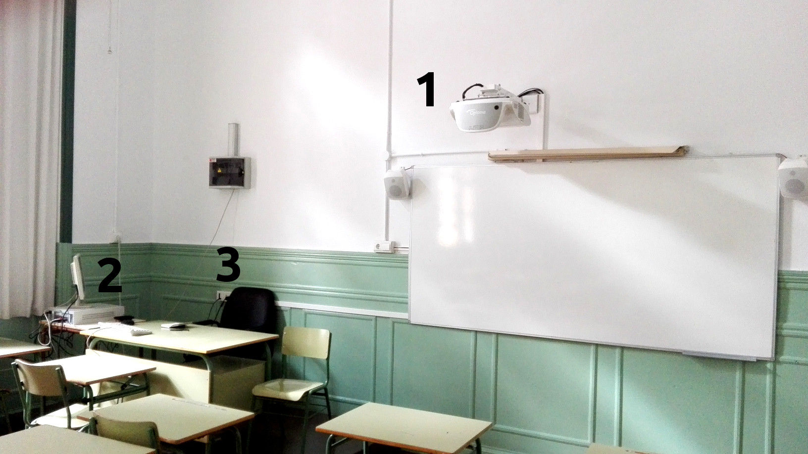
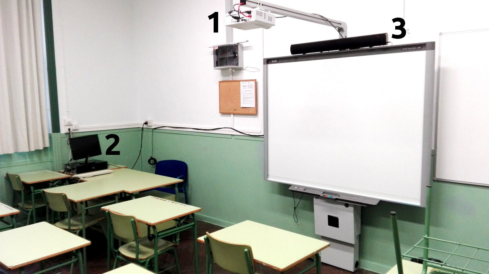
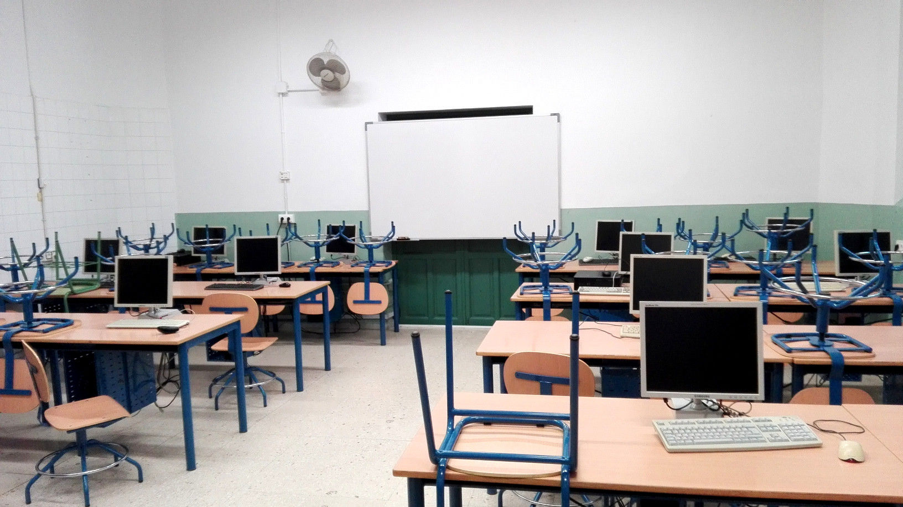
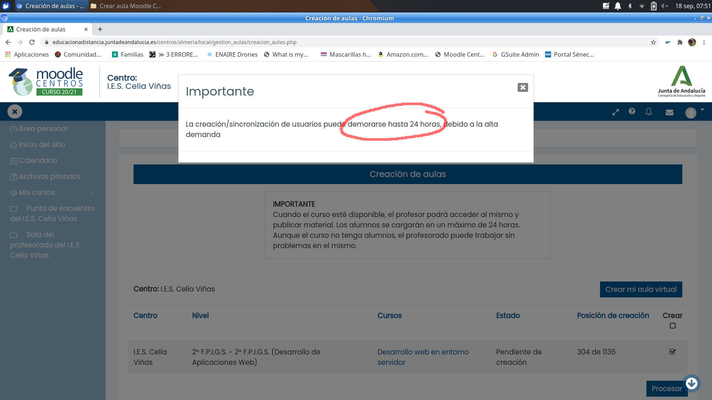
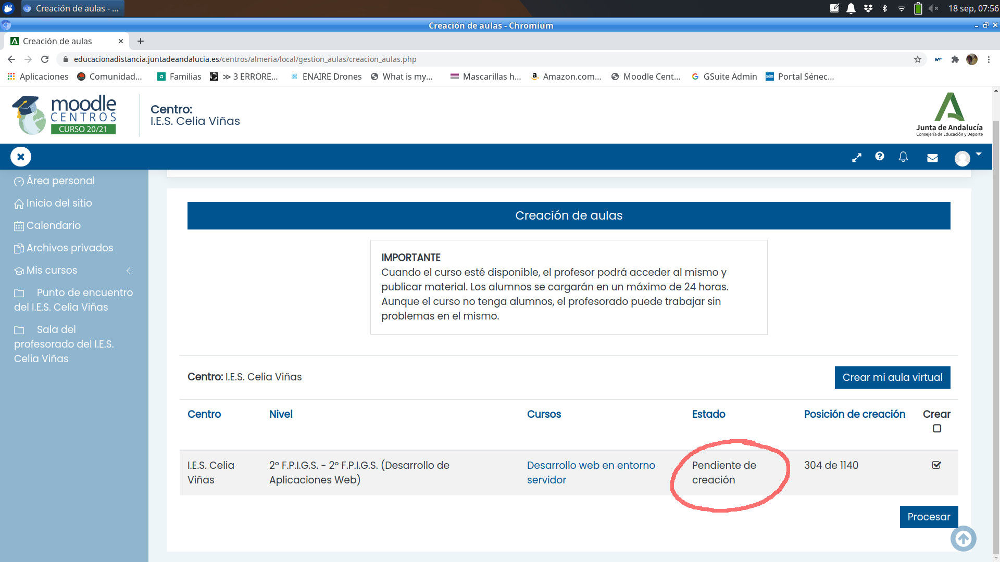
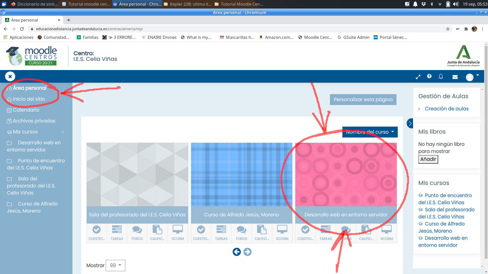
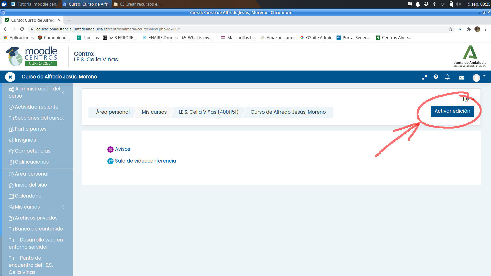
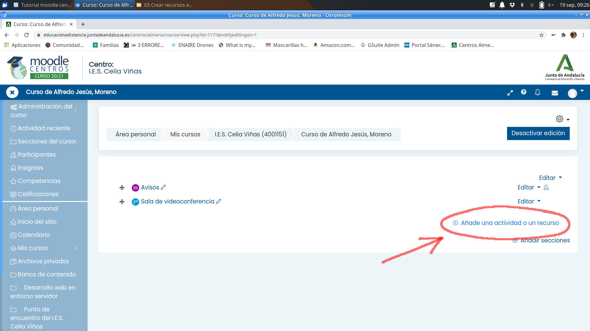
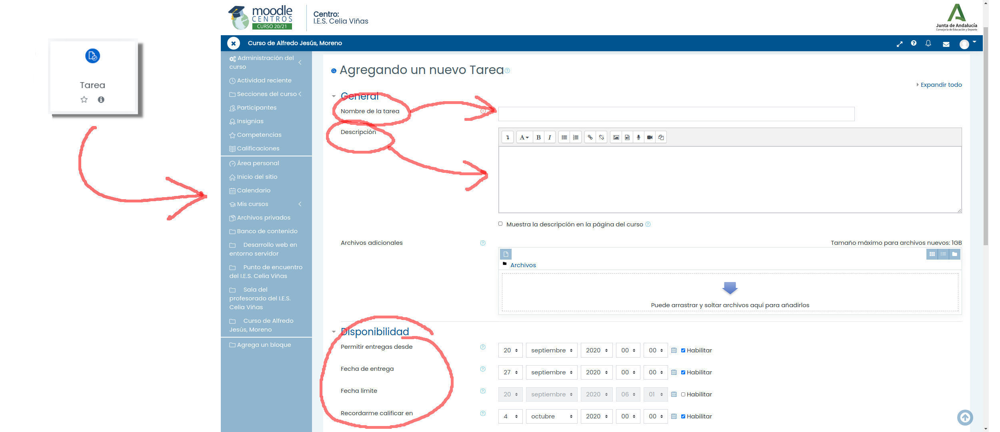
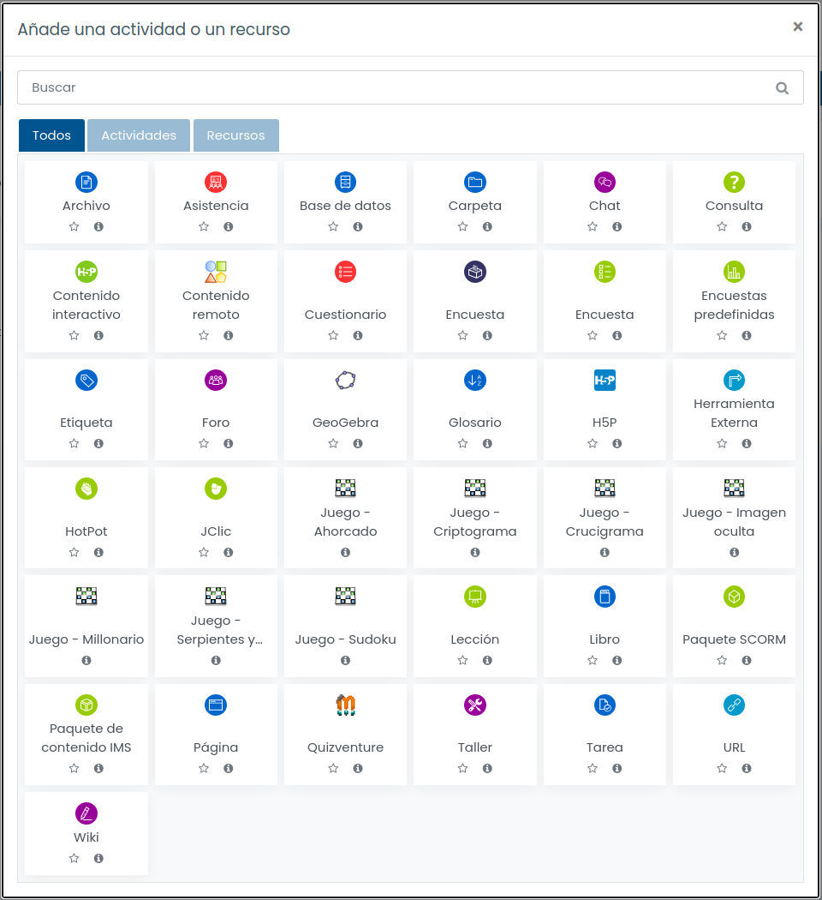

IES CELIA VIÑAS | PLAN DE TRANSFORMACIÓN DIGITAL EDUCATIVA

# Guía de buenas prácticas #TDE

Este documento es una guía de uso responsable de los equipos informáticos del IES Celia Viñas de Almería (España).

Esta documentación incluye un resumen de las normas y posibilidades de uso de todos los medios informáticos con los que cuenta el IES Celia Viñas, así como las ideas clave sobre protección de datos y sostenibilidad medioambiental.

Utiliza el menú de la izquierda para acceder a las distintas secciones.

Puedes enviar cualquier sugerencia por email a buzontic@iescelia.org

# 1. Medios informáticos del centro

En esta sección presentamos un resumen de las características de los medios informáticos con los que cuenta el IES Celia Viñas para uso del profesorado y el alumnado: tipología, ubicación, organización y gestión.

## 1.1. Carritos de portátiles

**¿Qué son los carritos de portátiles?**

Son carritos móviles con capacidad para 10 ordenadores portátiles cada uno, aunque, más a menudo de lo que nos gustaría, son menos de 10 los que están operativos. 

El centro dispone de 5 carritos de estas características distribuidos de la siguiente forma:
* Planta baja: 1 carrito en junto a la puerta de la Secretaría.
* Planta primera: 2 carritos en el Departamento de Física y Química. La llave está disponible en Conserjería.
* Planta segunda: 2 carritos en el Laboratorio de Ciencias Naturales. La llave está disponible en Consejería.

**¿A quién están destinados?**

Los ordenadores portátiles de los carritos están destinados al alumnado para su uso durante el horario de clases y siempre bajo la supervisión y responsabilidad de un miembro del profesorado.

**¿Cómo puedo utilizarlos?**

Para usar un carrito de portátiles, el procedimiento general es el siguiente:

* Reservarlo en el cuadrante horario correspondiente dispuesto en el tablón de anuncios TIC (en la Sala de Profesores)
* Conseguir la llave de la dependencia donde se ubiquen los carritos que se han reservado (las llaves están en Conserjería o en Jefatura de Estudios; véase apartado anterior)
* Acceder a la dependencia y desenchufar los carritos de la toma de corriente.
* Llevar los carritos hasta el aula. Aunque son pesados, se transportan con facilidad porque disponen de ruedas.
* Repartir los ordenadores entre el alumnado y velar por que se usen adecuadamente (de vez en cuando sufrimos epidemias de extracción de teclas o de decoración de los portátiles con pegatinas de diverso pelaje y condición)
* Al final de la clase, vigilar la reposición de los ordenadores a sus lugares originales. Para que los siguientes compañeros no los encuentren descargados, hay que dejarlos conectados a sus respectivos cargadores.
* Devolver el carrito a la dependencia en la que se encontraba, enchufarlo de nuevo a la corriente y devolver la llave.

MUY IMPORTANTE: si se detecta una incidencia en cualquier ordenador, es imprescindible hacerla llegar al coordinador TIC a la mayor brevedad posible. Más información en el apartado “Gestión de incidencias”

## 1.2. Equipos del profesorado en aulas generales

Todas las aulas del centro están equipadas con, al menos, un ordenador de sobremesa y un cañón/proyector con pizarra interactiva (PDI). Algunas tienen otra equipación adicional que se describe más abajo.

Estos ordenadores están destinados al uso del profesorado durante el ejercicio de su docencia.

Actualmente, hay cuatro modalidades de aula con pizarra interactiva (PDI) diferentes en el centro. Aunque todos tienen la misma funcionalidad, varían ligeramente en su forma de uso.

**Aulas 1, 2, 4, 5, 9 y 11: pizarras Promethean**

Algunos de estos ordenadores se encienden con un interruptor en el pie del monitor. La mayoría se encienden directamente pulsando el interruptor del ordenador.

Estas PDI están obsoletas y no funcionan correctamente como tales con los sistemas operativos recientes. Solo es posible utilizarlas como proyectores.

El procedimiento de puesta en marcha de estas prizarras es el siguiente:
* Encender el proyector.
* Encender el ordenador.
* Si es necesario, encender los altavoces. El interruptor está en un lateral de la pizarra. Si están apagados, el interruptor lucirá en rojo. Si están encendidos, lo hará en verde.
* Introducir el usuario y contraseña para usar el ordenador. Para más información sobre este punto, véase el apartado “Usuarios y contraseñas”

**Aulas 7, 10, 12, 15, 18, 25, 26, 27 y 28: pizarras blancas con cañones Optoma**

Todos estos ordenadores se encienden pulsando el interruptor del mismo. Puede ser necesario conectar la electricidad encendiendo una regleta que suele estar acoplada a la mesa o situada en el suelo.

Estas PDI necesitan el uso de un puntero específico que puede solicitarse al equipo de coordinación TDE.

Para utilizarlas, el procedimiento es el siguiente:
1. Encender el proyector.
2. Encender el ordenador.
3. Si es necesario, encender los altavoces.
    * En algunas aulas, el interruptor de los altavoces está situado en un cajetín blanco en la pared. El cajetín dispone de tres botones: on/off, subir volumen y bajar volumen. Manteniendo pulsado el botón on/off, los altavoces se encienden y se apagan, pero, si se pulsa solo un instante, se cambia de canal. Los ordenadores están conectados en el canal 1 (por el canal 2 no se escuchará nada).
    * En otras aulas, el interruptor es un mando giratorio situado tras uno de los altavoces. Ese mando también controla el volumen. Lo normal es que siempre estén encendidos. 
4. Introducir el usuario y contraseña para usar el ordenador. Para más información sobre este punto, véase el apartado “Usuarios y contraseñas”

**Aulas 6, 13, 14, 16, 17 y 19: pizarras Smartboard**

Estas pizarras están controladas por un miniordenador llamado NUC incorporado bajo la misma. Puede accionarse con el dedo, sin ningún puntero.

En estas aulas existe un segundo ordenador, situado en la mesa del profesor, que solo sirve para proyectar imágenes (no como pizarra interactiva), y que puede manejarse con el teclado y el ratón convencionales.

Para usar estas pizarras con el miniordenador NUC, el procedimiento es:
1. Encender el proyector.
2. Cuando la imagen azul se vea claramente en la pizarra y aparezca la leyenda “HDMI” sobreimpresionada, encender el ordenador NUC. El NUC es la cajita negra que hay bajo la pizarra, casi a ras de suelo.
3. Encender el tablero táctil con el interruptor grueso que hay en la botonera la pizarra.
4. Encender, si es necesario, los altavoces (sobre la pizarra). Tienen dos canales, y se cambia de uno a otro pulsando el botón de encendido un instante. Si se mantiene pulsado, los altavoces se apagan. La luz roja indica “altavoz apagado”. La luz verde es el “canal 1”, al que está conectado este ordenador.

Observa que este ordenador se usa exclusivamente con la pizarra interactiva (como si fuera una tableta gigante), pero es posible conectarle un teclado y/o un ratón en los puertos USB que hay en el NUC.

Si prefieres usar esta PDI como simple proyector con el ordenador de sobremesa, el procedimiento es:
1. Encender el proyector.
2. Encender el ordenador.
3. Encender, si es necesario, los altavoces (sobre la pizarra). Tienen dos canales, y se cambia de uno a otro pulsando el botón de encendido un instante. Si se mantiene pulsado, los altavoces se apagan. La luz roja indica “altavoz apagado”. La luz naranja es “canal 2”, al que está conectado este ordenador.

Fíjate que la botonera de la pizarra y las funciones táctiles no están contectadas con este ordenador. Para hacer uso de esas funciones, hay que utilizar el NUC (véase más arriba, “Modelo 3 con la PDI Smartboard”)

**Aulas 20 y 21: pizarra Toshiba (aulas 20 y 21)**

Algunas aulas específicas de los ciclos formativos poseen PDIs obsoletas que no describiremos en este documento.

**Resto de aulas**

El resto de aulas disponen de cañones proyectores (sin PDI) o televisores de gran formato.

## 1.3. Usuarios y contraseñas

Todos los ordenadores del centro, tanto los de sobremesa como los portátiles, tienen creado el usuario estándar de la Junta de Andalucía.

* Usuario: usuario
* Contraseña: usuario

Si alguien necesita disponer de un usuario personalizado en alguno de los ordenadores, puede solicitarlo al coordinador TDE. No obstante, se recomienda encarecidamente no dejar archivos personales en ninguno de los ordenadores del centro.

## 1.4. Aulas de informática

Estas aulas son para uso del alumnado de secundaria, bachillerato y adultos, siempre bajo la supervisión de un profesor/a responsable.

Dejando de lado las aulas específicas de los Ciclos Formativos, el centro dispone en este momento de un aula de informática con capacidad para 30 puestos y 60 personas.

**Ubicación de las aulas de informática**

El aula de informática está actualmente ubicada en la Biblioteca del centro (primera planta).

**Cómo usar las aulas de informática**

El procedimiento general para usar estas aulas es el siguiente:

1. Reservar el uso del aula en el cuadrante horario dispuesto en el tablón de anuncios TDE (en la Sala de Profesores)
2. Conseguir la llave del aula (disponible en Conserjería)
3. Al final de la clase, asegurarse de que todos los equipos han sido apagados y se encuentran en buen estado.
4. Devolver la llave.

MUY IMPORTANTE: si se detecta una incidencia en cualquier ordenador, se ruega comunicarla al coordinador TDE lo antes posible. Asimismo, si el alumnado detecta cualquier problema ANTES de usar el equipo, debe comunicarla al profesor/a con el mismo objetivo.

Más información en el apartado “Gestión de averías e incidencias”

## 1.5. Otros medios

El IES Celia Viñas dispone de otros muchos medios relacionados con las TIC. Sus características son tan variadas que enumerarlas aquí no tiene sentido. Nos limitaremos a dar una lista de los medios con los que contamos. 

Para cualquier consulta o incidencia relacionada con su uso, por favor, recurre al coordinador TIC.
* Ordenadores e impresoras de uso común en la sala de profesores y la sala de juntas.
* Ordenadores y proyectores en las aulas multimedia del sótano (religión, inglés, francés y arte)
* Ordenadores y proyector del taller de tecnología.
* Ordenadores del aula de pedagogía terapéutica.
* Ordenadores para uso del alumnado en la biblioteca.
* Ordenador para uso del profesorado encargado de la biblioteca.
* Ordenadores e impresoras de los diversos departamentos didácticos, del equipo directivo y del personal de administración.
* Ordenador ubicado en la conserjería y conectado al televisor del hall para proyección de presentaciones y vídeos.
* Ordenador y proyector del salón de actos.
* Ordenador y proyector del laboratorio de ciencias naturales.
* Ordenador y proyector del aula de música.
* Ordenadores y proyectores de las aulas específicas de los ciclos formativos de informática.
* Servidor TIC, puntos de acceso inalámbrico y switches de planta programables.

## 1.6. Gestión de incidencias

**Procedimiento general**

La mayor parte de las incidencias cotidianas tienen una fácil solución que cualquier usuario puede intentar (véase la sección “Preguntas frecuentes”)

Si la incidencia parece más grave, se debe poner en conocimiento del coordinador TDE para acometer su resolución con la mayor agilidad posible. Esto es particularmente importante en el caso de los equipos del alumnado que pasan por muchas manos al cabo del día. Si todos somos diligentes en ello, podremos disfrutar de una equipación en buen estado durante mucho tiempo.

**Cómo contactar con el coordinador TDE**

Es muy importante poner la incidencia por escrito. Comentársela al coordinador TDE en un pasillo o en el semáforo de la rambla a las tres de la tarde puede tener un cierto valor terapéutico, pero poca utilidad práctica.

Existe un parte de incidencias que se puede rellenar en menos de un minuto. 

El procedimiento recomendado es el siguiente:
* Conseguir un parte de incidencia. Siempre existen ejemplares disponibles en el tablón TDE de la sala de profesores y sobre la mesa del coordinador TDE.
* Dedicar unos segundos a rellenarlo, intentando ser explícito con el problema y el equipo al que afecta.
* Hacer llegar el parte al coordinador TDE por alguno de estos medios:
    * En persona (su horario estará expuesto en el tablón TDE, en la sala de profesores)
    * Dejándoselo sobre su mesa.
Clavándolo con una chincheta en el tablón TDE de la sala de profesores.

**El peliagudo caso de los carritos de portátiles**

Los carritos de portátiles y, en menor medida, las aulas de informática del sótano, son una fuente inagotable de incidencias porque son usados durante muchas horas al día por un alumnado cambiante.

En estos ordenadores hemos encontrado de todo: teclas arrancadas, chicles pegados, pantallas partidas y otras cosas de las que preferimos no dejar constancia por escrito.

Por ello rogamos la máxima colaboración en el uso de esta equipación. Es la única manera de mantenerla en un estado razonable de funcionamiento. Basta con recordar una pauta muy sencilla:
* Pedir al alumnado que avise de cualquier anomalía detectada en los portátiles antes o durante su uso.
* Informar lo antes posible de la incidencia al coordinador TDE.

Con esta simple precaución, podremos atender las incidencias con celeridad, mantener los carritos en un estado razonable de funcionamiento y atajar los actos de vandalismo.

**¿Y si se han agotado las hojas de incidencias?**

Es inevitable: las hojas de incidencia se agotan tarde o temprano. Para reponerlas, hay dos medios:
* Comunicarlo al coordinador TDE para que las reponga.
* Hacernos con una copia y reponerlas nosotros mismos o, mejor aún, tener nuestras propias copias para nuestro uso personal.

## 1.7. Preguntas frecuentes

En esta sección enumeraremos las preguntas más habituales y sus posibles respuestas.

**No hay internet**

Siempre se puede intentar desactivar y volver a activar la conexión de red. Apagar y encender el ordenador tendrá el mismo efecto, pero es mucho más lento. Es conveniente aprender a hacer lo primero.

A menudo, sobre todo en los días lluviosos y en la segunda planta, hay un corte de corriente puntual que afecta a algunos equipos e imposibilita la conexión a la red de los ordenadores de esa planta.

En el cuadro de interruptores de la segunda planta hemos colocado las instrucciones paso a paso para que cualquier profesor/a pueda volver a poner en marcha la conexión a la red.

Si ninguno de estos trucos funciona, por favor, contacte con el Coordinador TDE (véase "Gestión de incidencias")

**No hay sonido**

Casi siempre la causa es una de estas tres:
* Los altavoces están apagados. Se encienden de forma diferente según el modelo de PDI que exista en ese aula (Consúltese el apartado "Equipos de profesorado de las aulas generales")
* Los altavoces están "escuchando" en un canal distinto del que deberían. En algunas aulas, los altavoces disponen de dos canales de entrada. A veces, por accidente, acaban conectados al canal incorrecto (Consúltese el apartado "Equipos de profesorado de las aulas generales")
* El cable de audio está desconectado o conectado en el lugar incorrecto. El cable de audio es un minijack convencional. Debe salir del conector verde del ordenador y llegar a la entrada de los altavoces (a veces, a un conector en la pared).

Si ninguna de estas tres soluciones funciona, por favor, contacta con el Coordinador TDE (véase "Gestión de incidencias")

**No se ve nada en el monitor**

Comprueba que el monitor está encendido.

Comprueba la conexión del cable VGA al ordenador y al monitor.

Asegúrate de que el splitter VGA (la cajita metálica que está conectada al ordenador y al monitor) está encendido.

Si todas estas comprobaciones son correctas y el monitor sigue sin mostrar la imagen, por favor, contacta con el Coordinador TDE (véase "Gestión de incidencias")

**No puedo entrar con mi usuario**

El único usuario existente en los ordenadores es el estándar (usuario/usuario). Si alguien necesita un usuario de uso individual, puede solicitarlo al coordinador TDE. Ten en cuenta que, si el ordenador se cambia o formatea (algo que ocurre de vez en cuando, en caso de avería grave), perderás el usuario y todos tus archivos.

**Los ordenadores del carrito no se encienden**

Probablemente se quedaron desconectados y se les ha agotado la batería. Asegúrate de que quedan conectados al cargador tras su uso, y no te olvides de enchufar el carrito completo a una toma de corriente.

**El ordenador NUC de las PDI Promethean Smart no proyecta nada en la pantalla**

Con estos ordenadores es especialmente importante encender en primer lugar el proyector y, solo cuando aparezca la leyenda "HDMI" en la pantalla, encender el NUC. Hacerlo en otro momento provoca que el equipo no reconozca el proyector y, por lo tanto, no emita ninguna imagen.

Si ya te ha sucedido, puedes apagar el NUC manteniendo el botón de Power pulsado durante cinco segundos, hasta que la luz azul se apague. Luego, prueba a encenderlo de nuevo (¡cuando la leyenda "HDMI" apareza proyectada!)

**Necesito instalar un programa**

Los usuarios convencionales no tienen privilegios para instalar software adicional por motivos obvios de estabilidad de los sistemas. Si necesitas instalar cualquier programa que no esté disponible, por favor, contacta con el Coordinador TDE con la mayor antelación posible. Hacerlo cinco minutos antes de la clase en la que necesitas ese programa imperiosamente no suele dar buenos resultados.

**Error de seguridad al conectar con Séneca o con Moodle Centros**

Esto no es un problema de Linux ni del navegador web, sino una anomalía debida al certificado de seguridad que utilizan Séneca y Moodle Centros (así como otros organismos oficiales de la Junta de Andalucía y de otras administraciones públicas). Estos certificados están emitidos por la Fábrica Nacional de Moneda y Timbre, que no es un organismo reconocido por versiones antiguas de Firefox o Chrome.

Este problema se solventa actualizando el navegador web. Si te ocurre en alguno de los ordenadores del instituto, por favor, contacta con el coordinador TDE para comunicarle el problema.

**Mis archivos han desaparecido**

Probablemente el ordenador ha sido formateado o cambiado. Los ordenadores del instituto son de uso compartido y no deberíamos dejar archivos personales en ellos o, al menos, tendríamos que disponer de copias de seguridad de todo. En cualquier momento, pueden sufrir una avería y necesitar ser formateados o cambiados por otros sin previo aviso.

**No quedan partes de incidencia**

Los partes disponibles en la sala de profesores son repuestos por el Coordinador TDE con regularidad y siempre debería haber varios de reserva. Si no es así, comunícalo verbalmente o con una nota y lo solucionaremos de inmediato.

**Necesito instalar Microsoft Windows**

Todos los equipos informáticos del centro disponen, como es lógico, de software con licencia legal. Eso incluye el sistema operativo. Existen multitud de alternativas libres al software más popular para los sistemas Microsoft Windows o MacOS. En ultima instancia, se puede intentar emular el entorno de Windows por diversos medios.

Por favor, ponte en contacto con el Coordinador TDE para estudiar tus necesidades concretas y buscar la mejor solución (Aclaración: no suele ser buena idea hacerlo el día de antes de la clase en la que necesites el software funcionando).

**Necesito disponer de un (ordenador/monitor/impresora/lo-que-sea)**

Si necesitas cualquier equipación adicional a las disponibles, por favor, contacta con el coordinador TDE lo antes posible. Podemos mover equipos, cambiar instalaciones y, en general, hacer bastantes malabarismos con el material disponible, pero necesitaremos tiempo para organizarlo.

Si lo que necesitas es adquirir material nuevo para tu departamento o tu aula, tanto inventariable como consumible, recuerda que esto es competencia del equipo directivo, aunque siempre puedes hablarlo antes con el coordinador TDE para obtener una orientación técnica o para comprobar si ese material ya existe en alguna dependencia del instituto.

# 2. Plataformas online del centro

En esta sección hablamos de las plataformas online utilizadas oficialmente en el IES Celia Viñas, principalmente Moodle Centros y Google Suite. También nos referiremos a las posibilidades que existen para usar otras plataformas diferentes.

## 2.1. Moodle Centros

Moodle es una plataforma de aprendizaje online de código libre y abierto muy potente, configurable y extendida en el mundo académico.

La Consejería de Educación y Deporte proporciona una plataforma para Moodle para todos los centros educativos públicos andaluces. Esta plataforma se denomina Moodle Centros y puede accederse a ella en [esta dirección](https://educacionadistancia.juntadeandalucia.es/centros/almeria/).

Existen múltiples recursos en la red orientados al alumnado y al profesorado para aprender a usar Moodle, tanto a nivel principiante como avanzado. En esta sección solo explicaremos como habilitar nuestros usuarios y cursos y dar los primeros pasos en Moodle Centros.

**Soy nuevo/a en Moodle Centros y quiero crear un aula virtual**

**Paso 1.** Con cualquier navegador web, entra en la siguiente dirección y selecciona la provincia de Almería: https://educacionadistancia.juntadeandalucia.es/centros/almeria/

**Paso 2.** Escribe tu nombre de usuario y tu contraseña de Séneca.

**Paso 3**. Acabas de llegar a tu "Área personal" de Moodle Centros. A la derecha, tienes un enlace etiquetado como "Creación de aulas". Haz clic en él.

**Paso 4**. Te aparece una lista con todas las materias y cursos que impartes (por ejemplo: "1º ESO A - Inglés" o "2º Bachillerato C - Matemáticas"). Haz clic en el recuadro "Crear" de la parte derecha de todas las materias para las que deseas crear un aula virtual. Luego haz clic en el botón "Procesar".

IMPORTANTE: aquí solo aparecerán las materias que ya tengas cargadas en tu horario de Séneca. Por lo tanto, tienes que introducir tu horario (o, al menos, una parte) antes de este paso. El trasvase de datos entre Séneca y Moodle Centros puede tardar hasta 24 horas.

**Paso 5**. Moodle Centros te avisará de que la creación de tu aula virtual puede demorarse 24 horas. No te preocupes, es lo normal y suele tardar algo menos.

**Paso 6**. Ahora puedes ver que tus aulas virtuales están "Pendientes de creación". Tómate un café o vete a dar un paseo. Recuerda que este proceso puede tardar hasta 24 horas.

**Paso 7**. Cuando la creación de aula se haya realizado, tu lista de materias tendrá este aspecto, con el rótulo "Disponible" en la columna "Estado".

**Paso 8**. Si ahora regresas a tu "Área personal" (el enlace está permanentemente disponible en el panel de la izquierda), verás que tu aula virtual ya existe y que puedes entrar en ella para empezar a trabajar.

**Paso 9**. Desde la pantalla anterior, entra en tu aula virtual haciendo clic en el nombre de la misma. Verás una página como esta, que significa que tu aula virtual está operativa pero vacía:

**Paso 10**. Ya casi lo tenemos: solo nos queda hacer que el aula virtual sea visible al alumnado (por defecto, todas las aulas recién creadas están ocultas, no me preguntes por qué...)

Haz clic en "Administración del curso" (en el panel de la izquierda). Se desplegarán nuevas opciones.
 Un de ellas es "Editar ajustes". Haz clic ahí.

**Paso 11**. Te aparecerá un formulario muy largo. Solo tienes que tocar la opción "Visibilidad", cambiando su valor de "Ocultar" a "Mostrar". Luego tienes que irte hasta el final de esa página tan larga y hacer clic en el botón "Guardar cambios y mostrar".

¡Tu curso está listo para empezar a subir material! Consulta el apartado siguiente si quieres aprender a hacerlo.

**Ya tengo mi aula virtual en Moodle. ¿Ahora qué?**

Ya tienes un aula virtual en Moodle Centros y ahora quieres crear contenido dentro de ella, ¿verdad?

Lo más habitual es que queramos hacer alguna de estas cosas:

1. Subir documentos para nuestro alumnado (archivos PDF, presentaciones, etc)
2. Crear enlaces para que nuestro alumnado visite alguna página o algún recurso en internet.
3. Crear tareas para que nuestro alumnado nos pueda enviar archivos, como trabajos, ejercicios resueltos, etc.
4. Usar una sala de videoconferencia.

Moodle permite crear este tipo de recursos y muchísimos más, como tests autocorregibles, foros, chats, encuestas, lecciones guiadas, etc. En este manual solo nos centraremos en los recursos más habituales.

**Paso 1**. Necesitas al menos un aula virtual activa en Moodle Centro.

Si no sabes de qué estamos hablando, revisa los apartados 1 y 2 de este manual.

**Paso 2**. Entra en tu aula virtual y activa la edición. Este es un paso básico en cualquier Moodle.

Simplemente, pulsa el botón que está señalado en la imagen.

**Paso 3**. Verás que te aparecen muchos iconos que antes estaban ocultos. Sirven para añadir contenido al aula virtual o para modificar el contenido que ya existe. Haz clic en el enlace "Añade una actividad o un recurso"

**Paso 4**. Te aparecerá este menú para que elijas qué tipo de actividad o recurso quieres añadir a tu aula virtual. A continuación, vamos a indicarte los más habituales.

**4a) Subir documentos**. Haz clic en "Archivo" para subir un documento (PDF, documento de texto, presentación, etc) para tu alumnado. 

Pon un nombre al recurso (por ejemplo: "Ejercicios del tema 1") y arrastra tu archivo hasta la zona indicada. Al final de la pantalla, haz clic en "Guardar cambios y regresar"

**4b) Tareas para el alumnado**. Haz clic en "Tarea" para que tu alumnado pueda enviarte a ti archivos con tareas, trabajos, ejercicios resueltos, etc. Te aparecerá un formulario larguísimo, pero no temas: casi todo lo puedes dejar en sus valores por defecto. Ya tendrás tiempo de investigar todas las opciones más adelante.

Solo es imprescindible que indiques un nombre y una descripción para la tarea, así como la fecha límite de entrega, si deseas establecer una. 

No te olvides de hacer clic en el botón "Guardar cambios y regresar" que está al final de la página.

**4c) Enlazar otra página web**. Haz clic en "URL" para crear un enlace a un recurso de internet para tu alumnado. Aquí puedes poner cualquier cosa, desde un vídeo de Youtube hasta un artículo interesante de un blog, o lo que se te ocurra. Se aceptará cualquier dirección válida de internet. Igual que antes, tendrás que asignar un nombre al recurso, indicar cuál es la dirección de internet y pulsar el botón "Guardar cambios y regresar".

**4d) Sala de videoconferencia**. Todas las aulas de Moodle Centros tienen una sala de videoconferencia ya creada. Está en la cabecera del curso, incluso cuando el mismo está vacío. Simplemente, haz clic en el texto "Sala de videoconferencia".

Luego haz clic en "Crear sesión", asigna un nombre a la sesión (Por ejemplo: "Clase del lunes a las 8:05") y establece la fecha, la hora y la duración de la sesión. ¡No te olvides de pulsar el botón "Crear" para guardar los cambios!

Todos los usuarios del curso (es decir, tú y tu alumnado) tendréis acceso a esa videoconferencia en el horario programado. Si deseas que otras personas puedan entrar, debes hacer clic en "Acceso de invitados". Te aparecerá una dirección que puedes compartir con las personas que quieras invitar. Esto es lo que hace el equipo directivo, por ejemplo, cuando nos pasan el enlace para los claustros telemáticos.

**Quiero separar al alumnado en grupos**

En las aulas virtuales creadas automáticamente mediante el proceso que hemos visto en el apartado 1, nos encontraremos con todo el alumnado del mismo nivel agrupado en la misma aula virtual.

Por ejemplo, si eres profesor/a de inglés de 1º ESO A y 1º ESO B, en tu aula virtual de "Inglés 1º ESO" aparecerán TODOS los alumnos/as de 1º de ESO del grupo A y del grupo B mezclados.

Para separarlos en grupos, tienes dos posibilidades.

**POSIBILIDAD 1: usa recursos diferenciados para cada grupo.**

Al crear un recurso (tarea, archivo, URL o lo que sea - echa un vistazo al apartado 3 si no sabes cómo hacer esto-), tienes que bajar en el formulario de creación hasta la sección "Restricciones de acceso".
Una vez allí, despliega la sección, haz clic en "Añadir restricción", luego en "Grupos" y, por último, selecciona el grupo que podrá ver este recurso. No te olvides de pulsar "Guardar cambios" antes de terminar para que la restricción se guarde.

De este modo, solo el grupo o grupos seleccionado podrá acceder a este recurso.

**POSIBILIDAD 2: usa aulas virtuales separadas para cada grupo**

Es decir, si eres profesor/a de Inglés en 1º de ESO A y 1º de ESO B, puedes tener dos aulas virtuales diferentes, una para cada grupo.

Para ello, debes solicitar la creación manual de estas aulas al equipo de coordinación TDE mediante un email a: buzontic@iescelia.org. En el email, indica claramente qué aulas quieres crear y para qué grupos son.

Ten encuentra que, en estas aulas creadas manualmente, deberás dar de alta también manualmente al alumnado (mediante la opción "Participantes" del panel de la izquierda de cada aula virtual). Cuando te confirmemos la creación de las aulas virtuales solicitadas, te indicaremos lo que debes hacer para ponerlas en funcionamiento.

**Quiero echar un vistazo a las preguntas más frecuentes de mis compañeros/as**

***¿Cómo puede el alumnado acceder a Moodle Centros?***

El alumnado accede a Moodle Centros mediante su usuario y contraseña IdEA, esto es, su usuario y contraseña de Pasen (igual que nosotros accedemos con nuestro usuario y contraseña de Séneca).

Es responsabilidad del alumnado y sus familias conseguir las credenciales de Pasen tanto para la familia como para el alumnado. El procedimiento es muy sencillo y está descrito aquí (en el "Manual para la generación de las credenciales del alumnado"):

https://blogsaverroes.juntadeandalucia.es/eaprendizaje/moodle-centros/

Si, a pesar de ello, algún alumno/a no puede, no sabe o no quiere autogenerar sus credenciales, puede pasarse por jefatura de estudios para pedir que le generen unas.

***¿El aula virtual antigua del instituto va a desaparecer?***

Sí, esa es la idea.

Tanto por razones técnicas como legales, la antigua aula virtual del instituto (https://iescelia.org/aulavirtual) dejó de estar operativa en la primavera de 2021. Hemos hecho una copia de seguridad de todo el contenido. Si necesitas rescatar algún contenido antiguo, ponte en contacto con el equipo de coordinación TDE para que hagamos el trabajo arqueológico.

***¿Es ilegal usar cualquier otra plataforma web que no sea Moodle Centros?***

Si los servidores de esa otra plataforma manipulan cualquier dato personal del alumnado (cosas tan simples como nombres, direcciones de email, imágenes capturadas con la webcam, etc), entonces tenemos un problema. Mejor buscar una alternativa dentro de Moodle Centros.

***Quiero usar Google Suite, o Google Classroom, o cualquier otra cosa que empieza por "Google".***

La Junta de Andalucía tiene un convenio con Google para usar todas sus herramientas educativas de forma gratuita y con todas las garantías legales. Revisa la sección sobre Google Suite para encontrar más información.

***Quiero usar recursos que no están en Moodle***

No hay ningún problema. Puedes usar cualquier cosa que haya en internet, siempre que sea legal (¡claro!) y no requiera datos personales de los usuarios.

Eso sí, te ruego que sigas centralizando todo el material en Moodle Centros, de modo que el alumnado no se vuelva loco localizando los recursos de cada materia.

Por ejemplo, si quieres enlazar unos vídeos de Youtube para tu alumnado, bastaría con que colocaras esos enlaces en algún lugar de tu aula virtual de Moodle Centros.

***¿Las aulas virtuales de Moodle Centros se borran de un año para otro?***

Sí. El equipo encargado del mantenimiento de Moodle Centros realiza una limpieza a fondo de la plataforma durante el mes de septiembre. Para no perder sus aulas virtuales, cada profesor/a debe responsabilizarse de realizar una copia de seguridad antes del 15 de septiembre de cada año. Esa copia puede restaurarse posteriormente.

No te agobies demasiado por ello: es un proceso sencillísimo que no requiere más de diez minutos al año. Y, si tienes problemas para hacerlo, puedes pedir ayuda al equipo de coordinación TDE.

**¿Necesitas ayuda personalizada?**

Si, a pesar de los pasos que hemos detallado en este documento, sigues estando perdido/a en Moodle Centros y crees que necesitas ayuda individualizada, puedes solicitar esa ayuda enviando un mensaje a través de Séneca al coordinador TDE o por correo electrónico a la dirección buzontic@iescelia.org.

Las sesiones de ayuda personalizada tendrán lugar, en principio, durante los recreos de la mañana y solo se atenderán previa petición de cita y en estricto orden de solicitud para evitar aglomeraciones.

Para ampliar toda esta información, te remitimos a los manuales oficiales de la Junta de Andalucía que puedes encontrar en https://blogsaverroes.juntadeandalucia.es/eaprendizaje/moodle-centros/

Por último, puedes hacer llegar cualquier sugerencia al coordinador TDE a través de la mensajería de Séneca o por correo electrónico a la dirección buzontic@iescelia.org.

## 2.2. Google Suite for Education

La Consejería de Educación y Deporte de la Junta de Andalucía ha firmado un convenio con Google para proporcionar Google Suite de manera gratuita a los centros que así lo soliciten. El IES Celia Viñas es uno de esos centros.

En esta sección expondremos cómo puedes acceder a tu cuenta de Google Suite y cómo puedes utilizar sus herramientas.

**Qué es Google Suite**

Googe Suite for Education es un conjunto de herramientas web que Google ofrece a instituciones educativas. Incluye aplicaciones como Gmail, Meet, Calendar, Classroom, Docs o Drive.

Funciona como las cuentas personales de Google, pero incluye acceso a más herramientas, como Classroom o Meet, que normalmente son de pago.

**Acceso a Google Suite: profesorado**

En virtud del convenio de la Junta de Andalucía, todo el profesorado dispone de una cuenta en Google Suite con estas credenciales:

* Nombre de usuario: usuario-de-seneca@g.educaand.es
* Contraseña: Tu contraseña de Séneca

Basta con que inicies una sesión de Google con esas credenciales (por ejemplo, en Gmail) para empezar a usar las herramientas de Google Suite. Si ya tenías una cuenta de Google suite en el dominio iescelia.org, puedes seguir usándola porque seguirá estando operativa, pero ten en cuenta que son dos cuentas totalmente independientes.

**Acceso a Google Suite: alumnado**

El alumnado puede acceder a Google Suite del mismo modo que el profesorado, usando sus credenciales de Pasen:

* Nombre de usuario: usuario-de-pasen@g.educaand.es
* Contraseña: Su contraseña de Pasen

IMPORTANTE: para cumplir con la Ley Orgánica de Protección de Datos, el alumnado menor de 14 años debe contar con una autorización expresa de sus tutores legales antes de usar esta cuenta.

**¿Google Suite sustituye a Moodle Centros?**

No. Moodle Centros sigue siendo la plataforma online de referencia. Si un profesor/a desea usar Google Suite, debería enlazar los recursos de Google Suite en Moodle Centros, para no crear confusión entre el alumnado y las familias acerca del lugar en el que puede encontrar los recursos educativos.

**Soy nuevo/a en el centro. ¿Tengo que hacer algo para crear mi cuenta de Google Suite?**

No. Tu cuenta de Google Suite se creará automáticamente alrededor de 24 horas después de que te hayan dado de alta en el sistema Séneca. Del mismo modo, si dejas de pertenecer a la plantilla del centro, la cuenta de Google dejará de estar operativa.

## 2.3. Videoconferencias

Las videoconferencias para las clases semipresenciales o a distancia (o para cualquier otra situación en la que sea necesario establecer una videoconferencia) deben realizarse, por motivos de protección de datos, a través de las dos plataformas seleccionadas por la Consejería de Educación y Deporte: Moodle Centros o Google Suite (Meet o Hangouts).

Si necesitas utilizar imperativamente cualquier otro sistema de videoconferencia como Jitsi, Zoom o Teams, asegúrate de que el alumnado no participará en esa videoconferencia aportando ningún dato de carácter personal, lo que incluye su nombre, dirección de email y, por supuesto, su propia imagen.

**Moodle Centros: BB Collaborate**

Moodle Centros tiene integrado un sistema de videoconfencia basado en BB Collaborate, propiedad de la una compañía llamada Blackboard, especializada en tecnología educativa.

Todas las aulas virtuales de Moodle Centros tienen por defecto creada una sala de videoconferencia conectada a los servidores de BB Collaborate. Si entras a la sala a través de un aula virtual de Moodle Centros y tu alumnado hace lo mismo, la información de carácter personal estará protegida.

**Google Suite: Meet o Hangouts**

Google Suite proporciona acceso a sus dos plataformas de videoconferencia: Meet y Hangouts, aunque Meet es más recomendable porque tiene más funcionalidades y permite la conexión de más usuarios simultáneos.

En virtud del acuerdo firmado entre la Consejería de Educación y Deporte y Google, todos los datos de carácter personal implicados en las videoconferencias celebradas con estas herramientas están debidamente protegidos. Eso sí, debes asegurarte de que tu alumnado entra a la videoconferencia utilizando las cuentas corporativas de Google Suite pertenecientes al IES Celia Viñas, y no con cualquier otra cuenta personal.

Debes tener en cuenta que Google Meet consume más ancho de banda que BB Collaborate, por lo que, si experimentas problemas de rendimiento con Meet, te aconsejamos que te plantees la posibilidad de probar con BB Collaborate.

## 2.4. Otras plataformas

El centro solo dispone de dos plataformas online oficiales: Moodle Centros y Google Suite.

El profesorado que quiera usar cualquier otra, puede hacerlo siempre que su uso no exija la creación de cuentas de carácter personal por parte del alumnado. 

Por ejemplo, podrías usar Office 365 para elaborar documentos o presentaciones, pero no podrías exigir a tu alumnado que se registre en Microsoft para acceder o colaborar en los mismos.

Para este propósito, recuerda que el alumnado dispone de cuentas de Moodle y de Google con todas las garantías legales (¡recuerda que los menores de 14 años necesitan autorización de los tutores legales para usar estas últimas!)

# 3. Uso de dispositivos propios (BYOD)

El concepto BYOD ("Bring your own device", es decir, "Trae tu propio dispositivo") se está imponiendo cada vez con más fuerza, debido a la extensión de uso de los smartphones, a la obsolescencia del material informático de los institutos y a las consideraciones sanitarias como consecuencia de la pandemia por el COVID-19.

El uso de los dispositivos propios por parte del alumnado y del profesorado en el interior del centro educativo debe estar regulado por el Reglamento de Organización y Funcionamiento. En esta sección se resumen esas regulaciones, que afectan tanto a smartphones como a tablets u ordenadores personales.

## 3.1. Smartphones

Los smartphones no son, en principio, dispositivos necesarios para el desarrollo de la actividad académica, por lo que el Reglamento de Organización y Funcionamiento prohíbe expresamente su utilización o mera exhibición durante las sesiones de clase, debiendo permanecer en todo momento desconectados y guardados.

Excepcionalmente, un profesor/a puede permitir la utilización de los smartphones del alumnado únicamente con fines educativos. En tal caso, el alumnado se atendrá a las indicaciones del profesor/a.

Para evitar saturaciones de la red inalámbrica del centro, no se permite la conexión de los dispositivos móviles del alumnado a la misma.

En ningún caso el Instituto se responsabiliza de la pérdida, hurto o deterioro de los smartphones del alumnado, correspondiendo a cada alumno/a su guarda y custodia.

## 3.2. Tablets

Las tabletas que sean propiedad del alumnado se regirán por las mismas normas que los smartphones. Es decir, en principio está prohibido su uso en las instalaciones del centro y, en caso de traerlas consigo, el alumnado debe mantenerlas desconectadas y guardadas.

Excepcionalmente, un profesor/a puede permitir la utilización de estas tabletas con fines educativos. En tal caso, el alumnado se atendrá a las indicaciones del profesor/a.

Para evitar saturaciones de la red inalámbrica del centro, no se permitirá la conexión de dispositivos móviles del alumnado a la misma.

En ningún caso el Instituto se responsabiliza de la pérdida, hurto o deterioro de este tipo de dispositivos, correspondiendo a cada alumno/a su guarda y custodia.

## 3.3. Ordenadores portátiles

El empleo de ordenadores portátiles personales por parte del alumnado está desaconsejado excepto en el caso del alumnado mayor de edad de los ciclos formativos.

En esos casos, el centro declina toda responsabilidad en caso de robo, pérdida o deterioro, siendo el alumno/a quien debe encargarse de la custodia del dispositivo.

El alumnado que haga uso de su ordenador portátil en el centro debe cumplir una serie de normas:
* Entender y aceptar que el acceso a la red del instituto desde una máquina propia no constituye un derecho adquirido por el simple hecho de estar matriculado.
* Cumplir las normas generales de uso del material informático, independientemente del hecho que acceda a la red desde una máquina de su propiedad.
* Identificar su máquina mediante su dirección MAC, accediendo a que esta dirección sea dada de alta en la lista blanca del dispositivo de acceso a la red que corresponda. Esta dirección se utilizará para localizar el ordenador en caso de infracción de las normas.
* Cualquier incumplimiento de las normas reportado por algún miembro de la comunidad educativa y/o verificado por cualquiera de los profesores/as de este Instituto, supondrá la suspensión definitiva del acceso a la red del centro desde máquina propia, con independencia de cualesquiera otras responsabilidades que se derivasen de esa actuación.

El alumnado interesado en el acceso a la red del centro desde una máquina propia, deberá cumplimentar un documento en el que se identifica la dirección MAC de su ordenador portátil y contrae su compromiso de aceptación y cumplimiento de las normas anteriores.

## 3.4. Otros dispositivos

De momento, no se permite el uso de otros dispositivos tecnológicos propios (smartwatches, smartglasses, cámaras digitales, etc) por parte del alumnado durante su actividad lectiva en el centro.

# 4. Protección de datos

La protección de datos en centros educativos es de vital importancia. En este apartado resumimos algunas recomendaciones importantes para actuar conforme a la legislación vigente ([RGPD](https://www.boe.es/doue/2016/119/L00001-00088.pdf) y la [LOPDGDD](https://www.boe.es/boe/dias/2018/12/06/pdfs/BOE-A-2018-16673.pdf)).

Puedes acceder aquí a la [Guía para Centros Educativos de la AEPD](https://www.tudecideseninternet.es/aepd/images/guias/GuiaCentros/GuiaCentrosEducativos.pdf) para ampliar la información que te ofrecemos en las siguientes líneas.  

## 4.1. Tipos de datos que se manejan en nuestro centro

Los datos del alumnado y del profesorado que se manejan en nuestro centro son de estos tipos:

* Identificativos: nombre y apellidos, DNI, domicilio, email, etc.
* Origen y ambiente familiar.
* Condiciones personales: discapacidad, enfermedades, intolerancias, tratamientos, informes psicopedagógicos...
* Escolarización: curso, grupo, estudios previos, calificaciones, asignaturas...

Los datos personales no podrán usarse para fines diferentes al educativo (función docente y orientadora).

Tanto el profesorado como el resto del personal del centro que acceda a los datos de carácter personal, se encuentran sometidos al deber de salvaguardarlos.

## 4.2. Publicación de datos de carácter personal

Debes tener claro que ninguno de estos datos se puede publicar en ningún lugar público, físico o virtual, excepto en los siguientes casos:

* Listas de admitidos: solo en los tablones de anuncios del centro y en sitios web de acceso restringido (como Moodle Centros). Estas listas solo recogerán el resultado final del baremo, no resultados parciales que puedan responder a datos o información sensible.
* Beneficiarios de becas: en las mismas condiciones. Y si la beca está asociada a una situación de discapacidad o similar, solo se puede publicar el número identificador de la solicitud.

La publicación de ***cualquier*** otro dato de cualquier miembro de la comunidad educativa, ya sea en sitios web, en redes sociales o en cualquier otro espacio físico o virtual, deberá contar necesariamente con el consentimiento del afectado. Es consentimiento ha de ser inequívoco y específico, y el centro debe encargarse de acreditar su existencia en caso necesario.

Para los menores de 14 años, es necesario el consentimiento del tutor/a legal.

## 4.3. Captación de imágenes

Es habitual que, durante ciertos eventos como excursiones, talleres, conferencias o celebraciones, se recojan fotografías y vídeos del alumnado y el profesorado.

La toma de imágenes, si la actividad tiene fines educativos, no requiere consentimiento, pero su publicación en cualquier medio físico o virtual, sí. Por lo tanto, el consejo más sensato es recabar siempre el consentimiento de los afectados (o de sus tutores/as legales, en el caso de los menores de 14 años) antes de tomar fotografías o vídeos.

Si vas a realizar videoconferencias con el alumnado, ten en cuenta que las imágenes de estas videoconferencias también están protegidas por la normativa vigente, por lo que te recomendamos que uses siempre Moodle Centros (BB Collaborate) o Google Suite (Google Meet), que son las dos plataformas amparadas por la Consejería de Educación y Deporte.

## 4.4. Datos de víctimas de violencia de género

El centro educativo debe excluir cualquier información al respecto de cualquier publicación, incluso de las listas de admitidos, ya que prima la protección del menor. Los centros deberán proceder con especial cautela a tratar los datos de los menores que se vean afectados por estas situaciones.

Por lo tanto, el alumnado se puede oponer a la publicación de su admisión en un centro educativo si se alegan motivos fundamentados y legítimos relativos a su situación personal como, por ejemplo, razones de seguridad.

## 4.5. Datos sobre resultados académicos

Los resultados académicos también son datos sensibles según la legislación vigente, por lo que no se deben publicar en ningún lugar de acceso público, ya sea físico o virtual. Esta información, además de grabarse en el sistema Séneca, sí puede manipularse en Moodle Centros y en Google Suite, puesto que son plataformas en las que el acceso se haya restringido y la Consejería de Educación y Deporte asegura la salvaguardar de esos datos.

# 5. Sostenibilidad

Para tratar de aplicar criterios de sostenibilidad en el uso de las TIC, nos basaremos en los Objetivos de Desarrollo Sostenible elaborados por las Naciones Unidas en 2015.

El uso sostenible de las TIC tiene tres dimensiones:

* Social: condiciones laborales en la fábricas de dispositivos, extracción de materias primas, tratamiento de residuos electrónicos, etc.
* Económica: consumo, vida útil de los dispositivos, reutilización, economía circular...
* Medioambiental: técnicas de producción y contaminación asociada, explotación de materias primas, consumo energético, reciclaje...

En esta guía proporcionaremos algunas recomendaciones que influyen en las tres dimensiones anteriores. Su aplicación depende de cada uno/a de nosotros/as como individuos responsables y de toda la comunidad educativa del IES Celia Viñas como colectividad.

## 5.1. Publicaciones en la red

Cada vez que accedemos a internet, estamos consumiendo recursos: electricidad, ancho de banda (que se traduce en la necesidad de nuevas redes de comunicaciones), tiempo de cómputo en todos los dispositivos involucrados... Ten en cuenta que los centros de proceso de datos que constituyen los cimientos de la red son unos gigantescos sumideros energéticos.

Por ello, proponemos las siguientes acciones:

1. Accede a internet solo cuando sea necesario. 
2. Publica solo el contenido imprescindible. Esto es aplicable a blogs, foros, redes sociales o cualquier otro tablón digital.
3. No satures las redes sociales con contenidos.
4. No compartas contenido cuya fuente desconoces. Un sorprendentemente alto porcentaje de los contenidos de tipo viral son falsos.
5. Minimiza el número de mensajes que envías. Centraliza tus comunicaciones en unos pocos mensajes.
6. Los mensajes de texto consumen mucho menos recursos que los de audio, y estos mucho menos que los de vídeo. Actúa en consecuecia.

## 5.2. Renovación de dispositivos

Seguro que has oído hablar de la obsolescencia programada. La industria electrónica busca el máximo beneficio y nos intenta forzar a que renovemos nuestro teléfono móvil cada pocos meses o nuestro ordenador personal cada pocos años, pero ¿realmente es esto inevitable? 

1. Antes de comprar un dispositivo nuevo, asegúrate de que realmente lo necesitas.
2. Adquiere productos de empresas que cumplan con prácticas laborales legales y respeten los criterios de sostenibilidad en su cadena de producción. Puedes conocer estas prácticas a través de organizaciones como Greenpeace o Electronics Watch.
3. Compra productos que puedan ser desmontados, reparados y actualizados.
4. Prolonga la vida de las baterías siguiendo los consejos del fabricante.
5. Siempre que sea posible, dona tus dispositivos antiguos a personas o instituciones que puedan aprovecharlos.
6. En última instancia, lleva tus dispositivos obsoletos a un punto limpio donde sus componentes puedan reciclarse. Jamás tires un dispositivo electrónico a la basura convencional.

## 5.3. Consumo energético

Los centros de proceso de datos consumen mucha energía, la mayoría procedente de combustiles fósiles. En contra de lo que pueda parecer, nosotros con nuestros múltiples terminales podemos contribuir a aumentar o disminuir ese consumo energético.

1. Contrata tu conexión a internet con aquellas compañías que sean menos contaminantes. Unos minutos de búsqueda por la red te darán mucha información al respecto.
2. Contrata una tarifa razonable. ¿Seguro que necesitas 600 Megabits por segundo en tu casa?
3. Descarga los documentos que utilices de forma más habitual para trabajar con ellos offline.
4. Las videollamadas también contaminan. Utilízalas solo cuando no haya otra opción. Recuerda que el vídeo consume más recursos que el audio, el audio más que las imágenes y las imágenes más que el texto.
5. Adquiere dispositivos electrónicos de bajo consumo.
6. Apaga los dispositivos electrónicos cuando no los estés usando. Una bombilla de un proyector que se queda encendido toda la tarde, por ejemplo, consume una barbaridad.
7. No cargues las baterías de tus dispositivos durante más tiempo del necesario: disminuye la vida útil de la batería y malgasta electricidad.
8. Utiliza eficientemente la batería de tu ordenador o tu smartphone: cierra las aplicaciones que no uses, baja el brillo de la pantalla, mantén el sistema actualizado y no instales más software o más hardware del que realmente necesitas.
9. Conviértete en un ejemplo a seguir en el uso sostenible de las TIC en tu entorno familiar y laboral.

