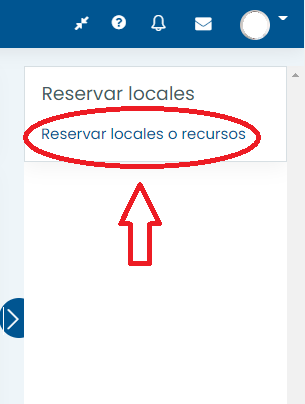
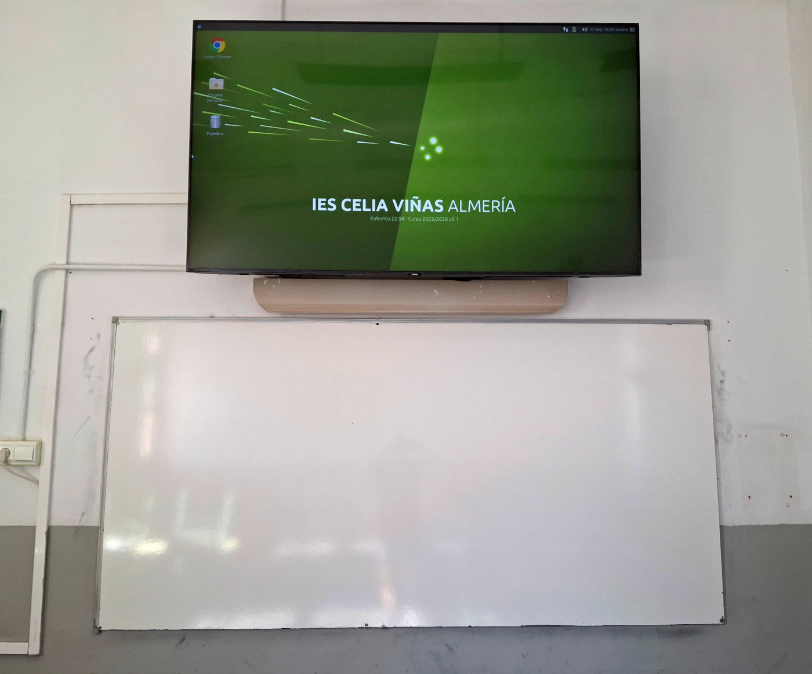
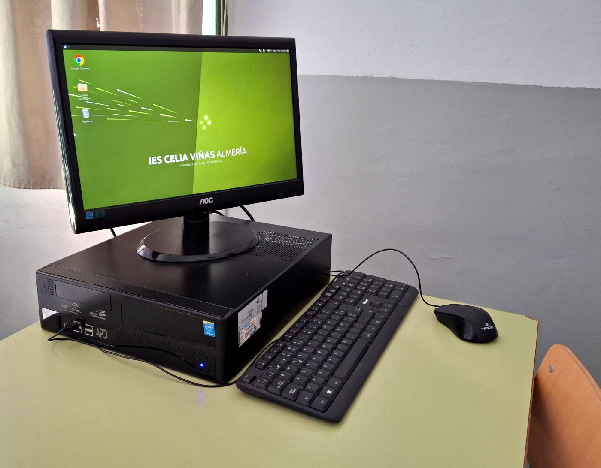
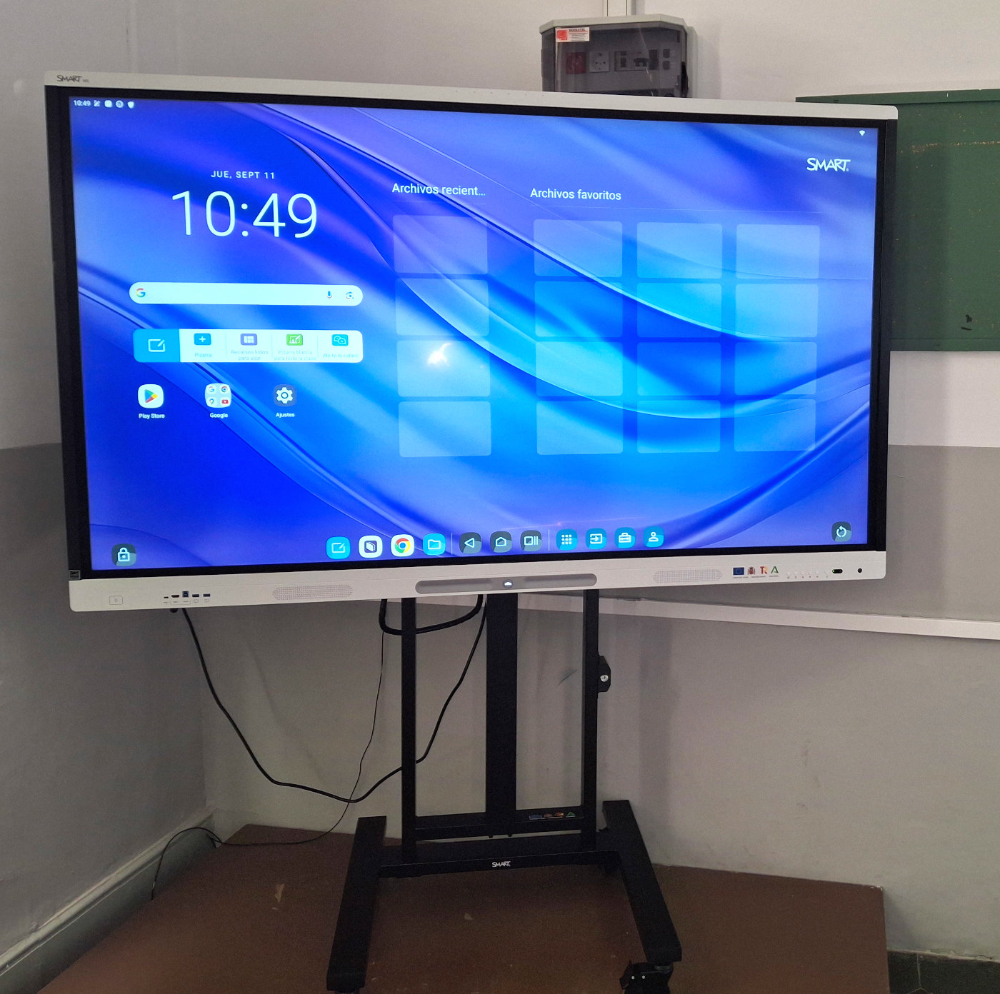
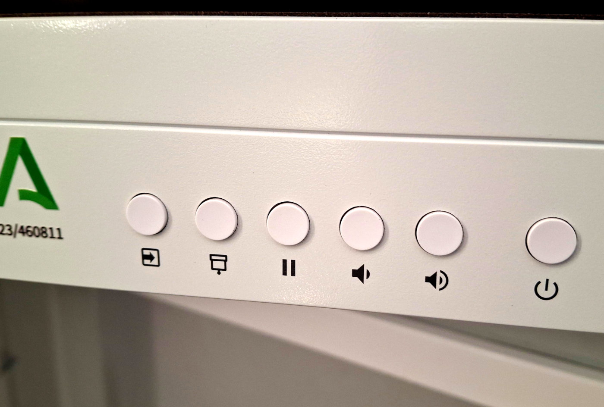

# 1. Medios informáticos del centro
{: .no_toc }

- TOC
{:toc}

En esta sección presentamos un resumen de las características de los medios informáticos con los que cuenta el IES Celia Viñas para uso del profesorado y el alumnado: tipología, ubicación, organización y gestión.

## 1.1. Carritos de portátiles

### ¿Qué son los carritos de portátiles?

Son carritos móviles con capacidad entre 10 y 30 ordenadores portátiles cada uno. 

El centro dispone de 6 carritos de estas características distribuidos de la siguiente forma:

SÓTANO

<table>
<thead>
<tr><td>Carro</td><td>Capacidad</td><td>Ubicación</td></tr>
</thead>
<tbody>
<tr><td>D (en preparación)</td><td>10 portátiles</td><td>Ateca</td></tr>
<tr><td>F</td><td>30 portátiles</td><td>Taller tecnología</td></tr>
</tbody>
</table>

PLANTA BAJA

<table>
<thead>
<tr><td>Carro</td><td>Capacidad</td><td>Ubicación</td></tr>
</thead>
<tbody>
<tr><td>C</td><td>24 portátiles</td><td>Secretaría</td></tr>
<tr><td>G</td><td>30 portátiles</td><td>Secretaría</td></tr>
</tbody>
</table>

PLANTA PRIMERA

<table>
<thead>
<tr><td>Carro</td><td>Capacidad</td><td>Ubicación</td></tr>
</thead>
<tbody>
<tr><td>A</td><td>30 portátiles</td><td>Dpto. de Física y Química</td></tr>
<tr><td>I</td><td>30 portátiles</td><td>Biblioteca</td></tr>
</tbody>
</table>

PLANTA SEGUNDA

<table>
<thead>
<tr><td>Carro</td><td>Capacidad</td><td>Ubicación</td></tr>
</thead>
<tbody>
<tr><td>B</td><td>24 portátiles</td><td>Lab. de Ciencias Naturales</td></tr>
<tr><td>H</td><td>26 portátiles</td><td>Aula 22</td></tr>
</tbody>
</table>

USO RESERVADO

<table>
<thead>
<tr><td>Carro</td><td>Capacidad</td><td>Ubicación</td></tr>
</thead>
<tbody>
<tr><td>E</td><td>10 portátiles</td><td>Taller TIC</td></tr>
</tbody>
</table>

### ¿A quién están destinados?

Los ordenadores portátiles de los carritos están destinados al alumnado para su uso durante el horario de clases y siempre bajo la supervisión y responsabilidad de un miembro del profesorado.

### ¿Cómo puedo utilizarlos?

Para usar un carrito de portátiles, el procedimiento general es el siguiente:

1. **[Reservarlo en Moodle Centros](https://iescelia.org/reservas)** (el procedimiento se describe en el siguiente apartado).
2. **Conseguir las llaves**, tanto de la dependencia donde se ubiquen los carritos que se han reservado como del propio carrito. Todas las llaves están en **Conserjería**. Los carritos ubicados en aulas suelen estar accesibles siempre que el aula esté en uso.
3. **Rellenar el parte de uso**. Te entregarán uno en blanco junto con la llave. También puedes hacerte con tus propias copias si usas el carro a menudo. *Es imprescindible rellenar este parte para localizar a los responsables de posibles actos vandálicos*.
4. **Acceder a la dependencia y desenchufar el carrito** de la toma de corriente.
5. **Llevar el carrito hasta el aula**. Aunque son pesados, se transportan con facilidad porque disponen de ruedas.
6. **Repartir los ordenadores entre el alumnado** y velar por que se usen adecuadamente. *REPETIMOS: Es importantísimo que el alumnado se apunte en el parte de uso*. Es la única forma de prevenir actos vandálicos y localizar a los responsables en caso de que se produzcan.
7. **Al final de la clase, vigilar la reposición de los ordenadores** a sus lugares originales. Para que los siguientes compañeros no los encuentren descargados, hay que dejarlos conectados a sus respectivos cargadores.
8. **Devolver el carrito** a la dependencia en la que se encontraba, **enchufarlo** de nuevo a la corriente y **devolver las llaves y el parte de uso relleno** en Conserjería.

***MUY IMPORTANTE: Rellenar adecuadamente el parte de uso es la única manera de prevenir actos vandálicos y poder así mantener los carritos en el mejor estado posible.*** Rogamos para ello vuestra colaboración.

### Procedimiento para reservar un carrito de portátiles

La reserva de carritos de portátiles **ya no se realiza en papel**, sino a través de Moodle Centros.

El procedimiento es el siguiente:

* **Entrar en [https://iescelia.org/reservas](https://iescelia.org/reservas)**. Se te pedirá tu usuario y contraseña de Moodle Centros.

* **Pulsar en la flecha para *Mostrar Bloques* de la parte derecha**

   

* **Nos aparecerá el bloque *Reservar locales* y un enlace donde tenemos que pulsar:**

   

* **En la página del *Gestor de Reserva de Salas* aparecen, en la parte izquierda, las distintas plantas del centro y un calendario. Seleccionamos la planta donde damos necesitamos el carro de portátiles y el día que queremos realizar la reserva.**

   

* **Nos aparecen las reservas actuales, para ese día y la planta seleccionada.** 

   

* **En la parte inferior de la pantalla, podemos seleccionar por días, por semanas o por meses.**

   

* **Si seleccionamos por semanas, podemos seleccionar cada uno de los carros de esa planta. Para hacer la reserva, pulsar en la hora libres deseada sobre el signo +**

   

8. **Nos aparece una ventana donde tendremos que rellenar la siguiente información:** 

   * Reserva para: Persona o departamento que realiza la reserva
   * Descripción completa: Indicar la materia y curso con el que se va a utilizar

9. **Pulsamos en el botón de *Guardar cambios*.**

   

En caso de dudas con este procemiento, no dudes en contactar con nosotros a través de Séneca, de email (buzontic@iescelia.org) o personalmente.

## 1.2. Equipos del profesorado en aulas generales

Las aulas del centro están equipadas con, al menos, un ordenador para uso del profesorado durante el ejercicio de su docencia y un televisor de gran formato y/o panel digital interactivo (PDI).

**Aulas con televisor convencional**

En estas aulas, el televisor sirve para proyectar la imagen y el sonido del ordenador que se encuentra ubicado en la mesa del profesor/a. 

Para usar esta equipación, el procedimiento es el siguiente:

1. Encender el ordenador y el televisor (da igual el orden). El televisor puede encenderse con el mando a distancia o pulsando directamente el botón de la carcasa, que suele ubicarse en el marco inferior.
2. Ajustar el nivel de volumen desde el ordenador y/o en el televisor.
3. Apagar el televisor al finalizar la clase con el fin de prolongar su vida útil. 

*IMPORTANTE: El alumnado tiene terminantemente prohibido hacer uso de este equipo salvo permiso expreso de un profesor/a y siempre bajo su supervisión*.

Uno de los televisores convencionales de 65 o 75", normalmente instalados encima de la pizarra blanca

Los televisores convencionales están conectados al PC de la mesa del profesor

**Aulas con panel digital interactivo (PDI)**

En estas aulas, en lugar de un televisor encontraremos un panel digital interactivo (PDI) o pantalla táctil. 

Externamente, un PDI parece un televisor convencional, pero consta de una pantalla táctil de 75" y dos ordenadores integrados, uno con Android y otro con EducandOS (la distribución Linux de la Junta de Andalucía).

Estas aulas se pueden usar de tres maneras diferentes:

MANERA 1: ANDROID

1. Encender el PDI. Automáticamente, entrará en modo Android.
2. El dispositivo, en este modo, se manipula exclusivamente desde su pantalla táctil.

MANERA 2: EDUCANDOS

1. Encender el PDI.
2. Usando la botonera que hay abajo y a la derecha del dispositivo, cambiar la entrada de "Android" a **"OPS"**
3. A partir de ahora, el dispositivo puede usarse tanto desde su pantalla táctil como desde el teclado y ratón situados en la mesa del profesor/a (como si fuera un ordenador convencional).

MANERA 3: CONECTANDO NUESTRO PROPIO EQUIPO

* Podemos conectar nuestro equipo de uso personal mediante un cable HDMI o inalámbricamente al PDI. La forma exacta de hacerlo dependerá del dispositivo, por lo que tendrás que investigar un poco cómo hacerlo o preguntar al equipo de coordinación TDE.

*IMPORTANTE: El alumnado tiene terminantemente prohibido hacer uso de la pantalla táctil salvo permiso expreso de un profesor/a y siempre bajo su supervisión*.

Una de las PDI Optoma de 75"

Botonera de la PDI Optoma. El primer botón nos permite seleccionar la entrada (OPS, Android, HDMI, etc). También se controla desde aquí el volumen del audio o se puede pausar la visualización

**Aulas de los ciclos formativos**

Las aulas de los ciclos formativos tienen su propio equipamiento derivado de la actividad lectiva que se lleva a cabo en ellas y no se describe en este documento.

## 1.3. Usuarios y contraseñas

Todos los ordenadores del centro, tanto los de sobremesa como los portátiles, tienen creado el usuario estándar de la Junta de Andalucía.

* Usuario: usuario
* Contraseña: usuario

Si alguien necesita disponer de un usuario personalizado en alguno de los ordenadores, puede solicitarlo al coordinador TDE. No obstante, se recomienda encarecidamente no dejar archivos personales en ninguno de los ordenadores del centro.

## 1.4. Aulas de informática

El centro, debido a la falta de espacio, no dispone de ningún aula de informática específica más allá de las propias de los ciclos formativos.

Sin embargo, cualquier aula del centro puede convertirse temporalmente en aula de informática usando los abundantes carritos de portátiles que existen distribuidos por el centro (véase sección "Carritos de portátiles").

## 1.5. Otros medios

El IES Celia Viñas dispone de otros muchos medios relacionados con las TIC. Sus características son tan variadas que enumerarlas aquí no tiene sentido. Nos limitaremos a dar una lista de los medios con los que contamos.

Para cualquier consulta o incidencia relacionada con su uso, por favor, recurre al coordinador TIC.

* Ordenadores e impresoras de uso común en la sala de profesores y departamentos.
* Ordenadores y proyectores en las aulas específicas (taller de tecnología, arte, laboratorios, emprendimiento...)
* Ordenadores del aula de pedagogía terapéutica.
* Ordenadores para uso del alumnado en la biblioteca.
* Ordenador para uso del profesorado encargado de la biblioteca.
* Ordenadores e impresoras del personal de administración y equipo directivo.
* Ordenador ubicado en la conserjería y conectado al televisor del hall para proyección de presentaciones y vídeos.
* Ordenador y proyector del salón de actos.
* Ordenadores y proyectores de las aulas específicas de los ciclos formativos de informática.
* Servidor TIC y toda la infraestructura de red cableada e inalámbrica.
* Equipación propia del Aula de Tecnología Aplicada (Ateca).

## 1.6. Gestión de incidencias

**Procedimiento general**

La mayor parte de las incidencias cotidianas tienen una fácil solución que cualquier usuario puede intentar (véase la sección “Preguntas frecuentes”)

Si la incidencia parece más grave, se debe poner en conocimiento del coordinador TDE para acometer su resolución con la mayor agilidad posible. Esto es particularmente importante en el caso de los equipos del alumnado que pasan por muchas manos al cabo del día. Si todos somos diligentes en ello, podremos disfrutar de una equipación en buen estado durante mucho tiempo.

**Cómo contactar con el coordinador TDE**

Es muy importante poner la incidencia por escrito. Comentársela al coordinador TDE en un pasillo o en el semáforo de la rambla a las tres de la tarde puede tener un cierto valor terapéutico, pero poca utilidad práctica.

Existen **dos maneras de comunicar una incidencia de forma eficaz**. Cada cual puede escoger la que le resulte más cómoda.

Forma número 1:

* **Enviar un mensaje por Séneca a coordinador TDE**, intentando ser explícito/a con el problema y el equipo al que afecta.

Forma número 2:

* **Enviar un email a la dirección buzontic@iescelia.org**, intentando ser explícito/a con el problema y el equipo al que afecta.

¿Qué significa "ser explícito/a con el problema y el equipo al que afecta"?

* Ejemplo de mensaje poco explícito que no sirve para nada: *"Ordenador no funciona"*.
* Ejemplo de mensaje explícito que facilita la resolución rápida del problema: *"El ordenador del aula X se enciende pero no emite ninguna imagen en el monitor. Ha ocurrido esta mañana a las 12:30"*.

**El peliagudo caso de los carritos de portátiles**

Los carritos de portátiles son una fuente inagotable de incidencias porque son usados durante muchas horas al día por un alumnado cambiante.

En estos ordenadores hemos encontrado de todo: teclas arrancadas, chicles pegados, pantallas partidas y otras cosas de las que preferimos no dejar constancia por escrito.

Por ello rogamos la máxima colaboración en el uso de esta equipación. Es la única manera de mantenerla en un estado razonable de funcionamiento. Basta con seguir [el protocolo de actuación que hemos sugerido más arriba](/docs/manual-buenas-practicas-digitales/_site/medios-informaticos/#cómo-puedo-utilizarlos).

* Pedir al alumnado que avise de cualquier anomalía detectada en los portátiles antes o durante su uso.
* Informar lo antes posible de la incidencia al coordinador TDE.

Con esta simple precaución, podremos atender las incidencias con celeridad, mantener los carritos en un estado razonable de funcionamiento y atajar los actos de vandalismo.

## 1.7. Preguntas frecuentes

En esta sección enumeraremos las preguntas más habituales y sus posibles respuestas.

**No hay internet**

Siempre se puede intentar desactivar y volver a activar la conexión de red. Apagar y encender el ordenador tendrá el mismo efecto, pero es mucho más lento. Es conveniente aprender a hacer lo primero.

A menudo, sobre todo en los días lluviosos y en la segunda planta, hay un corte de corriente puntual que afecta a algunos equipos e imposibilita la conexión a la red de los ordenadores de esa planta.

En el cuadro de interruptores de la segunda planta hemos colocado las instrucciones paso a paso para que cualquier profesor/a pueda volver a poner en marcha la conexión a la red.

Si ninguno de estos trucos funciona, por favor, contacte con el Coordinador TDE (véase "Gestión de incidencias")

**No hay sonido**

Casi siempre la causa es una de estas tres:

* Los altavoces están apagados. Se encienden de forma diferente según el modelo de altavoz que exista en ese aula (Consúltese el apartado "Equipos de profesorado de las aulas generales")
* Los altavoces están "escuchando" en un canal distinto del que deberían. En algunas aulas, los altavoces disponen de dos canales de entrada. A veces, por accidente o maldad premeditada, acaban conectados al canal incorrecto (Consúltese el apartado "Equipos de profesorado de las aulas generales")
* El cable de audio está desconectado o conectado en el lugar incorrecto. El cable de audio es un minijack convencional. Debe salir del conector verde del ordenador y llegar a la entrada de los altavoces (a veces, a un conector en la pared).

Si ninguna de estas tres soluciones funciona, por favor, contacta con el Coordinador TDE (véase "Gestión de incidencias")

**No se ve nada en el monitor**

Comprueba que el monitor está encendido.

Comprueba la conexión del cable HDMI o VGA al ordenador y al monitor.

Asegúrate de que el splitter VGA, si lo hay (la cajita metálica que está conectada al ordenador y al monitor) está encendido.

Si todas estas comprobaciones son correctas y el monitor sigue sin mostrar la imagen, por favor, contacta con el Coordinador TDE (véase "Gestión de incidencias")

**No puedo entrar con mi usuario**

El único usuario existente en los ordenadores es el estándar (usuario/usuario). Si alguien necesita un usuario de uso individual, puede solicitarlo al coordinador TDE. Ten en cuenta que, si el ordenador se cambia o formatea (algo que ocurre de vez en cuando, en caso de avería grave), perderás el usuario y todos tus archivos.

**Los ordenadores del carrito no se encienden**

Probablemente se quedaron desconectados y se les ha agotado la batería. Asegúrate de que quedan conectados al cargador tras su uso, y no te olvides de enchufar el carrito completo a una toma de corriente.

**Me he encontrado una sesión abierta de Google, Moodle, Netflix, etc.**

Esto es un problema relativamente frecuente. Lo más sensato es cerrar de inmediato cualquier sesión, en cualquier servicio online, que nos encontremos abierta, sea nuestra o de cualquier otra persona, y avisar inmediatamente a la persona afectada (si la hemos identificado) para que revise si se han producido accesos no deseados a su cuenta.

Como usuarios de dispositivos compartidos, es nuestra responsabilidad no dejar ninguna sesión abierta en ninguno de ellos cuando hayamos finalizado su uso.

**Necesito instalar un programa**

Los usuarios convencionales no tienen privilegios para instalar software adicional por motivos obvios de estabilidad de los sistemas. Si necesitas instalar cualquier programa que no esté disponible, por favor, contacta con el Coordinador TDE con la mayor antelación posible. Hacerlo cinco minutos antes de la clase en la que necesitas ese programa imperiosamente no suele dar buenos resultados.

**Error de seguridad al conectar con Séneca o con Moodle Centros**

Esto no es un problema de Linux, ni de Android ni del navegador web, sino una anomalía debida al certificado de seguridad que utilizan Séneca y Moodle Centros. 

El problema puede darse porque las versiones antiguas de Firefox o Chrome no reconocen los certificados emitidos por la Fábrica Nacional de Moneda y Timbre. En ese caso, bastará con actualizar el navegador web para solucionarlo. 

Otra posible causa de este problema es que la fecha y la hora del reloj interno del ordenador se haya desajustado.

Si te ocurre en alguno de los ordenadores del instituto, por favor, contacta con el coordinador TDE para comunicarle el problema.

**Mis archivos han desaparecido**

Probablemente el ordenador ha sido formateado o cambiado. Los ordenadores del instituto son de uso compartido y no deberíamos dejar archivos personales en ellos o, al menos, tendríamos que disponer de copias de seguridad de todo. En cualquier momento, pueden sufrir una avería y necesitar ser formateados o cambiados por otros sin previo aviso.

**Necesito instalar Microsoft Windows**

Todos los equipos informáticos del centro disponen, como es lógico, de software con licencia legal. Eso incluye el sistema operativo. Existen multitud de alternativas libres al software más popular para los sistemas Microsoft Windows o MacOS. En ultima instancia, se puede intentar emular el entorno de Windows por diversos medios.

Por favor, ponte en contacto con el Coordinador TDE para estudiar tus necesidades concretas y buscar la mejor solución (Aclaración: no suele ser buena idea hacerlo el día de antes de la clase en la que necesites el software funcionando).

**Necesito disponer de un (ordenador/monitor/impresora/lo-que-sea)**

Si necesitas cualquier equipación adicional a las disponibles, por favor, contacta con el coordinador TDE lo antes posible. Podemos mover equipos, cambiar instalaciones y, en general, hacer bastantes malabarismos con el material disponible, pero necesitaremos tiempo para organizarlo.

Si lo que necesitas es adquirir material nuevo para tu departamento o tu aula, tanto inventariable como consumible, recuerda que esto es competencia del equipo directivo, aunque siempre puedes hablarlo antes con el coordinador TDE para obtener una orientación técnica o para comprobar si ese material ya existe en alguna dependencia del instituto.