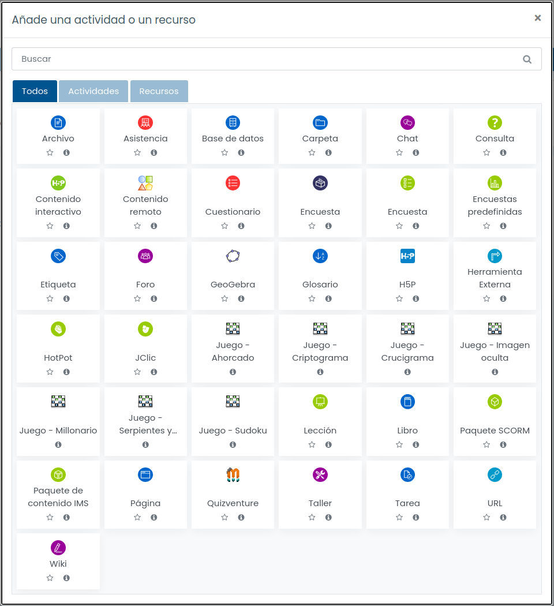

# 2. Plataformas online del centro
{: .no_toc }

- TOC
{:toc}

En esta sección hablamos de las plataformas online utilizadas oficialmente en el IES Celia Viñas, principalmente Moodle Centros y Google Suite. También nos referiremos a las posibilidades que existen para usar otras plataformas diferentes.

## 2.1. Moodle Centros

Moodle es una plataforma de aprendizaje online de código libre y abierto muy potente, configurable y extendida en el mundo académico.

La Consejería de Educación y Deporte proporciona una plataforma para Moodle para todos los centros educativos públicos andaluces. Esta plataforma se denomina Moodle Centros y puede accederse a ella en [esta dirección](https://educacionadistancia.juntadeandalucia.es/centros/almeria/).

Existen múltiples recursos en la red orientados al alumnado y al profesorado para aprender a usar Moodle, tanto a nivel principiante como avanzado. En esta sección solo explicaremos como habilitar nuestros usuarios y cursos y dar los primeros pasos en Moodle Centros.

Para aprender a manejar Moodle Centros, puedes consultar:

* El [manual de iniciación a Moodle para docentes](http://agrega.juntadeandalucia.es//repositorio/09122020/98/es-an_2020120911_9092449/rol_profesorado/index.html) de la Junta de Andalucía.
* El [manual completo de Moodle](https://www.juntadeandalucia.es/educacion/eaprendizaje/moodle-centros/) de la Junta de Andalucía.
* Nuestra guía para absolutos novatos/as, que encontrarás justo a continuación en este mismo documento.

### 2.1.1. Soy novato/a en Moodle Centros y quiero crear un aula virtual

**Paso 1.** Con cualquier navegador web, entra en la siguiente dirección y selecciona la provincia de Almería: https://educacionadistancia.juntadeandalucia.es/centros/almeria/

**Paso 2.** Escribe tu nombre de usuario y tu contraseña de Séneca.

**Paso 3**. Acabas de llegar a tu "Área personal" de Moodle Centros. A la derecha, tienes un enlace etiquetado como "Creación de aulas". Haz clic en él.

**Paso 4**. Te aparece una lista con todas las materias y cursos que impartes (por ejemplo: "1º ESO A - Inglés" o "2º Bachillerato C - Matemáticas"). Haz clic en el recuadro "Crear" de la parte derecha de todas las materias para las que deseas crear un aula virtual. Luego haz clic en el botón "Procesar".

IMPORTANTE: aquí solo aparecerán las materias que ya tengas cargadas en tu horario de Séneca. Por lo tanto, tienes que introducir tu horario (o, al menos, una parte) antes de este paso. El trasvase de datos entre Séneca y Moodle Centros puede tardar hasta 24 horas.

**Paso 5**. Moodle Centros te avisará de que la creación de tu aula virtual puede demorarse 24 horas. No te preocupes, es lo normal y suele tardar algo menos.

**Paso 6**. Ahora puedes ver que tus aulas virtuales están "Pendientes de creación". Tómate un café o vete a dar un paseo. Recuerda que este proceso puede tardar hasta 24 horas.

**Paso 7**. Cuando la creación de aula se haya realizado, tu lista de materias tendrá este aspecto, con el rótulo "Disponible" en la columna "Estado".

**Paso 8**. Si ahora regresas a tu "Área personal" (el enlace está permanentemente disponible en el panel de la izquierda), verás que tu aula virtual ya existe y que puedes entrar en ella para empezar a trabajar.

**Paso 9**. Desde la pantalla anterior, entra en tu aula virtual haciendo clic en el nombre de la misma. Verás una página como esta, que significa que tu aula virtual está operativa pero vacía:

**Paso 10**. Ya casi lo tenemos: solo nos queda hacer que el aula virtual sea visible al alumnado (por defecto, todas las aulas recién creadas están ocultas, no me preguntes por qué...)

Haz clic en "Administración del curso" (en el panel de la izquierda). Se desplegarán nuevas opciones.
 Un de ellas es "Editar ajustes". Haz clic ahí.

**Paso 11**. Te aparecerá un formulario muy largo. Solo tienes que tocar la opción "Visibilidad", cambiando su valor de "Ocultar" a "Mostrar". Luego tienes que irte hasta el final de esa página tan larga y hacer clic en el botón "Guardar cambios y mostrar".

¡Tu curso está listo para empezar a subir material! Consulta el apartado siguiente si quieres aprender a hacerlo.

### 2.1.2. Ya tengo mi aula virtual en Moodle. ¿Ahora qué?

Ya tienes un aula virtual en Moodle Centros y ahora quieres crear contenido dentro de ella, ¿verdad?

Lo más habitual es que queramos hacer alguna de estas cosas:

1. Subir documentos para nuestro alumnado (archivos PDF, presentaciones, etc)
2. Crear enlaces para que nuestro alumnado visite alguna página o algún recurso en internet.
3. Crear tareas para que nuestro alumnado nos pueda enviar archivos, como trabajos, ejercicios resueltos, etc.
4. Usar una sala de videoconferencia.

Moodle permite crear este tipo de recursos y muchísimos más, como tests autocorregibles, foros, chats, encuestas, lecciones guiadas, etc. En este manual solo nos centraremos en los recursos más habituales.

**Paso 1**. Necesitas al menos un aula virtual activa en Moodle Centro.

Si no sabes de qué estamos hablando, revisa los apartados 1 y 2 de este manual.

**Paso 2**. Entra en tu aula virtual y activa la edición. Este es un paso básico en cualquier Moodle.

Simplemente, pulsa el botón que está señalado en la imagen.

**Paso 3**. Verás que te aparecen muchos iconos que antes estaban ocultos. Sirven para añadir contenido al aula virtual o para modificar el contenido que ya existe. Haz clic en el enlace "Añade una actividad o un recurso"

**Paso 4**. Te aparecerá este menú para que elijas qué tipo de actividad o recurso quieres añadir a tu aula virtual. A continuación, vamos a indicarte los más habituales.

**4a) Subir documentos**. Haz clic en "Archivo" para subir un documento (PDF, documento de texto, presentación, etc) para tu alumnado. 

Pon un nombre al recurso (por ejemplo: "Ejercicios del tema 1") y arrastra tu archivo hasta la zona indicada. Al final de la pantalla, haz clic en "Guardar cambios y regresar"

**4b) Tareas para el alumnado**. Haz clic en "Tarea" para que tu alumnado pueda enviarte a ti archivos con tareas, trabajos, ejercicios resueltos, etc. Te aparecerá un formulario larguísimo, pero no temas: casi todo lo puedes dejar en sus valores por defecto. Ya tendrás tiempo de investigar todas las opciones más adelante.

Solo es imprescindible que indiques un nombre y una descripción para la tarea, así como la fecha límite de entrega, si deseas establecer una. 

No te olvides de hacer clic en el botón "Guardar cambios y regresar" que está al final de la página.

**4c) Enlazar otra página web**. Haz clic en "URL" para crear un enlace a un recurso de internet para tu alumnado. Aquí puedes poner cualquier cosa, desde un vídeo de Youtube hasta un artículo interesante de un blog, o lo que se te ocurra. Se aceptará cualquier dirección válida de internet. Igual que antes, tendrás que asignar un nombre al recurso, indicar cuál es la dirección de internet y pulsar el botón "Guardar cambios y regresar".

**4d) Sala de videoconferencia**. Todas las aulas de Moodle Centros tienen una sala de videoconferencia ya creada. Está en la cabecera del curso, incluso cuando el mismo está vacío. Simplemente, haz clic en el texto "Sala de videoconferencia".

Luego haz clic en "Crear sesión", asigna un nombre a la sesión (Por ejemplo: "Clase del lunes a las 8:05") y establece la fecha, la hora y la duración de la sesión. ¡No te olvides de pulsar el botón "Crear" para guardar los cambios!

Todos los usuarios del curso (es decir, tú y tu alumnado) tendréis acceso a esa videoconferencia en el horario programado. Si deseas que otras personas puedan entrar, debes hacer clic en "Acceso de invitados". Te aparecerá una dirección que puedes compartir con las personas que quieras invitar. Esto es lo que hace el equipo directivo, por ejemplo, cuando nos pasan el enlace para los claustros telemáticos.

### 2.1.3. Quiero separar al alumnado en grupos

En las aulas virtuales creadas automáticamente mediante el proceso que hemos visto en el apartado 1, nos encontraremos con todo el alumnado del mismo nivel agrupado en la misma aula virtual.

Por ejemplo, si eres profesor/a de inglés de 1º ESO A y 1º ESO B, en tu aula virtual de "Inglés 1º ESO" aparecerán TODOS los alumnos/as de 1º de ESO del grupo A y del grupo B mezclados.

Para separarlos en grupos, tienes dos posibilidades.

**POSIBILIDAD 1: usa recursos diferenciados para cada grupo.**

Al crear un recurso (tarea, archivo, URL o lo que sea - echa un vistazo al apartado 3 si no sabes cómo hacer esto-), tienes que bajar en el formulario de creación hasta la sección "Restricciones de acceso".
Una vez allí, despliega la sección, haz clic en "Añadir restricción", luego en "Grupos" y, por último, selecciona el grupo que podrá ver este recurso. No te olvides de pulsar "Guardar cambios" antes de terminar para que la restricción se guarde.

De este modo, solo el grupo o grupos seleccionado podrá acceder a este recurso.

**POSIBILIDAD 2: usa aulas virtuales separadas para cada grupo**

Es decir, si eres profesor/a de Inglés en 1º de ESO A y 1º de ESO B, puedes tener dos aulas virtuales diferentes, una para cada grupo.

Para ello, debes solicitar la creación manual de estas aulas al equipo de coordinación TDE mediante un email a: buzontic@iescelia.org. En el email, indica claramente qué aulas quieres crear y para qué grupos son.

Ten encuentra que, en estas aulas creadas manualmente, deberás dar de alta también manualmente al alumnado (mediante la opción "Participantes" del panel de la izquierda de cada aula virtual). Cuando te confirmemos la creación de las aulas virtuales solicitadas, te indicaremos lo que debes hacer para ponerlas en funcionamiento.

### 2.1.4. Quiero echar un vistazo a las preguntas más frecuentes de mis compañeros/as

***¿Cómo puede el alumnado acceder a Moodle Centros?***

El alumnado accede a Moodle Centros mediante su usuario y contraseña IdEA, esto es, su usuario y contraseña de Pasen (igual que nosotros accedemos con nuestro usuario y contraseña de Séneca).

Es responsabilidad del alumnado y sus familias conseguir las credenciales de Pasen tanto para la familia como para el alumnado. El procedimiento es muy sencillo y está descrito aquí (en el "Manual para la generación de las credenciales del alumnado"):

https://blogsaverroes.juntadeandalucia.es/eaprendizaje/moodle-centros/

Si, a pesar de ello, algún alumno/a no puede, no sabe o no quiere autogenerar sus credenciales, puede pasarse por jefatura de estudios para pedir que le generen unas.

***¿El aula virtual antigua del instituto va a desaparecer?***

Sí, esa es la idea.

Tanto por razones técnicas como legales, la antigua aula virtual del instituto (https://iescelia.org/aulavirtual) dejó de estar operativa en la primavera de 2021. Hemos hecho una copia de seguridad de todo el contenido. Si necesitas rescatar algún contenido antiguo, ponte en contacto con el equipo de coordinación TDE para que hagamos el trabajo arqueológico.

***¿Es ilegal usar cualquier otra plataforma web que no sea Moodle Centros?***

Si los servidores de esa otra plataforma manipulan cualquier dato personal del alumnado (cosas tan simples como nombres, direcciones de email, imágenes capturadas con la webcam, etc), entonces tenemos un problema. Mejor buscar una alternativa dentro de Moodle Centros.

***Quiero usar Google Suite, o Google Classroom, o cualquier otra cosa que empieza por "Google".***

La Junta de Andalucía tiene un convenio con Google para usar todas sus herramientas educativas de forma gratuita y con todas las garantías legales. Revisa la sección sobre Google Suite para encontrar más información.

***Quiero usar recursos que no están en Moodle***

No hay ningún problema. Puedes usar cualquier cosa que haya en internet, siempre que sea legal (¡claro!) y no requiera datos personales de los usuarios.

Eso sí, te ruego que sigas centralizando todo el material en Moodle Centros, de modo que el alumnado no se vuelva loco localizando los recursos de cada materia.

Por ejemplo, si quieres enlazar unos vídeos de Youtube para tu alumnado, bastaría con que colocaras esos enlaces en algún lugar de tu aula virtual de Moodle Centros.

***¿Las aulas virtuales de Moodle Centros se borran de un año para otro?***

Sí. El equipo encargado del mantenimiento de Moodle Centros realiza una limpieza completa de la plataforma durante el mes de septiembre. Para no perder sus aulas virtuales, cada profesor/a debe responsabilizarse de realizar una copia de seguridad antes de esa fecha. Esa copia puede restaurarse posteriormente en el Moodle Centros limpio.

No te agobies demasiado por ello: es un proceso sencillísimo que no requiere más de diez minutos al año. Y, si tienes problemas para hacerlo, puedes pedir ayuda al equipo de coordinación TDE.

### 2.1.4. ¿Necesitas ayuda personalizada?

Si, a pesar de los pasos que hemos detallado en este documento, sigues estando perdido/a en Moodle Centros y crees que necesitas ayuda individualizada, puedes solicitar esa ayuda enviando un mensaje a través de Séneca al coordinador TDE o por correo electrónico a la dirección buzontic@iescelia.org.

Las sesiones de ayuda personalizada tendrán lugar, en principio, durante los recreos de la mañana y solo se atenderán previa petición de cita y en estricto orden de solicitud para evitar aglomeraciones.

Para ampliar toda esta información, te remitimos a los manuales oficiales de la Junta de Andalucía que puedes encontrar en https://blogsaverroes.juntadeandalucia.es/eaprendizaje/moodle-centros/

Por último, puedes hacer llegar cualquier sugerencia al coordinador TDE a través de la mensajería de Séneca o por correo electrónico a la dirección buzontic@iescelia.org.

## 2.2. Google Suite for Education

La Consejería de Educación y Deporte de la Junta de Andalucía ha firmado un convenio con Google para proporcionar Google Suite de manera gratuita a los centros que así lo soliciten. El IES Celia Viñas es uno de esos centros.

En esta sección expondremos cómo puedes acceder a tu cuenta de Google Suite y cómo puedes utilizar sus herramientas.

**Qué es Google Suite**

Googe Suite for Education es un conjunto de herramientas web que Google ofrece a instituciones educativas. Incluye aplicaciones como Gmail, Meet, Calendar, Classroom, Docs o Drive.

Funciona como las cuentas personales de Google, pero incluye acceso a más herramientas, como Classroom o Meet, que normalmente son de pago.

**Acceso a Google Suite: profesorado**

En virtud del convenio de la Junta de Andalucía, todo el profesorado dispone de una cuenta en Google Suite con estas credenciales:

* Nombre de usuario: usuario-de-seneca@g.educaand.es
* Contraseña: Tu contraseña de Séneca

Basta con que inicies una sesión de Google con esas credenciales (por ejemplo, en Gmail) para empezar a usar las herramientas de Google Suite. Si ya tenías una cuenta de Google suite en el dominio iescelia.org, puedes seguir usándola porque seguirá estando operativa, pero ten en cuenta que son dos cuentas totalmente independientes.

**Acceso a Google Suite: alumnado**

El alumnado puede acceder a Google Suite del mismo modo que el profesorado, usando sus credenciales de Pasen:

* Nombre de usuario: usuario-de-pasen@g.educaand.es
* Contraseña: Su contraseña de Pasen

IMPORTANTE: para cumplir con la Ley Orgánica de Protección de Datos, el alumnado menor de 14 años debe contar con una autorización expresa de sus tutores legales antes de usar esta cuenta.

**¿Google Suite sustituye a Moodle Centros?**

No. Moodle Centros sigue siendo la plataforma online de referencia. Si un profesor/a desea usar Google Suite, debería enlazar los recursos de Google Suite en Moodle Centros, para no crear confusión entre el alumnado y las familias acerca del lugar en el que puede encontrar los recursos educativos.

**Soy nuevo/a en el centro. ¿Tengo que hacer algo para crear mi cuenta de Google Suite?**

No. Tu cuenta de Google Suite se creará automáticamente alrededor de 24 horas después de que te hayan dado de alta en el sistema Séneca. Del mismo modo, si dejas de pertenecer a la plantilla del centro, la cuenta de Google dejará de estar operativa.

## 2.3. Videoconferencias

Las videoconferencias para las clases semipresenciales o a distancia (o para cualquier otra situación en la que sea necesario establecer una videoconferencia) deben realizarse, por motivos de **protección de datos**, a través de las dos plataformas seleccionadas por la Consejería de Educación y Deporte: Moodle Centros o Google Suite (Google Meet).

Si necesitas utilizar imperativamente cualquier otro sistema de videoconferencia como Jitsi, Zoom o Teams, asegúrate de que el alumnado no participará en esa videoconferencia aportando ningún dato de carácter personal, lo que incluye su nombre, dirección de email y, por supuesto, su propia imagen.

**Moodle Centros: Webex**

Desde el curso 21-22 el servicio de videoconferencia integrado con Moodle es **Webex**.

El módulo de videoconferencia Webex solo está incluido por defecto en las aulas Sala del Profesorado y Punto de encuentro. En el resto de aulas, hay que añadir el servicio Webex al curso Moodle en el que queramos usarlo. Para ello se siguen los siguientes pasos:

1. Entrar en el curso.
2. Hacer clic en "Activar edición".
3. Hacer clic en "Añadir una actividad o recurso".
4. Seleccionar Herramienta externa > Webex. A partir de ahí, seguiremos las instrucciones de Webex para crear la sesión de videoconferencia.

IMPORTANTE: la primera vez, Webex nos pedirá que nos registremos en su servicio. *NO debe crearse el usuario directamente a través de la web o la APP de WEBEX, debe hacerse SIEMPRE a través del módulo en Moodle*, siguiendo las instrucciones que aparecerán en la pantalla.

Más información: [Guía Rápida Webex](https://www.juntadeandalucia.es/educacion/eaprendizaje/wp-content/uploads/2021/09/Guia-rapida-Webex-21-22.pdf)

**Google Suite: Meet o Hangouts**

Google Suite proporciona acceso a sus dos plataformas de videoconferencia: Meet y Hangouts, aunque Meet es más recomendable porque tiene más funcionalidades y permite la conexión de más usuarios simultáneos.

En virtud del acuerdo firmado entre la Consejería de Educación y Deporte y Google, todos los datos de carácter personal implicados en las videoconferencias celebradas con estas herramientas están debidamente protegidos. Eso sí, debes asegurarte de que tu alumnado entra a la videoconferencia utilizando las cuentas corporativas de Google Suite pertenecientes al IES Celia Viñas, y no con cualquier otra cuenta personal.

Debes tener en cuenta que Google Meet consume más ancho de banda que BB Collaborate, por lo que, si experimentas problemas de rendimiento con Meet, te aconsejamos que te plantees la posibilidad de probar con BB Collaborate.

## 2.4. Otras plataformas

El centro solo dispone de dos plataformas online oficiales: Moodle Centros y Google Suite.

El profesorado que quiera usar cualquier otra, puede hacerlo siempre que su uso no exija la creación de cuentas de carácter personal por parte del alumnado. 

Por ejemplo, podrías usar Office 365 para elaborar documentos o presentaciones, pero no podrías exigir a tu alumnado que se registre en Microsoft para acceder o colaborar en los mismos.

Para este propósito, recuerda que el alumnado dispone de cuentas de Moodle y de Google con todas las garantías legales (¡recuerda que los menores de 14 años necesitan autorización de los tutores legales para usar estas últimas!)

En este capítulo te voy a presentar a un amigo íntimo: **el lenguaje PHP**. Veremos la sintaxis básica y cómo este lenguaje trabaja **en el lado del servidor** para ayudarnos a crear aplicaciones web dinámicas, es decir, aplicaciones que generan un HTML distinto según los datos de entrada y el estado del servidor.

También conoceremos el **kit de herramientas** básico que vamos a necesitar para convertirnos en desarrolladores/as web y nos conectaremos a una base de datos remota para enviar y recuperar información.

Por último, veremos algunos **ejemplos de aplicaciones web** sencillas que puedes utilizar como base para tus propios desarrollos. Esta será una práctica habitual a lo largo de todo este curso de programación: siempre ofreceremos ejemplos de código real para comprender y aplicar la parte más "teórica".

Y, por supuesto, no te escaparás sin desarrollar tus primeras aplicaciones web.

